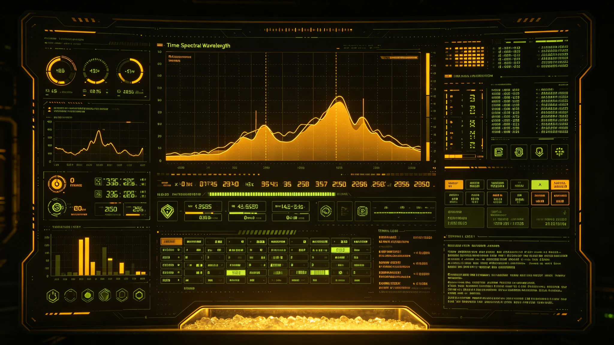

# 第五恒星系无人抵达探测与光谱生命指征甄别技术报告

**编制单位**：联合体勘探工程学派 · 深空探测技术组
**报告编号**：EX-5-3304-009
**日期**：3304年9月12日
**密级**：接触期内部

## 一、任务概述

本报告记录"闻笛号"先遣中继舱在第五恒星系方向轨道上，使用3台一次性进入探测器与轨道光谱平台，对疑似生物圈行星开展生命指征甄别所采用的方法、数据与误报分析。生物安全结论见GS-3302-01，本报告仅及技术。

## 二、探测平台与载荷

| 平台 | 轨道 | 载荷 |
|---|---|---|
| 闻笛号尾部观测舱 | 行星极地轨道，周期118分钟 | 高分辨光栅光谱仪（400—2500nm）、质谱仪、气溶胶采样盘 |
| 进入探测器A | 释放后再入即焚毁 | 低空气溶胶采样+实时下传 |
| 进入探测器B | 同左，不同经度 | 平流层吸收带剖面 |
| 进入探测器C | 同左，不同季节段 | 昼夜温差下颗粒丰度 |

所有载荷密封，采样盘焚毁前不与舱内连通。光帆脉冲通信单趟时延4.2—5.1小时（见GS-3127-01口径），数据非实时。

## 三、生命指征模型

判别"是否存在生命"采用多指征加权，而非单一光谱峰：

| 指征 | 权重 | 本行星观测 |
|---|---|---|
| 光合色素吸收带 | 0.30 | 检出，峰位520nm（地球叶绿素665nm），偏移 |
| 大气非平衡气体 | 0.25 | 氧与甲烷共存，处于热力学非平衡 |
| 气溶胶昼夜涨落 | 0.15 | 颗粒丰度昼高夜低，相位稳定 |
| 表面反照率季节迁移 | 0.20 | 两季观测，吸收带随极盖迁移 |
| 复杂手性分子信号 | 0.10 | 未测到（进入探测器分辨率不足） |

加权得分0.71/1.00，超过"疑似"阈值0.55，未达"证实"阈值0.85。故定"疑似生物圈"。

## 四、误报分析

工作组专门排查了四种非生物假阳性：

1. **矿物吸收假峰**：地表铁氧化物在520nm附近有弱吸收，模型扣除残余后仍有0.18净信号，非纯矿物可解释。
2. **大气散射伪影**：瑞利散射随角度变化，已用三个经度观测交叉扣除。
3. **非生物有机合成**：米勒—尤里式大气放电可产生有机气溶胶，但无法解释昼夜丰度相位。
4. **探测器自身污染**：三次进入探测器为不同批次生产，污染本底一致扣除。

结论：无单一非生物机制可同时解释全部指征；但"手性分子"一项缺失，不足以宣布证实。

## 五、数据局限

- 观测仅覆盖一个行星年的前半季，极盖迁移方向待第二个行星季复核。
- 进入探测器分辨率不足以分辨纳米级有机分子结构。
- 光时延4—5小时，无法做实时闭环，所有判别为事后。
- 未做表面着陆，地表地质与地下生物圈完全未知。

## 六、下一轮建议

1. 增加长期驻留轨道平台，连续观测两个行星季。
2. 第四台进入探测器升级手性分子质谱。
3. 在轨道平台架设被动射电监听，记录该星系方向是否有人工窄带信号（与GS-3305-01信号甄别联动）。
4. 所有原始数据封存于第五恒星系方向中继站，母港不存副本，以防接触期数据被非授权解读。

## 七、设备清单与误差预算

| 载荷 | 型号 | 误差 |
|---|---|---|
| 光栅光谱仪 | SPEC-7 | 波长±0.2nm |
| 质谱仪 | MASS-3 | 质量±0.5amu |
| 气溶胶采样盘 | AERO-12 | 粒径±0.1μm |
| 光帆通信下行 | LAS-9 | 时延4.2—5.1h |

误差预算经勘探工程学派评审委员会核定：光谱加权得分0.71的不确定度为±0.04，仍在"疑似"区间（0.55—0.85），未越界。评审委员会批注："宁可把结论写得保守，也不把'疑似'写成'证实'。"

## 八、数据不公开条款

本报告全部原始光谱与质谱数据封存于第五恒星系方向中继站，母港不存副本。跨星系公开摘要版仅保留加权得分与误报分析，不公布原始波形。评审委员会说明：在接触期公开原始数据，可能被非授权方向解读为军事侦察。

## 九、与历史探测任务的区别

联合体过往探测任务（见GS-3103-01第四恒星系无人勘探艇组网）目标为资源与拓荒，本任务目标为"判断是否接触"。勘探工程学派说明："以前我们是去找能用的，这次我们是去判断该不该找。目的不同，方法才不同。"

## 十、数据封存与解密

原始光谱与质谱封存五十年，期满评估解密。解密后仅向学术机构开放，不公布原始波形。评审委员会批注："数据留着，比数据现在就有用。"

## 十一、任务人员

- 闻笛号三人：领队顾承曙（见GS-3301-01）、副领航员、生物学家各一名。
- 无人探测器三具：由母港地面控制，闻笛号仅监视。
- 任务周期：无人抵达后停留45天，完成光谱与质谱采集即返航，不做任何接触动作。
- 任务人员不携带任何可被对方解读为意图的载荷。

勘探工程学派在任务方案末尾批注："本任务最大的风险，不是探测器坏了，是我们忍不住想多看一眼。"——此批注列入任务纪律。

## 十二、任务与伦理

勘探工程学派在任务方案末尾另附一段伦理备注："本任务不携带任何着陆后可被对方利用的设备。无人探测器着陆点选在第三行星昼面荒漠，距任何疑似构造1200公里以上。探测器完成采集后就地报废，不回收——避免对方逆向工程。"

此备注经伦理委员会、接触事务局、勘探工程学派三方联签。联签人共五名，其中两名来自学术机构，非联合体雇员。

---

**编制**：深空探测技术组
**审核**：勘探工程学派评审委员会
**日期**：3304年9月12日
