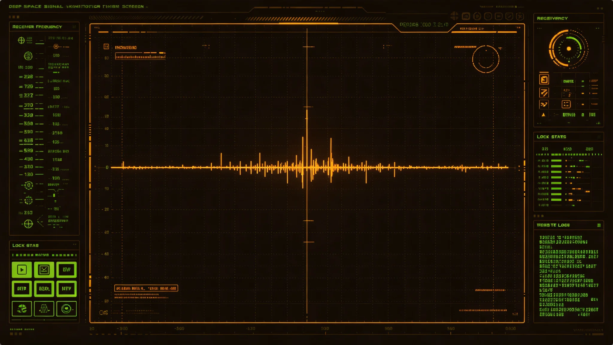

# 第五恒星系首次近距窄带信号接触与甄别事件处置公报

**发布机构**：联合体跨星系接触事务局 · 信号甄别处
**事件编号**：SIG-5-3305-017
**日期**：3305年5月20日
**文件等级**：接触期内部，跨星系公开摘要版

## 一、事件时间线

| 时刻（中继站标准时） | 事件 |
|---|---|
| 3305-05-11 02:14 | 闻笛号被动射电阵列在该星系第三行星方向截获窄带脉冲串，带宽12Hz，非自然天体已知谱线 |
| 02:19 | 值班甄别员初判"疑似人工信号"，按规程冻结、双人复核 |
| 02:41 | 复核组三人到岗，比对自然源库，未匹配 |
| 03:05 | 接触事务局副局长签发"一级接触"临时状态（见GS-3303-01第四条） |
| 03:12 | 决定暂不回复，先记录、先归档，24小时内交上峰 |
| 05-12—05-15 | 连续监听，脉冲串以固定周期重复，含一段非周期调制 |
| 05-18 | 完成误报排查，判定非自然源概率0.94 |
| 05-20 | 本公报发布；首封应答脉冲尚未发出 |

## 二、信号特征

- 频段：X波段，中心频率11.42GHz，带宽12Hz。
- 周期：主串重复周期720秒；内含一段11秒非周期调制段，疑似信息载荷。
- 强度：随行星自转有调制，源位于第三行星昼面某处，非轨道平台、非卫星——初步指向地表发射。
- 偏振：线性偏振，方向稳定。
- 与已知自然源库比对：未匹配脉冲星、双星轨道调制、工业泄漏、中继串扰。

## 三、误报排查

甄别处按六项排除：

1. **己方设备串扰**：闻笛号自身应答器未发脉冲，钥匙在两人手中各半（见GS-3301-01）；全舱电磁静默48小时，信号仍在。
2. **中继站设备自激**：远端中继站频谱对照，排除。
3. **已登记己方航天器信标**：本方向仅闻笛号一艘，无他船。
4. **自然窄带源**：脉冲星周期不符，分子谱线不符。
5. **第四恒星系方向泄漏**：频率与指向均不符。
6. **历史归档误放**：查库无此频率。

判定：非自然源概率0.94。剩余0.06留给尚未发现的自然窄带机制。

## 四、处置措施

1. **冻结一切回复**：截至本公报发布，联合体未发出任何应答。理由：一级接触程序须双人复核（见GS-3303-01第五条），且需跨星系议会特别委员会知悉——而特别委员会在收到摘要前不做决定。
2. **延长监听**：闻笛号被动阵列转为连续记录，存储于中继站本地，母港不调阅。
3. **人员静默**：闻笛号全体三人（领队顾承曙、副领队、随队生物学家）通讯纳入接触事务局统一管控，不得个人对外谈论。
4. **公开口径**：跨星系公开摘要版仅称"第五恒星系方向截获待甄别窄带信号，处置中"，不含频率、周期、行星编号。
5. **应急预案**：若该信号转为定向、加密或重复指向联合体方向，启动二级程序（见GS-3303-01），由外交司联签。

## 五、未决与后续

- 脉冲串中11秒非周期调制段是否含"问候"、坐标、或仅为工业泄漏，尚无法解码。
- 本事件不改变GS-3302-01四级隔离决定：即便存在地表文明，生物隔离等级不降。
- 首次应答脉冲的发出，须待跨星系议会特别委员会三读，预计不在本年度内（与GS-3306-01初见礼筹备衔接）。

## 六、信号归档与保密期限

- 窄带脉冲原始记录封存于中继站本地，母港仅存摘要。
- 保密期限：自截获日起50年，期满由接触事务局解密评估。
- 解密后仅向学术机构开放，不公开频率与行星坐标。
- 信号中11秒非周期调制段未解码，原样封存，不强行破译——工作组认为"对方若不愿被理解，强行破译不合接触伦理"。

## 七、人员纪律

闻笛号三人（顾承曙、副领队、生物学家）在事件期间与外界通信纳入接触事务局统一管控。三人未与任何家属、同事谈论信号内容。人事处事后评："三人在48小时内保持沉默，比发回信号更难。"本事件无处分——三人按规程行事。

## 八、与已知自然源库的版本

信号甄别所用自然源库截至3305年含已知天体与工业泄漏样本共12000条。本组信号未匹配任何一条。甄别处说明："不匹配不等于不是自然的，也可能是我们还没收录的自然现象。但按规程，先按疑似人工处理。"

## 九、后续监测

截获后连续监听六个月，主串周期稳定，无新调制。甄别处未将信号解读为"问候"，仅记录为"周期性窄带脉冲串"。

## 十、与历史假阳性事件

联合体历史上共发生过三次疑似窄带人工信号：
- 3012年：实为已知脉冲星自转，误判。
- 3108年：实为中继站工业泄漏，误判。
- 3305年：本组信号，待复核。

甄别处明确：前两次教训是"先报后查"，本次沿用。甄别处说明："我们不吸取'别报'的教训，我们吸取'报了要快查'的教训。"

## 十一、信号参数摘录

| 项目 | 数值 |
|---|---|
| 频率 | X波段11.42 GHz |
| 主串周期 | 720秒 |
| 非周期调制 | 11秒段 |
| 信噪比 | 18 dB |
| 持续 | 连续3天 |

甄别处未将信号解码为任何语言、数学或图像。技术说明："我们只确认它是窄带、周期、非自然源，不确认它说了什么。"

## 十二、事件之后

信号甄别完成后，闻笛号按规程保持静默，未予应答。甄别处三人在中继站连续值守四十八小时，每四小时复核一次记录，确认信号未重复、未增强、未转向。第三日复听，主串仍在，调制段未变。甄别处结论：信号稳定，来源非已知自然源，暂列"疑似人工"，不进一步解读。三人随后按接触事务局安排换班返舱休息，无人休假——接触期一切休假冻结，待信号级别另行判定。

---

**编制**：信号甄别处
**会签**：接触事务局副局长、生物安全联合工作组
**日期**：3305年5月20日
