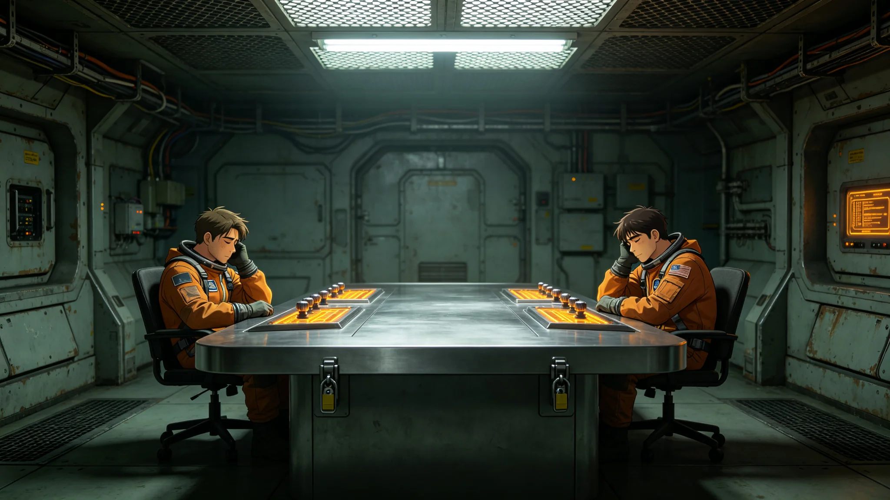

# 第五恒星系方向"初见礼"跨文明首次非接触信号仪式规程公报

**发布机构**：联合体跨星系接触事务局 · 文化接触处
**文件编号**：CUL-5-3306-021
**日期**：3306年11月8日
**文件等级**：跨星系公开

## 一、规程缘起

3305年5月，闻笛号被动阵列截获第五恒星系第三行星方向窄带信号（见GS-3305-01）。经跨星系议会特别委员会三读，决定于3306年内发出联合体首次应答。本次应答不派人员、不派载荷，仅以光帆脉冲信道发送一段最小信息量标定问候。文化接触处参照本库既有拓荒仪式体例（见GS-3105-01锚定夜、GS-3141-01点灯礼、GS-3121-01授名仪式），将本次应答命名为"初见礼"，并制定本规程。

## 二、仪式原则

1. **最小信息量**：问候内容限于数学基元（质数序列、氢谱线频率）与一个标定脉冲，不发送星图、人口、技术。
2. **非接触**：不释放任何物理载荷，不派遣人员。
3. **双人执钥**：应答器钥匙由闻笛号领队顾承曙与接触事务局远程值班官各执一半（见GS-3301-01），须同时到场方可解锁发射。
4. **对等静默**：发射后进入72小时静默期，不重复、不催促。
5. **不预设意义**：不对对方是否"听懂"、是否"友好"作任何公开判断。

## 三、仪式流程（中继站标准时）

| 时刻 | 动作 |
|---|---|
| T-120分钟 | 双人执钥人员到岗，核对身份，核验应答器封存铅封 |
| T-60分钟 | 全舱电磁静默，排除设备串扰（沿用GS-3305排查六项） |
| T-30分钟 | 第三行星昼面进入通信窗，光帆脉冲阵列预热 |
| T-10分钟 | 跨星系议会特别委员会远程见证席签到 |
| T-0 | 钥匙合璧，发射质数序列+氢谱线标定脉冲，持续40秒 |
| T+40秒 | 发射结束，封存记录，打印发射回执 |
| T+72小时 | 静默期结束，转入被动监听 |

## 四、发射内容

- 第一帧：质数序列2,3,5,7,11,13……共41项。
- 第二帧：氢原子21cm谱线频率标定。
- 第三帧：一个简单几何图形的脉冲编码（矩形）。
- 不含任何语言、任何名称、任何坐标。

文化接触处说明：选择质数与氢谱线，是因为任何掌握电磁技术的文明都应共享同一套数学与物理常数；不发"我们是谁"，是因为"是谁"在第一次接触中无法被对方理解，且可能造成误读。

## 五、观礼与公开

- 仪式不开放现场观礼，闻笛号仅3人，中继站仅执钥与值班官共5人。
- 跨星系议会特别委员会远程见证，不录像、不直播。
- 仪式结束后24小时，本公报向跨星系公开，但不公布发射的确切时刻与功率，以防非授权方向推算。
- 未邀请任何媒体、旅游团、研学配额（见GS-3142-01边疆研学游口径）——接触期不开放观礼经济。

## 六、后续

- 72小时静默期后，闻笛号被动阵列连续监听。
- 若对方应答，按二级程序（见GS-3303-01）由外交司联签下一步。
- 若不应答，不补发、不升级功率；初见礼仅此一次。
- 本规程作为第五恒星系方向文化接触首例，归档于文化接触处"初见礼"专卷，与后续GS-3343星旗共升大典分卷保存——前者为信号接触，后者为公民整合，不混同。

## 七、仪式成本与人员调配

| 项目 | 金额（星元） |
|---|---|
| 应答器校准与发射 | 12万 |
| 中继站5人值守加班 | 3.6万 |
| 跨星系议会见证席远程链路 | 2.8万 |
| 仪式记录与封存 | 1.2万 |
| 合计 | 19.6万 |

成本由接触事务局专项预算列支。文化接触处说明：初见礼不设纪念品、不发行邮票、不售观览权。仪式的全部产出，仅为一段40秒的脉冲与一份封存记录。

## 八、后续观察期

72小时静默期后，闻笛号被动阵列连续监听六个月。若对方应答，按二级程序另案；若不应答，不补发、不升级。文化接触处将"不应答"也视为一种答案——它意味着对方尚未准备好，联合体应尊重。

## 九、发射功率与方向

- 发射功率：仅够第三行星昼面接收，不向其他方向溢散。
- 发射时长：40秒，不重复。
- 应答器钥匙：领队与远程各执一半，合璧方可解锁。

## 十、失败的可能性

文化接触处明确：本仪式可能失败——对方可能收不到、可能不理解、可能不回应。文化接触处说明："我们发一束光，不是为了得到回答。是为了确认我们把门敲过了。"

## 十一、仪式失败的预案

若72小时静默期内对方无应答，文化接触处不补发、不升级、不改变发射参数。若对方以更强信号回应，按二级程序另案，本仪式结束。若对方以武器性手段回应（经技术甄别），闻笛号立即静默撤离，按战时程序处置。文化接触处说明："敲门的规矩，是敲三下。对方不开，我们就走。"

## 十二、仪式在场

仪式在场人员共五名：闻笛号三人（领队顾承曙、副领航员、生物学家），中继站远程观察员两名。无人旁观、无直播。文化接触处说明："这种事，人多了就轻了。"

## 十三、仪式之后

应答脉冲发出后，文化接触处将闻笛号转为被动监听，连续六个月。期间对方未以同频段同周期回应，亦未以任何已知频段回应。文化接触处未据此判断"对方未收到"或"对方不愿答"，仅记录"无应答"。闻笛号船员未被要求就仪式发表感想。接触事务局说明："我们敲了门，这是我们这边的全部动作。门那边怎样，不归我们猜。"

---

**编制**：文化接触处
**会签**：接触事务局、跨星系议会特别委员会见证席
**日期**：3306年11月8日
