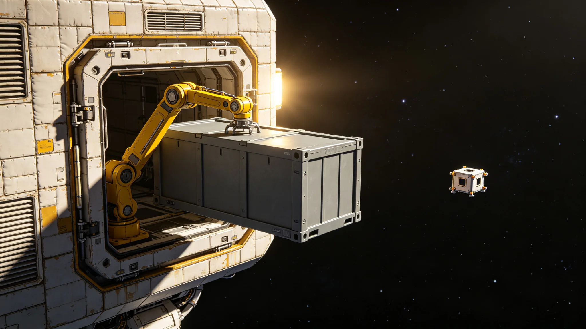

# 第五恒星系方向接触期轨道贸易准入与首批交换货物清单首年决算报告

**编制单位**：联合体跨星系接触事务局 · 贸易准入处
**报告编号**：EC-5-3307-031
**日期**：3307年7月15日
**文件等级**：跨星系公开

## 一、贸易准入背景

按GS-3303-01第四条，接触期贸易仅限轨道层面非接触交换，行星表面货物、活体、生物材料冻结。3306年初见礼（见GS-3306-01）后，对方未发"问候"，但在3307年初以一个固定周期的窄带脉冲序列确认收到标定信号。贸易准入处据此启动轨道层面"最小交换"——双方均不派遣人员，仅以密封货柜经中继站对接口交换。

## 二、交换原则

1. **非接触**：货柜由机械臂交接，双方人员不共舱。
2. **生物冻结**：不交换活体、食品、有机材料，仅限工业制成品与矿物标本。
3. **最小价值**：首批不涉及大宗资源，单批货值上限50万星元。
4. **双向对等**：双方各出一批，货柜重量、体积大致相当。
5. **透明可审**：所有货物清单双向公开，交接触事务局存档。

## 三、首批交换货物清单

**联合体出向（第一批，3307年3月）：**

| 货物 | 数量 | 用途说明 |
|---|---|---|
| 标准工业轴承组件 | 200套 | 展示联合体机械加工精度 |
| 纯金属标本片（铁、铜、铝） | 各50片 | 元素基准对照 |
| 标定电阻与电容样组 | 100组 | 电子元件精度对照 |
| 密封玻璃刻度块 | 10件 | 长度与温度基准 |
| 数学印刷件（质数表） | 无 | 仅图案，非文字 |

**对方向出向（第一批，3307年5月）：**

| 货物 | 联合体初步判读 |
|---|---|
| 未知几何构件（约2kg） | 非金属，含碳，疑为其本地工程材料样片 |
| 晶体块一组 | 折射率与熔点待测，疑为其半导体材料 |
| 标定件（矩形金属片） | 长度单位基准，与联合体米制偏差未知 |

所有对方向货物在中继站加压隔离舱内检测，不运回母港。

## 四、首年决算

| 项目 | 金额（星元） |
|---|---|
| 第一批出向货物成本 | 31.2万 |
| 中继站对接与隔离检测费 | 18.7万 |
| 贸易收入（对方以晶体样片估价折抵） | 44.0万（暂定） |
| 首年净支出 | 5.9万 |

贸易准入处说明：首年不以盈利为目的，净支出由接触事务局专项预算列支。对方向晶体样片的经济价值尚无法估价——其材料若为联合体所无，长期可能改变材料工业格局；若与已知材料等价，则首批交换仅具仪式意义。

## 五、风险与限制

1. 不交换技术图纸、不交换设备整机，仅交换"可被复制的最小单元"。
2. 不开放私营贸易，首批货物由接触事务局统一经办，不适用市场化招标（见GS-3114-01运力招标口径在本方向暂缓）。
3. 向第五恒星系方向的旅游、研学、移民配额仍冻结（见GS-3303-01、GS-3310-01）。
4. 货物清单不包含任何武器、能源、推进相关部件。

## 六、下一年度计划

- 第二批交换拟增加"双方时间基准对照件"（原子钟芯片），以确认双方时间计量差异。
- 对方若提出特定货物请求，须经贸易准入处+外交司联签，不接受单方报价。
- 首年决算报跨星系议会特别委员会备查。

## 七、关税与清算规则

- 接触期贸易不征关税，仅收中继站对接与检测费（成本价）。
- 货物估值双方互认，争议部分由贸易准入处委托第三方测绘。
- 结算以标定件实物交换为主，星元仅用于差额清算。
- 对方向晶体样片长期不商用——仅估值、不上市、不申请专利。

## 八、安全审查

每批交换货物双向安全审查：联合体出向货物不含武器、能源、推进部件；对方向货物在中继站隔离舱检测，确认不含生物危害后，方计入交换清单。生物安全联合工作组（见GS-3302-01）全程在场。贸易准入处说明："首年贸易不是为了赚钱，是为了建立一套双方都信任的交接流程。"

## 九、交换节奏

- 首批交换3307年3月出向，5月对方回向。
- 第二批拟3308年启动，加入时间基准对照件。
- 交换节奏由双方信号确认，不催。

## 十、不交换清单

明确不交换：活体、食品、有机材料、武器、能源、推进部件、技术图纸、设备整机、数字内容。贸易准入处说明："我们只交换'最小单元'，不交换'怎么造'。"

## 十一、货物溯源

- 出向货物来源：联合体各星区公益募集，非军工企业产品。
- 对方向货物：由对方交付方指定，联合体不指定。
- 货物清单双向公开，仅删除成分。
贸易准入处说明："第一批发出去的东西，不能是我们挑的好东西，得是大家凑的普通东西。第一印象要普通。"

## 十二、首年货物

| 批次 | 出向 | 回向 |
|---|---|---|
| 第一批 | 纯硅晶片、钛样片、标准砝码 | 透明晶体样片、未知矿物 |
| 第二批 | 时间基准对照件 | 同批回向 |

所有货物双方互检，安全事件零。贸易准入处说明："我们交换的不是商品，是样品。样品不上市。"

## 十三、首年总结

首年接触期轨道贸易完成两批交换，无安全事件，无货损，无技术泄露。贸易准入处认为首年目标已达成：建立了一套双方都认可的交接、检测、估值流程。第二年是否扩大品类，待生物安全工作组与文化接触处联合评估。贸易准入处强调："首年不求多，求稳。流程跑顺了，货多货少是以后的事。"

---

**编制**：贸易准入处
**会签**：接触事务局、生物安全联合工作组
**日期**：3307年7月15日
