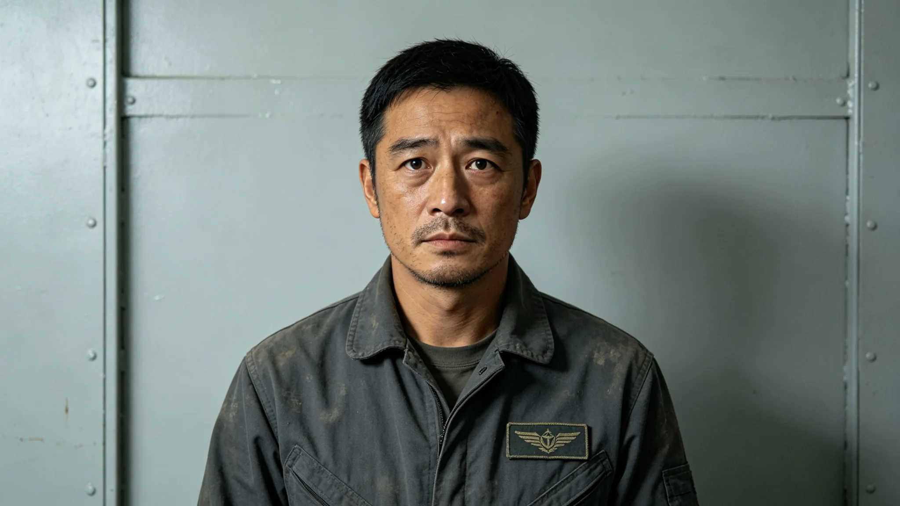

# 第五恒星系方向原生文明地表考古学家叶书文野外记录与体检处分档案

**归档单位**：联合体跨星系接触事务局 · 文化接触处档案卷
**档案袋编号**：CUL-5-ARCH-0003
**立卷日期**：3308年10月5日

## 一、岗位履历卡

| 项目 | 登记内容 |
|---|---|
| 姓名 | 叶书文 |
| 出生星区 | 三恒星系，火星地下城第三环 |
| 出生年 | 3255年 |
| 学历 | 联合体考古学硕士，方向为ARK-01原始船骸田野考古（师承GS-3158-01林承古课题组） |
| 既往岗位 | 比邻星b ARK船骸发掘队记录员四年；第四恒星系"新拓"前哨地下遗址调查两年 |
| 拟任岗位 | 第五恒星系方向随队考古学家（接触期密封载荷往返，不直接出舱） |
| 派遣条件 | 仅在加压观测舱内操作机械臂，不释放个人至行星表面 |

履历卡背面批注："该员无外交履历，无对外发言记录；申请本岗理由一栏手写：'想知道独立起源的生命会不会也留下垃圾堆。'"——此句被阅卷人用铅笔圈出，未删。

## 二、野外记录摘录（3308年，接触期三级程序）

按GS-3303-01，三级程序允许密封载荷往返，但人员不接触地表。叶书文在闻笛号尾部加压舱内操作远程机械臂，对行星一处疑似废弃结构做非侵入式扫描：

- 3308-04-12："目标为一组排列整齐的柱状构件，间距均匀，非自然侵蚀可成。未取样，仅成像。"
- 3308-04-19："构件表面有规则纹理，疑为刻痕或书写；分辨率不足以辨认。不建议放大扫描——可能扰动。"
- 3308-05-03："附近无热源、无移动目标。结构疑似废弃。记录：独立起源的文明也会留下废弃建筑，此条无特别之处。"
- 3308-06-21："机械臂取样申请被驳回（见处分）。"

记录全程无抒情、无推断，仅事实。

## 三、体检通报（3308年2月出队前）

- 骨密度：腰椎T值 -1.4，火星地下城第二代常见范围。
- 辐射剂量：累计0.38 Sv，未超阈。
- 心理评定：接触期考古专项——评定官关注"对独立起源文明的好奇是否会压过规程"。评定结论：中等好奇，规程意识强，可担密封操作岗。
- 前庭：合格。

## 四、处分记录（一次）

**3308-06-21**：叶书文在未获生物安全联合工作组批准前，拟指挥机械臂对柱状构件表面做一次刮取样。接触事务局值班官远程叫停。处分：

- 停操作权两周；
- 书面检查；
- 记入接触岗位适宜性评估。

检查原件中一句："我以为只是刮一微米。规程说得对，一微米也不该由我决定。"——与顾承曙3297年处分（见GS-3301-01）中"制度不清楚的地方先把自己这一格盯死"形成对照。文化接触处批注："该组人员对'边界'的兴趣持续偏高，已纳入观察。"

## 五、与既有考古传统的衔接

叶书文师承林承古课题组（见GS-3158-01），但本次对象与ARK船骸性质根本不同：ARK船骸是人类自己的遗迹，而此处是独立起源文明的遗迹。接触事务局明确要求：

1. 不修复、不拼装、不带走；
2. 仅成像、仅记录；
3. 一切解读留待四级程序（人员面对面接触）后；
4. 不公开任何图像细节，跨星系公开版仅称"疑似废弃结构"。

## 六、签名页

档案袋末页叶书文签收："已知悉：我不代表联合体作任何文化判断，不发表论文，不接受采访；我的工作是把图像存进中继站，不是解释图像。"签名日期3308年3月1日。

## 七、野外记录补遗

叶书文3308年4月19日记录原文后，有一行铅笔小字："构件表面纹理不像文字，更像某种自然结壳。我猜错了。"——他最初以为是刻痕，后经放大成像，判为风蚀结壳。此句被卷内保存，未删改。叶书文在处分检查中写道："我把风蚀当成了文字，因为我太想看到他们的痕迹。规程叫停是对的。"

## 八、后续安排

叶书文3308年10月返母港述职，此后不再赴第五恒星系方向——接触事务局认为他对该方向的个人兴趣过高，不宜再任随队。他转任三恒星系内部考古，教授"如何不把风蚀当文字"。人事处批注："这不是处分，是保护——保护他，也保护接触期的克制。"

## 九、与ARK船骸考古的区别

叶书文师承林承古（见GS-3158-01），但ARK船骸是人类自己的遗迹，可发掘、可拼装。本方向是独立起源，仅成像、不发掘。叶书文在述职中说："以前我挖的是我们自己的旧东西。这次我隔着窗户看别人家的旧东西。手不能伸进去。"

## 十、不发表论文

接触期不发表任何图像与解读。叶书文的野外记录仅存于中继站，母港不存副本。

## 十一、叶书文的野外记录格式

记录采用三联单：
- 第一联：现场成像与判读，随附扫描。
- 第二联：现场手书笔记，密封。
- 第三联：次日复核意见，另页。

三联装订成册，母港不存副本。叶书文在3308年4月19日那一页的三联单上，第二联与第三联结论不同——第二联初判"疑似刻痕"，第三联复核"风蚀结壳"。两版并存，不删改。

## 十二、处分执行

叶书文3308年7月返中继站，停职检查一个月，记轻微过失一次。他在检查中写道："规程叫停，是对的。我把风蚀当文字，是因为我太想看到他们。"此检查被卷内保存，未删改。

---

**立卷**：文化接触处档案卷
**复核**：与闻笛号机械臂操作日志（另卷）互锁
**日期**：3308年10月5日
