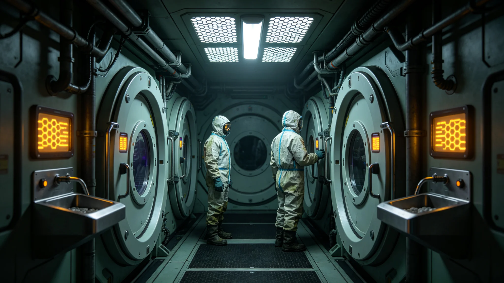

# 跨星系人口迁徙常态化伴生物种检疫与防控年度公报

**发布机构**：联合体跨星系检疫总署 · 生物安全处
**年度报告编号**：AQ-3309-004
**日期**：3309年4月22日
**文件等级**：跨星系公开

## 一、背景

自《跨星系迁徙权扩展与自由迁徙法案》生效（见GS-3166-01）以来，三恒星系与第四恒星系之间的人口流动已常态化：年度迁徙人次从3166年的约1.2万增至3309年的约8.7万。迁徙人口携带的衣物、行李、工程设备、实验材料，附带大量地球与三恒星系伴生物种（霉菌孢子、尘螨、肠道菌群、植物种子）。本公报为3308—3309年度检疫与防控总结。第五恒星系方向因四级隔离（见GS-3302-01）暂不开放人口迁徙，不在本公报统计内。

## 二、检疫设施与流程

| 环节 | 设施 | 处理 |
|---|---|---|
| 入境申报 | 迁徙中继站加压检疫通道 | 行李与随身物品X光+气溶胶采样 |
| 气闸隔离 | 三段式气闸，每人/每件通过约40分钟 | 表面臭氧吹扫 |
| 样本快检 | 实时PCR，约90分钟出结果 | 阳性即扣留 |
| 留置舱 | 24小时留置舱，对存疑样本 | 必要时延长至72小时 |
| 终末消毒 | 器械与行李终末辐照 | 不合格行李销毁或退回 |

## 三、年度数据

| 指标 | 3306年度 | 3308年度 |
|---|---|---|
| 迁徙人次 | 5.1万 | 8.7万 |
| 检疫通道通过 | 100% | 100% |
| 阳性检出率 | 0.41% | 0.58% |
| 其中：已知真菌 | 0.29% | 0.33% |
| 其中：违规种子/植物 | 0.08% | 0.14% |
| 其中：未知微生物 | 0.04% | 0.11% |
| 重大泄漏事件 | 0 | 1（见下） |

检出率随迁徙量上升而略升，但均未突破检疫通道拦截。

## 四、年度重大事件：一次舱内真菌超标滞港

3308年11月，一艘跨星系移民船在进入中继站检疫通道时，气闸内气溶胶采样检出一株新型青霉菌属，疑似来自火星地下温室长期未消杀的旧设备（与GS-3183-01火星地下温室真菌通报同类风险）。处置：

1. 全船人员在中继站留置舱延长至72小时；
2. 全船行李与设备终末辐照；
3. 船体气闸单独臭氧吹扫48小时；
4. 该株真菌样本送第四恒星系生物安全四级隔离室鉴定；
5. 无人员感染，无扩散。

详见另卷（与GS-3348-01微生物超标滞港处置口径互锁）。

## 五、防控措施升级

1. **迁徙前预检**：拟在出发站增设预检通道，减少入境端积压（呼应GS-3312-01中继站拥堵事件）。
2. **行李辐照标准化**：将行李终末辐照剂量统一为0.25 Mrad，各中继站校准。
3. **数据库扩容**：未知微生物样本建跨星系共享库，避免重复鉴定。
4. **第五恒星系方向**：因四级隔离，暂不适用本公报检疫流程，另按GS-3302-01密封消毒执行。

## 六、遗留

- 迁徙人次预计3310年破10万，检疫通道扩容已列入GS-3310-01迁徙配额修订。
- "未知微生物"检出率上升需持续观察，是否为迁徙人口携带的地球古菌在新环境中复现，尚需三年数据。
- 本公报不涉及人类健康检疫，仅及伴生物种。

## 七、年度经费与人员

| 项目 | 金额（星元） |
|---|---|
| 检疫通道运营 | 280万 |
| 第七代设备折旧 | 120万 |
| 留置舱与消毒耗材 | 95万 |
| 人员经费 | 210万 |
| 年度合计 | 705万 |

检疫为公共服务，不向迁徙者收费。成本由联合体跨星系公共预算列支。

## 八、公众沟通

检疫总署每季度发布一次跨星系公开检疫数据摘要（不含具体人员信息）。3308年真菌超标事件后，总署增设"检疫问答"专栏，回答迁徙者常见疑问。总署强调："检疫不是歧视，是对所有人负责——包括迁徙者自己。"

## 九、与第四恒星系检疫的区别

第四恒星系拓荒（见GS-3107-01）为人类先行抵达，检疫防污染；本方向迁徙常态化，检疫防人类伴生物种跨系扩散。总署说明："以前是防外星的，现在是防我们自己的。"

## 十、公众误解

3308年真菌超标事件后，部分迁徙者误以为检疫针对某星区。总署公开澄清：所有迁徙者同一标准，不因星区区别。

## 十一、跨系互认

检疫阳性结果在联合体内部互认：三恒星系检疫合格，第四恒星系认可；第四恒星系合格，三恒星系认可。第五恒星系方向冻结，不互认。

互认不降级：合格不等于免检。总署说明："互认是互相信，不是互相不管。"

## 十二、跨系互认细节

- 三恒星系检疫合格，第四恒星系认可，免二次检疫。
- 第四恒星系合格，三恒星系认可，免二次检疫。
- 第五恒星系方向冻结，不互认。
- 互认不降级：合格不等于免检，仍需通道抽检。

总署说明："互认是省一道手续，不是省一道检查。"

## 十三、年度总结

本年度跨星系迁徙检疫共放行旅客约八千二百人次，检出伴生生物超标七起，均在隔离舱处理，无扩散。第七代设备（见GS-3311-01）运行稳定，假阳率维持在千分之四以下。总署认为本季检疫体系已可支撑常态化迁徙，但仍不放松对第五恒星系方向的冻结。

## 十四、年度回顾

本年度检疫体系运行平稳，未发生泄漏。第七代设备部署到位，跨系互认执行顺畅。总署认为：迁徙常态化已从"临时措施"转为"常态制度"，检疫部门须按长期运行编制。明年预算维持不变，不增不减。

## 十五、结语

本批五十年，检疫体系从临时措施转为常态制度。总署认为：下一批五十年，重点在跨系互认深化与第五恒星系方向解冻后的准备。本公报不公开具体人员信息。

---

**编制**：生物安全处
**会签**：跨星系迁徙管理署、生态学派咨询组
**日期**：3309年4月22日
