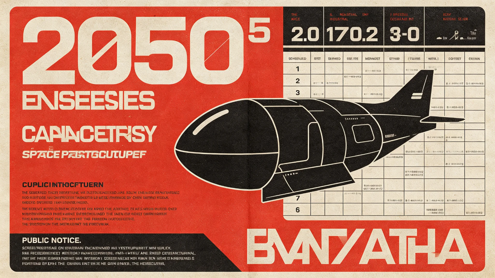

# 跨星系人口迁徙配额与落户制度修订公报

**发布机构**：联合体跨星系迁徙管理署 · 立法处
**文件编号**：MIG-3310-017
**日期**：3310年6月30日
**文件等级**：跨星系公开

## 一、修订背景

《跨星系迁徙权扩展与自由迁徙法案》生效以来（见GS-3166-01），三恒星系—第四恒星系年度迁徙人次已达8.7万（见GS-3309-01），检疫通道、轨道运力、目的地定居点容量均趋紧张。3308年11月发生移民船舱内真菌超标滞港事件（见GS-3309-01），3312年将出现中继站拥堵（见GS-3312-01）。迁徙管理署经立法处起草、跨星系议会社会委员会三读，对迁徙配额与落户制度作如下修订。

## 二、迁徙配额修订

| 路线 | 3309年实际 | 3311年配额 |
|---|---|---|
| 三恒星系→第四恒星系 | 3.1万 | 3.5万 |
| 第四恒星系→三恒星系 | 2.4万 | 2.6万 |
| 三恒星系内部（行星间） | 3.2万 | 3.4万 |
| 第五恒星系方向 | 0（冻结） | 0（继续冻结） |

配额按出发站预检容量与目的地定居点床位双约束核定，不按需求核定。第五恒星系方向因四级隔离（见GS-3302-01、GS-3303-01）继续冻结。

## 三、落户制度修订

1. **落户等待期**：迁徙人口到达目的地后，原7日临时居留延长至30日，期间完成完整检疫与背景核验，方可办理落户。
2. **户籍与选举权并轨**：沿用GS-3138-01口径，落户满一年取得当地户籍，满两年取得联合体选举权。
3. **家庭团聚**：跨星系家庭法（见GS-3189-01）项下的团聚迁徙，配额优先，不占普通配额。
4. **返程权**：迁徙人口在目的地落户前，保留返回原星区的返程配额，不得因迁徙而丧失原星区居留。
5. **第五恒星系方向**：该方向不开放迁徙；已报名候补队列按本修订重新排序，不退还登记费。

## 四、检疫与运力配套

- 出发站预检通道增设（呼应GS-3309-01升级措施），预计3311年投用。
- 中继站检疫通道扩容列入下年度预算，应对3312年拥堵预案（见GS-3312-01）。
- 迁徙船舱内空气循环与表面消杀标准更新，避免再次出现舱内真菌超标。

## 五、罚则与过渡

- 伪造预检报告、逃避检疫者，按《跨星系检疫法》从重，三年内禁迁。
- 本修订生效前已签发的迁徙许可，30日等待期新规溯及适用，但已在途者不追回。
- 本修订由迁徙管理署解释，每年6月30日向跨星系议会社会委员会报告。

## 六、与既有法衔接

本修订不改变《跨星系迁徙权扩展与自由迁徙法案》的权利基础，仅调整配额与程序；不改变《跨星系家庭法》（见GS-3189-01）、《跨星系教育课程标准》（见GS-3173-01）在迁徙子女入学上的适用。

## 七、申诉与复核

- 迁徙配额被拒或候补过久者，可向迁徙管理署申诉委员会申请复核。
- 复核只查程序是否合规，不重定配额。
- 因生物安全被拒入境者，申诉期间不得入境，可在目的地申请再次检测。
- 第五恒星系方向冻结名单不接受申诉——该方向无配额，无申诉对象。

## 八、年度评估

本修订每三年评估一次，由跨星系议会社会委员会主持。评估指标：迁徙人次、检疫阳性率、目的地定居点床位使用率、申诉率。评估结果公开。迁徙管理署说明："迁徙配额不是特权，是容量——我们能容纳多少人安全通过，就放多少人。"

## 九、目的地容量

| 目的地 | 现有床位 | 3311年新增 |
|---|---|---|
| 第四恒星系前哨 | 1.2万 | 0.3万 |
| 三恒星系内部 | 8万 | 0.5万 |

容量是硬约束，配额按容量核定。

## 十、不发加急

本修订不设加急通道。接触第五恒星系方向冻结不接受加急。迁徙管理署说明："想快的人，先去排队。"

## 十一、名额分配

| 类别 | 3311年名额 |
|---|---|
| 跨系家庭团聚 | 800 |
| 教育迁徙 | 600 |
| 就业迁徙 | 900 |
| 紧急安置 | 50 |
| 合计 | 2350 |

名额按类分配，类内按申请时间排序。第五恒星系方向不分配名额。

## 十二、3311年名额执行

| 类别 | 名额 | 实际 |
|---|---|---|
| 家庭团聚 | 800 | 780 |
| 教育迁徙 | 600 | 590 |
| 就业迁徙 | 900 | 920 |
| 紧急安置 | 50 | 40 |
| 合计 | 2350 | 2330 |

就业类略超，紧急类略缺。迁徙管理署说明："就业的人多，紧急的人少。这是好年。"

## 十三、制度衔接

本修订与跨系家庭团聚（见GS-3189-01）、教育迁徙（见GS-3173-01）、就业迁徙（见GS-3166-01）三类既有通道衔接，不另设新通道。第五恒星系方向不在本制度范围内——该方向按接触期条例冻结登记。迁徙管理署说明："本制度不是开新门，是把旧门的容量算清楚。"

## 十四、执行回顾

本年度名额执行二千三百三十人，就业类略超，紧急类略缺。迁徙管理署认为：就业需求旺盛，紧急需求稳定。明年名额微调，就业加五十，紧急加十。不设加急。

## 十五、结语

本修订执行一年，无申诉。迁徙管理署说明：配额是容量，不是特权。明年微调，不另设新通道。

本修订经跨星系议会社会委员会三读通过。迁徙管理署说明：配额不是特权，是容量。

迁徙管理署同时指出：本修订不设加急，不接受第五恒星系方向申请。配额按容量核定，不按申请先后。明年微调名额，不另开新通道。本修订自三百一十一年一月一日施行。

本修订不设加急。第五恒星系方向冻结。配额按容量核定。明年微调，不另开新通道。

---

**编制**：跨星系迁徙管理署立法处
**会签**：检疫总署、跨星系议会社会委员会
**日期**：3310年6月30日
