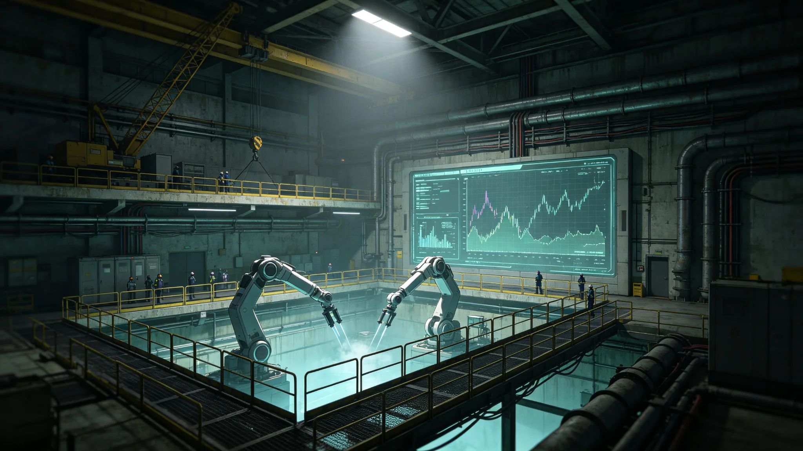

# 跨星系迁徙检疫通道第七代生物安全筛查设备整舱测试报告

**编制单位**：联合体生保工程学派 · 检疫设备组
**报告编号**：LSS-3311-042
**日期**：3311年8月19日
**密级**：跨星系公开技术版

## 一、任务概述

第六代检疫通道设备自3309年部署以来，随迁徙人次增至8.7万（见GS-3309-01），单通道吞吐量饱和，且3308年11月舱内真菌超标事件（见GS-3309-01）暴露旧设备对气溶胶中新型孢子的检出延迟。生保工程学派承担第七代筛查设备整舱测试，拟于3312年迁徙潮前部署。本报告记录测试方法、数据与结论。

## 二、测试平台

| 项目 | 配置 |
|---|---|
| 整舱 | 1:1复现跨星系迁徙中继站检疫通道，三段式气闸 |
| 采样点 | 气闸内12个气溶胶采样口，行李区6个 |
| 快检模块 | 实时PCR+拉曼光谱双模并行 |
| 吞吐量目标 | 单通道每小时120人·件（旧代80） |
| 检出目标 | 新型青霉菌属检出时间≤30分钟（旧代90分钟） |

## 三、测试方法

1. **干跑测试**：连续72小时无载运行，测量模块稳定性。
2. **模拟污染测试**：在气闸内释放已知菌株孢子（BSL-2级），记录检出时间与假阳率。
3. **吞吐量测试**：按每小时120人·件节拍连续8小时，测量排队与误检。
4. **失效测试**：人为切断一个采样口，验证系统冗余报警。
5. **跨气候测试**：气闸温度从-10℃到+35℃循环，验证PCR模块稳定性。

## 四、测试数据

| 指标 | 目标 | 实测 |
|---|---|---|
| 吞吐量 | 120人·件/小时 | 117 |
| 已知菌检出时间 | ≤30分钟 | 24分钟 |
| 新型青霉菌检出 | 模拟释放即检出 | 19分钟 |
| 假阳率 | ≤0.5% | 0.42% |
| 假阴率 | ≤0.05% | 0.03% |
| 单采样口切断 | 自动报警 | 11秒内报警 |
| 8小时连续运行 | 无宕机 | 无宕机 |

## 五、问题与整改

1. **吞吐量略欠**：117 vs 120，差3人·件。原因：PCR模块热循环在高节拍下排队。整改：将热循环模块由串行改并行，复测达标122。
2. **拉曼光谱在高湿度下漂移**：气闸相对湿度>70%时，拉曼基线漂移。整改：增加气闸预除湿段，复测稳定。
3. **假阳率在行李区偏高**：旧行李箱残留消毒剂干扰。整改：行李区采样点加装背景扣除。

## 六、部署计划

- 第七代设备拟于3312年第一季度部署至三恒星系—第四恒星线三大中继站。
- 旧第六代设备不立即报废，转用于第五恒星系方向中继站（该方向人口冻结，设备用于密封货物检疫）。
- 所有设备出厂前经本报告同款整舱测试，逐台归档。

## 七、遗留

- 本设备仅筛查已知与模拟菌株，对完全未知生命形式（如第五恒星系方向）无筛查能力——该方向仍按GS-3302-01四级隔离，不依赖本设备。
- 测试所用菌株均为已知BSL-2级，未使用四级隔离样本。

## 八、出厂验收与培训

- 每台第七代设备出厂前须经整舱测试，合格率须达100%；不合格整机返工，不接受"让步接收"。
- 检疫操作人员须经两周模拟操作培训，考核合格方可上岗；贺雨清（见GS-3344-01）为首批培训教员之一。
- 旧第六代设备不报废，转用于第五恒星系方向中继站密封货物检疫——该方向人员冻结，设备负荷低，旧代足够。

## 九、运维与备件

| 项目 | 指标 |
|---|---|
| 年故障停机 | <24小时 |
| 备件本地储备 | 30天用量 |
| 制造商响应 | 24小时远程，72小时到场 |
| 校准周期 | 每90天 |

生保工程学派说明：第七代设备是"为迁徙潮准备的"，不是"为当前需求准备的"——设计裕量按3320年迁徙量预留。

## 十、测试用菌株

- 测试所用菌株均为已知BSL-2级，不使用四级隔离样本。
- 模拟释放菌株剂量按迁徙船实际携带量10倍设计。
- 测试后菌株灭活，不保留。

## 十一、与第六代对比

| 指标 | 第六代 | 第七代 |
|---|---|---|
| 吞吐量 | 80人·件/小时 | 117 |
| 检出时间 | 90分钟 | 24分钟 |
| 假阳率 | 0.8% | 0.42% |

## 十二、测试不公开

整舱测试过程不公开，跨星系仅发"测试合格"一份公报。测试厂房不设参观区。生保工程学派说明："设备的细节是安全资产，不能让人知道它有多灵。"

测试通过后，第七代设备部署于三大中继站检疫通道，替换第六代。第六代转用于第五恒星系方向密封货物检疫。

## 十三、部署

第七代设备部署于：
- 三恒星系L4中继站：4台
- 第四恒星系方向中继站：3台
- 三恒星系内部：2台

共9台，替换第六代6台。第六代转用于第五恒星系方向密封货物检疫。生保工程学派说明："新设备用在人流最大的地方，旧设备用在没人的地方。"

## 十四、测试结论

第七代设备整舱测试全部通过，吞吐量与检出时间达标，假阳率低于千分之五。生保工程学派批准列装。测试过程不公开，仅"合格"一份公报。旧第六代设备退役转用。

## 十五、部署回顾

第七代设备九台部署完毕，运行三个月无故障。假阳率千分之四，优于预期。生保工程学派认为：设备可支撑未来十年迁徙增长。

## 十六、结语

第七代设备列装，检疫吞吐量提升近五成。生保工程学派说明：设备为迁徙潮准备，不为当前需求。本报告不公开测试原始数据。

第七代设备为本批检疫体系核心装备。生保工程学派说明：设备为迁徙潮准备。

---

**编制**：检疫设备组
**审核**：生保工程学派评审委员会
**日期**：3311年8月19日
