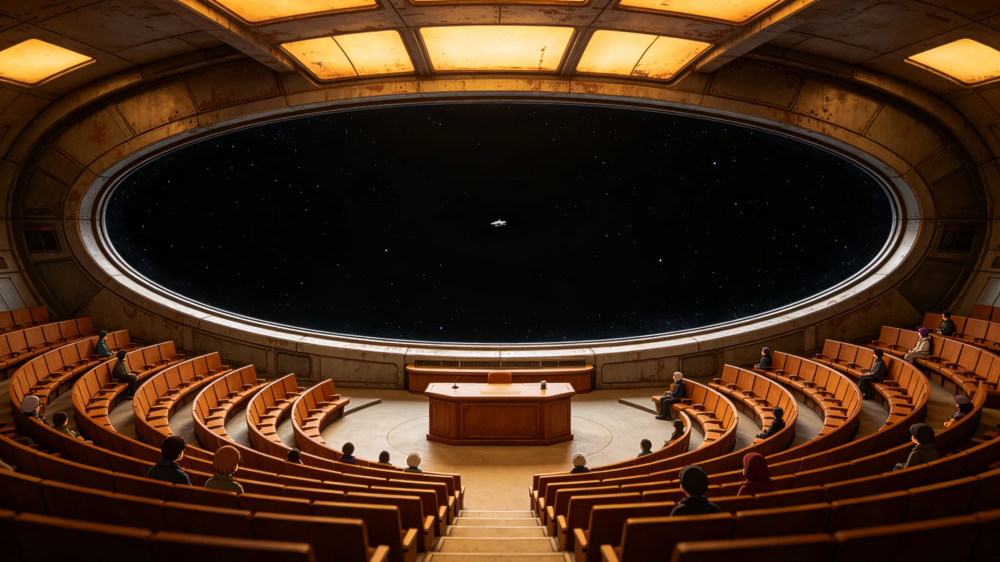

# 跨星系迁徙人口"落地换籍"新公民颁证仪式规程公报

**发布机构**：联合体跨星系迁徙管理署 · 公民事务处
**文件编号**：CIT-3313-009
**日期**：3313年5月20日
**文件等级**：跨星系公开

## 一、规程缘起

跨星系迁徙常态化后（见GS-3166-01、GS-3310-01），年度迁徙人口已近9万。新到达者在目的地完成30日检疫与核验、办理落户后，如何在仪式层面确认"新公民"身份，此前无统一规程——各星区自行其是，有的仅发一纸户籍卡，有的举办集体仪式。公民事务处参照本库拓荒仪式体例（见GS-3121-01授名、GS-3148-01功勋墙、GS-3141-01点灯礼），制定本"落地换籍"颁证仪式规程。

## 二、仪式原则

1. **非宗教**：不设祈祷、不设誓言效忠，仅为行政确认。
2. **集体而非个人**：以季度为批次，同一目的地同一季度落户者集体颁证，不办个人专场。
3. **不中断生产**：仪式时长不超过90分钟，不占用工作日。
4. **自愿参加**：颁证为行政行为，仪式参加与否自愿，不参加者户籍效力不变。
5. **原乡纪念**：仪式中保留对原星区的简短致谢，不要求"告别原乡"。

## 三、仪式流程

| 环节 | 时长 | 内容 |
|---|---|---|
| 签到 | 15分钟 | 新公民凭户籍卡入场 |
| 点名 | 10分钟 | 按目的地新户籍登记点名，不宣读原星区 |
| 颁证 | 30分钟 | 逐人领取新户籍卡与公民编号卡 |
| 原乡致谢 | 15分钟 | 集体默立30秒，纪念原星区与迁徙途中逝去的先人 |
| 须知宣读 | 10分钟 | 宣读选举权、纳税、检疫义务（见GS-3138-01、GS-3309-01） |
| 散场 | 10分钟 | 不设宴会、不设合影墙 |

## 四、颁证件

- 新户籍卡一张（目的地星区）。
- 公民编号卡一张（联合体统一编号，终身不变）。
- 一张《迁徙须知》折页，含检疫通道、选举权、返程权（见GS-3310-01）要点。
- 不发奖章、不发证书框——户籍卡即凭证。

## 五、不做什么

- 不要求新公民宣誓"效忠联合体"——联合体无效忠誓词。
- 不设"融入考核"——语言、文化适应为自愿，不考核。
- 不公开新公民姓名——仪式仅本人与直系家属可入场。
- 不邀请媒体——本仪式非宣传素材。

## 六、与既有仪式的分卷

- 本仪式为"公民身份"确认，与GS-3306初见礼（跨文明信号接触）、GS-3343星旗共升大典（星系并入）分卷保存。
- 第五恒星系方向因冻结迁徙（见GS-3303-01、GS-3310-01），暂无本仪式适用对象。

## 七、颁证成本

| 项目 | 单次 |
|---|---|
| 场地与人员 | 1.2万星元 |
| 证件印制 | 0.3万 |
| 年度（按4批次） | 6.0万 |

成本由联合体公民事务专项预算列支，不向新公民收费。

## 八、不设回访

颁证后不回访、不考核"融入度"。公民事务处说明："一个人换到哪个星区，是他自己的事。我们发证，不查他过得好不好——那是他自己的生活。"新公民若需帮助，可向目的地社区申请，不属本仪式范围。

## 九、与拓荒仪式的区别

新公民颁证（见GS-3121-01授名仪式）为拓荒时代的命名，本仪式为迁徙时代的行政确认。公民事务处说明："以前是给新地方起名，现在是给新来的人发证。名字是地方的，证是人的。"

## 十、不办集体合影

仪式散场后不设合影墙、不发合影。公民事务处说明："来的人记住自己什么时候来的就行，不需要一张大照片。"

## 十一、颁证不设席

仪式不设主礼人座位，不设主席台。公民事务处官员坐在长桌一端，与新公民并排。官员不致辞，仅念规程第七条。念毕，新公民领证，散场。

公民事务处说明："发证不是典礼，是手续。坐成一排，像什么样子。"

## 十二、颁证不设席细节

- 长桌一端：公民事务处官员。
- 长桌对面：新公民（每次不超过20人）。
- 官员不致辞，仅念规程第七条。
- 念毕，新公民领证，散场。
- 不合影、不合影墙、不纪念品。

公民事务处说明："这是手续，不是典礼。"

## 十三、颁证规模

本年度共颁发新公民证件约二千三百三十份，分四批次。每批次不超过二十人。仪式不设主礼台，官员与新公民并坐长桌。公民事务处说明："发证是手续，不是典礼。坐成一排，像什么样子。"

## 十四、颁证回顾

本年度颁证二千三百三十份，无差错，无投诉。公民事务处认为：颁证流程已稳定，不须再改。明年继续四批次，每批不超二十人。

## 十五、结语

颁证仪式稳定。公民事务处不设回访。本批五十年，新公民约二十万人换籍。

颁证仪式不设回访。公民事务处说明：发证是手续，不是典礼。

公民事务处同时明确：颁证后不回访、不考核融入度。新公民若需帮助，可向目的地社区申请。本仪式每年四批次，每批不超二十人。

本仪式不设主礼台。官员与新公民并坐长桌。不合影。

公民事务处同时明确：颁证后不回访。本仪式每年四批次。

公民事务处同时说明：坐成一排，像什么样子。

公民事务处同时说明：来的人记住自己什么时候来的就行，不需要一张大照片。

公民事务处同时说明：来的人记住自己什么时候来的就行。

公民事务处同时说明：发证不是典礼，是手续。

公民事务处同时说明：来的人记住自己什么时候来的就行，不需要一张大照片。

---

**编制**：公民事务处
**会签**：迁徙管理署、跨星系议会社会委员会
**日期**：3313年5月20日
