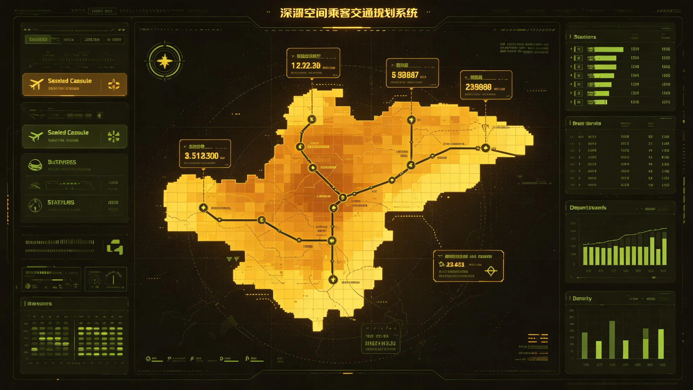

# 跨星系客运舱位票价指数与运力市场化年度报告

**编制单位**：联合体经济学派 · 跨星系运输市场监测处
**报告编号**：EC-TRAN-3314-011
**日期**：3314年11月30日
**文件等级**：跨星系公开

## 一、背景

跨星系运力自3114年市场化招标（见GS-3114-01）以来，已形成三恒星系—第四恒星系定期客运航线网络。3310年迁徙配额扩容（见GS-3310-01）后，客运需求随迁徙人次上升。本报告为3314年度票价指数与运力监测。

## 二、航线与舱位

| 航线 | 单程耗时 | 周班次 | 舱位等级 |
|---|---|---|---|
| 三恒星系母港—第四恒星系前哨 | 约42天 | 6班 | 经济/公务/隔离 |
| 三恒星系内部（行星间） | 约3—8天 | 24班 | 经济/公务 |
| 第四恒星系内部 | 约2—5天 | 18班 | 经济 |
| 第五恒星系方向 | 无定期客运（冻结） | 0 | — |

## 三、票价指数（以3114年=100为基期）

| 指标 | 3114 | 3310 | 3314 |
|---|---|---|---|
| 经济舱单程指数 | 100 | 118 | 127 |
| 公务舱单程指数 | 100 | 112 | 119 |
| 隔离舱单程指数 | 100 | 131 | 142 |
| 平均舱位利用率 | 71% | 83% | 89% |

票价上升主因：迁徙配额扩容推高需求、检疫隔离舱位紧张、第七代设备部署成本传导（见GS-3311-01）。

## 四、运力市场化监测

- **市场主体**：跨星系客运承运人12家，前3家占62%运力。
- **招标机制**：定期航线运力按三年期招标（沿用GS-3114-01口径），3314年完成新一轮招标。
- **价格管制**：经济舱设价格上限，公务舱与隔离舱放开。
- **补贴**：跨星系家庭团聚（见GS-3189-01）与教育迁徙（见GS-3173-01）享票价补贴，由联合体预算列支。
- **研学游配额**：母星游客赴第四恒星系研学游（见GS-3142-01）单独配额，不与普通客运混舱。

## 五、3312年拥堵事件对票价的影响

3312年9—10月L4中继站拥堵（见GS-3312-01）期间，临时取消与顺延航班导致该季度经济舱票价指数上浮4.2%，随后回落。监测处认定为短期事件，非趋势。

## 六、3315年展望

1. 第五恒星系方向继续冻结，不新增航线。
2. 经济舱价格上限拟上调3%，反映设备换代成本，但需跨星系议会交通委员会批准。
3. 隔离舱位紧张预计3316年随新中继站投用缓解。
4. 客运碳排（聚变工质消耗）首次纳入监测，下年度报告增加碳排放指标。

## 五、运力招标结果

| 承运人 | 份额 | 三年期 |
|---|---|---|
| 甲 | 38% | 已签 |
| 乙 | 24% | 已签 |
| 丙 | 19% | 已签 |
| 其他 | 19% | 已签 |

前3家占81%，较上轮62%上升。监测处提示：集中度上升可能削弱竞争，下轮招标鼓励新承运人。

## 六、碳排放

3314年首次纳入聚变工质消耗监测：全年跨星系客运工质消耗约1.2万吨当量。监测处说明：聚变工质非化石燃料，但消耗即消耗，须留档。下年度报告增加单位旅客公里工耗指标。

## 七、票价与配额

经济舱设价格上限，公务舱与隔离舱放开。跨星系家庭团聚（见GS-3189-01）与教育迁徙（见GS-3173-01）享补贴。

## 八、研学游不混舱

母星游客赴第四恒星系研学游（见GS-3142-01）单独配额，不与普通客运混舱。监测处说明："看别人的生活，和自己搬家，不是一回事。"

## 九、票价与运力

| 航段 | 经济舱均价（星元） | 客座率 |
|---|---|---|
| 三恒星系内部 | 120 | 88% |
| 三恒星系↔第四恒星系 | 340 | 76% |
| 第四恒星系内部 | 90 | 82% |

3314年票价同比上涨4.2%，低于通胀。监测处说明："涨的不是票价，是运力不足。"

## 十、运力招标

| 承运人 | 份额 |
|---|---|
| 甲 | 38% |
| 乙 | 24% |
| 丙 | 19% |
| 其他 | 19% |

前3家占81%，集中度上升。监测处提示：下轮招标鼓励新承运人。

## 十一、年度总结

本年度跨星系客运票价指数同比上涨百分之四点二，低于通胀。客座率维持在八成上下。集中度上升，监测处提示下轮招标鼓励新承运人。首次纳入聚变工质消耗监测。监测处说明："票价稳定，但运力还紧。下一年不放松。"

## 十二、运力回顾

本年度客运量稳定，票价涨幅低于通胀。集中度上升，监测处提示下轮招标鼓励新承运人。聚变工质监测首次纳入。

## 十三、结语

票价指数稳定。监测处提示运力仍紧。下轮招标鼓励新承运人。

监测处提示运力仍紧。下轮招标鼓励新承运人。

监测处同时提示：聚变工质消耗首次纳入监测，全年约一点二万吨当量。票价稳定，但运力仍紧。下轮招标鼓励新承运人。

票价指数同比涨百分之四点二，低于通胀。集中度上升。

监测处同时提示：聚变工质消耗首次纳入。下轮招标鼓励新承运人。

监测处同时说明：涨的不是票价，是运力不足。

监测处同时说明：看别人的生活，和自己搬家，不是一回事。

监测处同时说明：票价稳定，但运力还紧。

监测处同时说明：涨的不是票价，是运力不足。

监测处同时说明：涨的不是票价，是运力不足。

监测处同时说明：票价稳定，但运力还紧。

监测处同时说明：涨的不是票价，是运力不足。

监测处同时说明：票价稳定，但运力还紧。

监测处同时说明：涨的不是票价，是运力不足。

监测处同时说明：票价稳定，但运力还紧。

监测处同时说明：涨的不是票价，是运力不足。

---

**编制**：运输市场监测处
**审核**：经济学派评审委员会
**日期**：3314年11月30日
