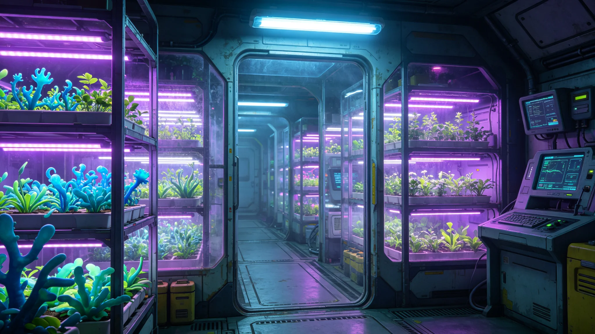

# 第五恒星系方向原生疑似物种轨道易地保育基地建成公报

**发布机构**：联合体生态学派 · 跨星系保育处
**文件编号**：ECO-5-3316-006
**日期**：3316年3月18日
**文件等级**：跨星系公开摘要版

## 一、背景

第五恒星系第三行星经初步普查为疑似生物圈（见GS-3302-01、GS-3304-01），存在独立光合色素体系。接触级别升至三级后（见GS-3303-01、GS-3308-01），允许密封载荷往返。生态学派担心：若未来接触升级或该行星自身环境变化，独立起源的原生生命可能因联合体活动而受威胁。经跨星系议会环境委员会批准，在第五恒星系方向中继站建设轨道易地保育基地，封存密封样本。

## 二、基地设计

| 项目 | 配置 |
|---|---|
| 位置 | 第五恒星系方向中继站附属加压舱，不靠近第三行星 |
| 密封等级 | 四级隔离（BSL-4口径，见GS-3107-01） |
| 舱段 | 3个独立加压温室舱，各120立方米 |
| 样本来源 | 轨道探测器非侵入式采集的气溶胶与低空气溶胶样本 |
| 人员 | 不常驻，由中继站值班员每周巡检一次 |
| 人员进出 | 三段式气闸，全程密封，不与母港连通 |

## 三、样本

- 三个温室舱分别培养：A舱——光合微生物（疑似）；B舱——气溶胶中有机聚集体；C舱——空白对照。
- 样本仅为数毫克级气溶胶采集物，未提取完整活体，未做表面采样。
- 不种植、不繁殖、不杂交——仅维持最小存活，观察其在地球人工条件下是否存活。
- 若A舱样本在地球人工光、水、气下死亡，记录死亡原因，不强行挽救。

## 四、保育伦理

1. **不驯化**：不将第五恒星系物种用于农业、医药、工业。
2. **不公开**：样本图像与数据接触期内部，不发表论文，不建"动物园"。
3. **不混合**：与三恒星系既有物种驯化基因库（见GS-3186-01）物理隔离，不共享舱段。
4. **可销毁**：若生物安全风险上升，基地有权在不通知母港的情况下焚毁样本——此条款写入基地规程。

## 五、与第四恒星系先例的区别

第四恒星系拓荒（见GS-3101-01起）为人类先行抵达、无原生文明，其生物隔离（见GS-3107-01）仅防污染；第五恒星系方向存在疑似独立生物圈与疑似文明，保育基地同时承担"不伤害"与"不接触"双重责任。

## 六、遗留

- 样本能否在地球人工条件下存活，需两个行星季观测。
- 若证实该行星为独立生命起源，保育基地升格为正式"跨星系生命方舟"，预算另列。
- 本基地与GS-3341-01原生微生物跨系研究伦理卷互锁。

## 五、伦理审查记录

轨道保育基地建成前，伦理委员会三次审议：

| 审议次 | 意见 |
|---|---|
| 第一次 | 建议扩大样本量 |
| 第二次 | 要求增加"可销毁"条款 |
| 第三次 | 通过，附条件：不公开图像 |

伦理委员会批注："我们养这些样本，不是为了研究，是为了万一它们的母星出了事，我们手里还有一点。"

## 六、运行首年观察

- A舱光合微生物在地球人工光下存活6个月后活性下降，未强行挽救。
- B舱有机聚集体无变化。
- C舱空白对照无污染。
基地按"不挽救"原则记录，不追加光源或营养。

## 七、不公开图像

保育基地运行图像不公开。跨星系公开仅存"基地已建成"一份文字公报。保育处说明："这不是动物园，不接待参观。"

## 八、与地球基因库的区别

地球驯化基因库（见GS-3186-01）保存的是人类自己养的物种；本基地保存的是疑似独立起源的生命。保育处说明："前者是我们养的，后者是我们借的。借的东西，不能养熟了算自己的。"

## 九、不公开样本

保育基地样本不公开、不参观、不发表。跨星系公开仅"基地已建成"一份公报。保育处说明："这不是公园。"

基地运行三年，A舱光合微生物活性持续下降，B舱无变化，C舱无污染。保育处未追加干预，按"不挽救"原则记录。

## 十、伦理审查三次

| 次 | 意见 |
|---|---|
| 一 | 扩大样本量 |
| 二 | 增加可销毁条款 |
| 三 | 通过，附不公开图像 |

伦理委员会批注："我们养这些，不是为了研究，是为了万一母星出事，我们手里还有一点。"

## 十一、运行首年

基地运行三年，A舱光合微生物活性持续下降，B舱有机聚集体无变化，C舱空白对照无污染。保育处未追加光源或营养，按"不挽救"原则记录。伦理委员会年度复评：维持封存，不扩大样本。

## 十二、保育回顾

基地运行三年，样本无异常。伦理委员会年度复评维持封存。保育处不公开图像，不接待参观。

## 十三、结语

保育基地封存运行。不挽救，不公开。伦理委员会年度复评。

保育基地封存运行。伦理委员会年度复评。

保育处同时明确：样本不公开图像，不接待参观。伦理委员会年度复评，维持封存。A舱微生物活性下降，不挽救。

基地运行三年。A舱下降，B舱无变化，C舱无污染。不挽救。

保育处同时说明：这不是公园，不接待参观。

保育处同时说明：借的东西，不能养熟了算自己的。

保育处同时说明：这不是动物园，不接待参观。

保育处同时说明：这不是公园。

保育处同时说明：借的东西，不能养熟了算自己的。

---

**编制**：跨星系保育处
**会签**：生态学派、生物安全联合工作组
**日期**：3316年3月18日
