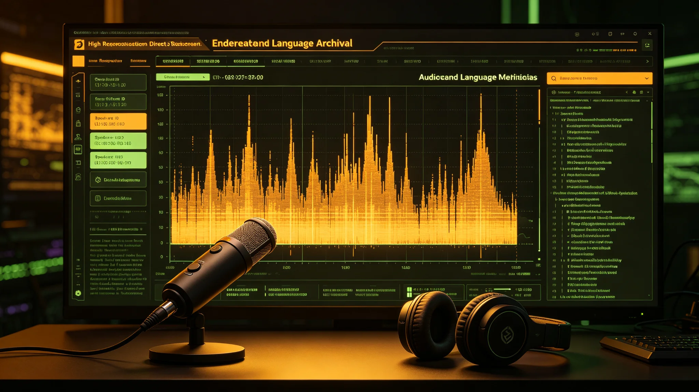

# 濒危语言声学归档与语音复原技术规范报告

**编制单位**：联合体通信工程学派 · 文化存档组
**报告编号**：COM-ARCH-3318-019
**日期**：3318年4月25日
**密级**：跨星系公开技术版

## 一、任务概述

按《文明多样性保护名录与濒危语言登记制度》（见GS-3317-01），濒危语言须声学归档。本报告记录归档与语音复原的技术规范，服务于跨星系文化遗产数字化存档系统（见GS-3190-01）。

## 二、录音规范

| 项目 | 规范 |
|---|---|
| 录音对象 | 自愿母语使用者，单次不超过90分钟 |
| 录音设备 | 头戴式电容麦+环境麦双轨，48kHz/24bit |
| 录音内容 | 母语使用者自由讲述，不提供讲稿 |
| 知情同意 | 录音前签署同意书，可随时撤回 |
| 隐私 | 不录面部，仅录声；声纹与个人身份分离存储 |

## 三、归档格式

- 原始WAV双轨存档于跨星系文化遗产数字化存档系统（见GS-3190-01），母港与第四恒星系双备份。
- 元数据：语种、录音日期、录音地点（星区级，不精确到居所）、母语使用者年龄段。
- 不存储母语使用者真实姓名，仅存编号。
- 归档期：永久。

## 四、语音复原技术

部分濒危方言已无母语使用者，仅有历史录音（磁带、早期数字）。复原流程：

1. **降噪**：历史磁带底噪去除，保留原始动态。
2. **声纹分离**：从多人录音中分离单人。
3. **音素标注**：语言学工作者人工标注音素，不自动。
4. **不合成**：不生成"母语使用者说话"的合成语音——复原仅为存档，不用于表演。

## 五、伦理约束

1. **不公开母语使用者身份**：声纹与身份分离，即使技术上可反推，规程禁止。
2. **不商业使用**：濒危语言录音不用于语音合成产品、不用于广告、不用于训练公开模型。
3. **不强制"复活"**：若某语言已无母语使用者，归档不等于复活；不人为制造"使用者"。
4. **第五恒星系方向**：待接触类（见GS-3317-01）无任何录音，不适用本技术。

## 六、与既有系统衔接

- 声学归档与跨星系文化遗产数字化存档系统（见GS-3190-01）同一存储层，不另建。
- 语音复原不涉及跨星系光帆通信（见GS-3127-01），仅本地处理。
- 录音数据不通过公开网络传输，仅经加密物理介质在星区间转运。

## 六、复原能力边界

语音复原仅做降噪与分离，不做"合成说话人"。技术规范明确：复原后的语音不用于公开演示，仅存于档案。复原组说明："复原的目的是留住声音，不是再造一个说话的人。"

## 七、存储与备份

- 原始WAV存于跨星系文化遗产数字化存档系统（见GS-3190-01）。
- 母港与第四恒星系双备份，备份介质每年校验一次。
- 声纹与身份分离存储，访问须双人授权。

## 八、录音不公开

- 录音母版不公开，仅学术研究申请。
- 声纹与身份分离存储。
- 不用于语音合成产品。

## 九、技术边界

复原仅降噪与分离，不合成说话人。技术规范明确："我们不造一个会说话的人，我们只是留住已经说过的话。"

## 十、归档不公开

录音母版存于跨星系文化遗产数字化存档系统，双备份。学术研究须经委员会审批，不公开原始录音。技术规范明确："复原后的声音只存档，不播放。"

## 十一、技术参数

| 项目 | 指标 |
|---|---|
| 采样率 | 96kHz |
| 位深 | 24bit |
| 降噪 | 仅分离，不合成 |
| 存储 | WAV无损 |

技术规范明确：不合成说话人，不用于语音产品。

## 十二、归档完成

首批濒危语言录音共二十三段，全部完成降噪与分离，存于跨星系文化遗产数字化存档系统。母港与第四恒星系双备份。技术规范明确：不合成说话人，不用于语音产品。

## 十三、归档回顾

首批二十三段录音全部归档。双备份。不合成说话人，不用于产品。

## 十四、结语

首批二十三段录音归档。双备份。不合成说话人。

首批二十三段录音归档。双备份。

技术规范同时明确：不合成说话人，不用于语音产品。录音母版双备份，声纹与身份分离存储。

首批二十三段录音归档。双备份。不合成说话人。

技术规范同时明确：复原后的声音只存档，不播放。

技术规范同时说明：我们不造一个会说话的人，我们只是留住已经说过的话。

技术规范同时说明：复原后的语音不用于公开演示，仅存于档案。

技术规范同时说明：不合成说话人。

技术规范同时说明：不合成说话人。

技术规范同时说明：不合成说话人。

技术规范同时说明：不合成说话人。

---

**编制**：文化存档组
**审核**：通信工程学派评审委员会
**日期**：3318年4月25日
