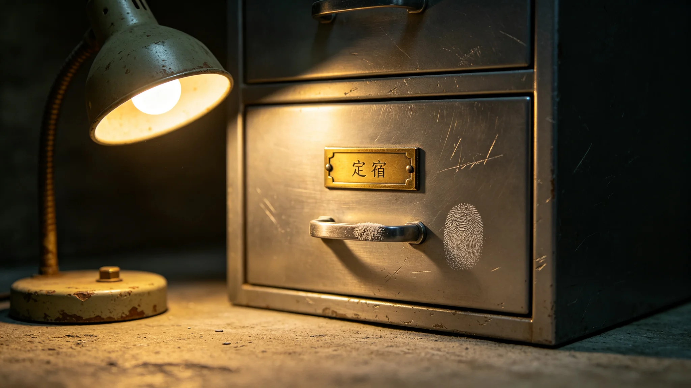

# 鲸鱼座τ星地下城"西岭方音"最后母语使用者辞世与录音封存事件公报

**发布机构**：联合体跨星系文化委员会 · 多样性保护处
**事件编号**：CUL-LANG-3319-004　**日期**：3319年12月1日　**文件等级**：跨星系公开

## 一、辞世通报（登记）

3319年11月14日，鲸鱼座τ星地下城第七环，"西岭方音"最后一位以该方言为母语的使用者林阿婆，在居所内辞世，享年91岁。按《濒危语言登记制度》（见GS-3317-01），其辞世标志着西岭方音作为母语的传承终结。本公报为事件处置与录音封存记录。

方音简史（名录抄）：西岭方源自第七环早期拓荒者的江淮官话分支，约3150年前后成形；3250年前后母语使用者约2000人；3317年名录登记时仅余林阿婆一人。林阿婆年轻时曾教授邻里，年轻一代改说联合体通用语，不再传承。

## 二、处置时刻表

| 时刻 | 事件 | 经手 |
|---|---|---|
| 3317-08 | 林阿婆自愿同意录音，两次上门录音，共6.2小时（见GS-3318-01） | 文化存档组 |
| 3319-11-14 | 林阿婆辞世 | — |
| 11-15 | 家属通知多样性保护处 | 家属 |
| 11-16 | 启动录音封存程序 | 文化存档组 |
| 11-20 | 录音母版封存于跨星系文化遗产数字化存档系统（见GS-3190-01），双备份 | 文化存档组 |
| 12-01 | 本公报发布 | 多样性保护处 |

## 三、录音封存记录（物证）

> **母版**：6.2小时录音WAV双轨，存跨星系文化遗产数字化存档系统，母港与第四恒星系双备份。
> **元数据**：语种"西岭方音"，状态"无母语使用者"，录音地点鲸鱼座τ星地下城第七环（不精确到居所）。声纹与林阿婆身份分离存储，姓名不入元数据。
> **使用限制**：封存后仅可用于语言学研究，不用于公开表演、语音合成、旅游展示。
> **末段录音登记**：录于3319年2月，时长47秒，内容为西岭方音讲述一则农事旧事；由其孙代录，多样性保护处不派员在场。此段封存，不公开。

## 四、家属签字件与不做什么

> 林阿婆子女三人，均已不操方音。家属书面同意录音封存，要求：不举办纪念仪式、不公开遗容、不设纪念物。多样性保护处全部照办。
> **家属代表在封存记录上签字**："母亲说，方音是她自己的事，不是展品。"

处置界限，四条：

1. **不宣布"复活"**——录音封存不等于西岭方音复活，它不再是活的语言；
2. **不拍摄葬礼**——家属不邀请媒体，不公开遗容；
3. **不建纪念馆**——不立碑、不设"西岭方音纪念室"；
4. **不强行教授**——不强迫林阿婆后代"传承"，其后代有权不说。

## 五、名录状态变更与衔接

西岭方音在名录中状态由"濒危"改为"已封存"。此为联合体登记的第一个因母语使用者全部辞世而封存的方言，不代表最后一个。本事件与GS-3320名录刻石仪式衔接：西岭方音名称刻入名录石墙，仅刻方言名，不刻林阿婆姓名。

多样性保护处说明留档一句："我们把声音存起来，是它值得被存，不是它还活着。"

---

**编制**：多样性保护处　**会签**：文化存档组、家属代表　**日期**：3319年12月1日

> 记录人注：一段6.2小时的母版，一段47秒的末录，进柜、双备份、姓名不入元数据。名录改一个字：濒危，已封存。石墙上只刻方言名。档案记到此为止。
