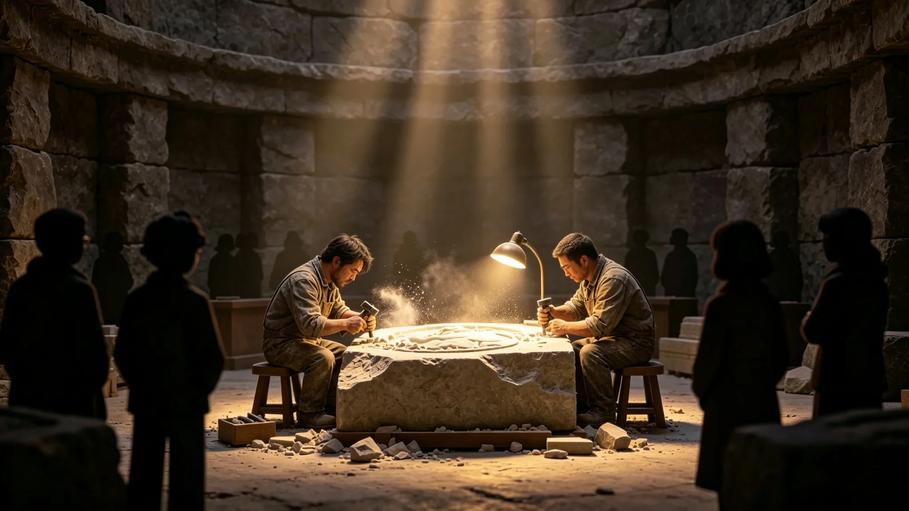

# 跨星系文明多样性保护名录首批刻石仪式规程公报

**发布机构**：联合体跨星系文化委员会 · 多样性保护处
**文件编号**：CUL-CARVE-3320-002
**日期**：3320年6月21日
**文件等级**：跨星系公开

## 一、规程缘起

《文明多样性保护名录与濒危语言登记制度》建立（见GS-3317-01）后，首批名录条目需在物理空间留存。文化委员会参照本库拓荒仪式体例（见GS-3148-01功勋墙、GS-3141-01点灯礼），在跨星系文化遗产数字化存档系统（见GS-3190-01）实体建筑内辟"名录刻石厅"，将首批名录条目以石刻留存。本公报为刻石仪式规程。

## 二、刻石原则

1. **刻条目，不刻人名**：石墙仅刻名录条目名称（如"西岭方音"），不刻母语使用者、不刻贡献者姓名。
2. **手工凿刻**：由凿石人手工以钢凿刻入玄武岩，不激光、不铸字。
3. **不可逆**：刻入后不修改、不磨除、不补刻错误——错字以旁注说明，不掩盖。
4. **批次而非个人**：以年度为批次，同批次条目同日刻入，不办个人专场。
5. **静默仪式**：无致辞、无音乐、无观礼。

## 三、首批刻石条目（3320年6月21日）

| 类别 | 条目 | 状态 |
|---|---|---|
| 语言 | 西岭方音（见GS-3319-01） | 已封存 |
| 语言 | 第四恒星系"新拓"矿工俚语 | 濒危 |
| 民俗 | 锚定夜（见GS-3105-01） | 存续 |
| 民俗 | 点灯礼（见GS-3141-01） | 存续 |
| 技术 | 比邻星b早期生态修复手工技艺（见GS-3188-01） | 濒危 |
| 知识 | 第四恒星系拓荒口述史（见GS-3145-01） | 存续 |

## 四、仪式流程

| 环节 | 时长 | 内容 |
|---|---|---|
| 入场 | 5分钟 | 凿石人与监督人入场，无观众 |
| 核对 | 10分钟 | 逐条目核对名录文字，确认无误 |
| 凿刻 | 60分钟 | 6条目手工凿入玄武岩 |
| 检查 | 10分钟 | 监督人核对凿刻与名录一致 |
| 默立 | 5分钟 | 不致辞、不拍照 |
| 退场 | 5分钟 | 仪式结束 |

全程不开放观礼，不录像。跨星系公开版仅发本公报，不发仪式影像。

## 五、不做什么

- 不邀请政要——刻石厅无主席台。
- 不设"揭幕"——石墙始终敞开，任何人可在开放日自由观看。
- 不刻第五恒星系方向条目——待接触类（见GS-3317-01）仅登记"存在"，不刻内容。
- 不刻已消亡但未归档者——刻石仅针对已入名录者。

## 六、与既有仪式分卷

- 本仪式为"名录条目"留存，与GS-3313-01新公民颁证（个人身份）、GS-3343-01星旗共升大典（星系并入）分卷保存。
- 刻石厅每年6月21日开放一日，其余时间不开放。

## 七、开放日

名录刻石厅每年6月21日开放一日，其余时间不开放。开放日不设讲解、不设导览，参观者自行观看。多样性保护处说明："刻石不是为了让人膜拜，是为了让人走过时看一眼。"

## 八、不补刻错误

若凿刻错字，不磨除、不重刻，仅在旁以小字加注。首批刻石中，"锚定夜"三字有一处笔画偏差，已按此原则旁注。刻石人说："石头记得错，比石头假装没错好。"

## 九、刻石人

首批刻石人两名，均为本职为石匠的联合体公民，非专业演员。刻石为手工钢凿，不激光。刻石人说："石头上的字，得是人凿的。机器凿的，不算。"

## 十、不开放观礼

刻石仪式不开放观礼，仅刻石人与监督人在场。跨星系公开仅事后公报。

## 十一、刻石不补字

首批刻石共12方，其中一方刻错一个偏旁，不磨除，旁注"此处刻错"。刻石人说："错了就是错了，石头替我们记着。"

## 十二、刻石厅

- 位置：三恒星系联合体总部地下。
- 材质：第四恒星系花岗岩。
- 刻法：手工钢凿，不激光。
- 开放日：每年6月21日，其余时间不开放。
刻石厅不设讲解员。

## 十三、刻石完成

首批十二方刻石全部完成，其中一方刻错偏旁不磨除，旁注"此处刻错"。刻石厅每年六月二十一日开放一日，不设讲解员。刻石人说："石头记得错，比石头假装没错好。"

## 十四、刻石回顾

十二方刻石完成。刻错偏旁不磨除。刻石厅每年开放一日。

## 十五、结语

十二方刻石完成。刻错不磨除。每年开放一日。

十二方刻石完成。刻错不磨除。

刻石人同时说明：石头记得错，比石头假装没错好。刻石厅每年开放一日，不设讲解员。

十二方刻石完成。一方刻错偏旁不磨除，旁注。

刻石人同时说：机器凿的不算，得是人凿的。

刻石人同时说：石头上的字，得是人凿的。

刻石人同时说：石头替我们记着。

刻石人同时说：错了就是错了，石头替我们记着。

刻石人同时说：机器凿的不算，得是人凿的。

刻石人同时说：石头替我们记着。

刻石人同时说：错了就是错了，石头替我们记着。

刻石人同时说：石头替我们记着。

刻石人同时说：机器凿的不算，得是人凿的。

刻石人同时说：错了就是错了，石头替我们记着。

刻石人同时说：石头替我们记着。

刻石人同时说：机器凿的不算，得是人凿的。

刻石人同时说：错了就是错了，石头替我们记着。

刻石人同时说：石头替我们记着。

刻石人同时说：错了就是错了，石头替我们记着。

刻石人同时说：石头替我们记着。

刻石人同时说：机器凿的不算，得是人凿的。

刻石人同时说：错了就是错了，石头替我们记着。

刻石人同时说：石头替我们记着。

---

**编制**：多样性保护处
**会签**：跨星系文化委员会
**日期**：3320年6月21日
