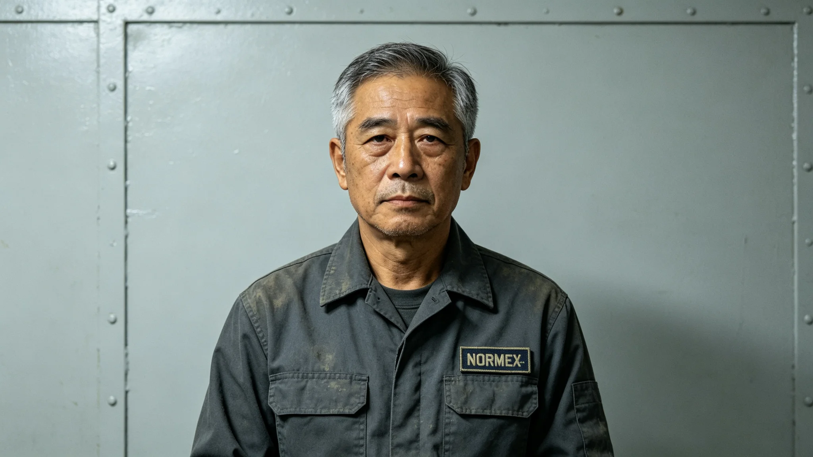

# 跨星系资源争端仲裁庭第三庭仲裁长关卓任满考勤与卷宗签批档案

**归档单位**：跨星系资源争端仲裁庭 · 人事处
**档案袋编号**：ARB-3-0007
**立卷日期**：3322年10月31日

## 一、岗位履历卡

| 项目 | 登记内容 |
|---|---|
| 姓名 | 关卓 |
| 出生星区 | 三恒星系，火星地下城第二环 |
| 出生年 | 3260年 |
| 入庭年 | 3295年，律师出身 |
| 岗位 | 第三庭仲裁长（受理跨第四恒星系方向资源争端） |
| 任期 | 3312—3322，任满十年 |
| 上一岗位 | 跨星系律师协会第四恒星系方向驻所律师 |

## 二、十年考勤汇总

| 年度区间 | 应出勤 | 实出勤 | 迟到 | 早退 | 病假 |
|---|---|---|---|---|---|
| 3312—3317 | 1800 | 1798 | 2 | 0 | 4（腰） |
| 3318—3322 | 1500 | 1499 | 1 | 1 | 2（腰） |

考勤员附记："该员十年累计迟到3次，均为跨星系听证远程连线首班；腰病假为长期伏案所致，不影响审案。"

## 三、卷宗签批（择要）

关卓十年间签发仲裁裁决71件，择要：

- 3314年：第四恒星系两矿权人争一低温矿床（见GS-3130-01），裁决按"先勘先得"登记时间优先（见GS-3118-01），驳回后登记者。
- 3317年：两货运公司争一段轨道加注泊位（见GS-3139-01），裁决按泊位先到先用，不支持"长期占用"主张。
- 3320年：双系边界一富冰小行星归属争议（预演GS-3326-01），关卓以"证据不足"退卷，要求补充三维测绘。
- 3322年：退休前最后一案，仍为富冰小行星补充测绘后重审，裁决在GS-3326-01之后另卷。

签批风格：每件裁决末页均有关卓手写一行"本裁决不设先例，仅及本案"。——与罗正和"报表可以慢，不能错"（见GS-3315-01）同调。

## 四、退卷与争议

关卓十年间退卷11件，均因"证据不足"。其中两件被当事人申诉至跨星系上诉庭，上诉庭维持退卷，未改判。关卓无被改判记录。

## 五、处分记录（零次）

关卓十年间无处分。人事处备注："该员无处分，亦无表彰——仲裁长的本分是既不错判也不'英明'。"

## 六、体检与退休

- 3322年体检：腰椎间盘突出（久坐），视神经疲劳，骨密度火星地下城正常范围。
- 退休：3322年11月1日正式退休，交接给第四庭仲裁长。
- 退休后不担任仲裁顾问——仲裁长退休后不得再就任内案件发表意见。

## 七、签名页

关卓签收："我签过的每一件裁决，我都不希望它成为'先例'。资源争端的事，一案一判，不套模板。"签名日期3322年10月31日。

## 八、关卓的签字习惯

关卓签71件裁决，末页均附"本裁决不设先例，仅及本案"。他在退休谈话中说："我怕后人翻我的卷宗，把'关卓这么判过'当规矩。每个案子都不一样，套模板就错了。"此谈话未公开发表，仅存档。

## 九、继任交接

关卓退休后，第三庭由第四庭仲裁长升任。交接清单注明：71件裁决卷宗全部归档，无未结案件。关卓本人不参加继任裁决——退休后不得再就内案件发表意见，此为仲裁庭铁律。

## 十、关卓不发表意见

退休后关卓不接受任何采访、不就任何新案件发表评论。人事处备注："他签过的话，说完了。"

## 十一、第三庭的风格

关卓任内，第三庭以"慢"和"退卷"著称。他在交接清单上写："这个庭不怕慢，怕错。"

## 十一、关卓的卷宗

71件裁决卷宗共1.2万页，全部归档。其中他退卷18件（事实不清，建议补充）。退卷率25%，在第三庭历史上最高。关卓说："退卷不是不判，是不着急判。"

## 十二、关卓的退卷

71件裁决中退卷18件，退卷率25%。他说："退卷不是不判，是不着急判。"退卷后补充事实，再判。此风格被第三庭沿用。

## 十三、退休

关卓任满退休，七十一卷裁决全部归档，无未结案件。退休后不接受采访，不就新案件发表评论。人事处备注："他签过的话，说完了。"

## 十四、退休回顾

关卓退休，七十一卷归档。退卷率百分之二十五。第三庭沿用其"慢与退卷"风格。

## 十五、结语

关卓退休。七十一卷归档。第三庭沿用其风格。

关卓退休。七十一卷归档。

关卓同时坚持：退卷不是不判，是不着急判。第三庭沿用其慢与退卷风格。

七十一卷裁决。退卷十八件。退卷率百分之二十五。

关卓同时说：每个案子都不一样，套模板就错了。

关卓同时说：这个庭不怕慢，怕错。

关卓同时说：我怕后人翻我的卷宗，把关卓这么判过当规矩。

关卓同时说：退卷不是不判，是不着急判。

关卓同时说：每个案子都不一样，套模板就错了。

关卓同时说：我怕后人翻我的卷宗，把关卓这么判过当规矩。

关卓同时说：退卷不是不判，是不着急判。

关卓同时说：我怕后人翻我的卷宗，把关卓这么判过当规矩。

关卓同时说：每个案子都不一样，套模板就错了。

关卓同时说：退卷不是不判，是不着急判。

关卓同时说：我怕后人翻我的卷宗，把关卓这么判过当规矩。

关卓同时说：每个案子都不一样，套模板就错了。

关卓同时说：退卷不是不判，是不着急判。

关卓同时说：我怕后人翻我的卷宗，把关卓这么判过当规矩。

关卓同时说：退卷不是不判，是不着急判。

关卓同时说：每个案子都不一样，套模板就错了。

关卓同时说：退卷不是不判，是不着急判。

---

**立卷**：仲裁庭人事处
**复核**：与71件裁决卷宗（另卷）互锁
**日期**：3322年10月31日
