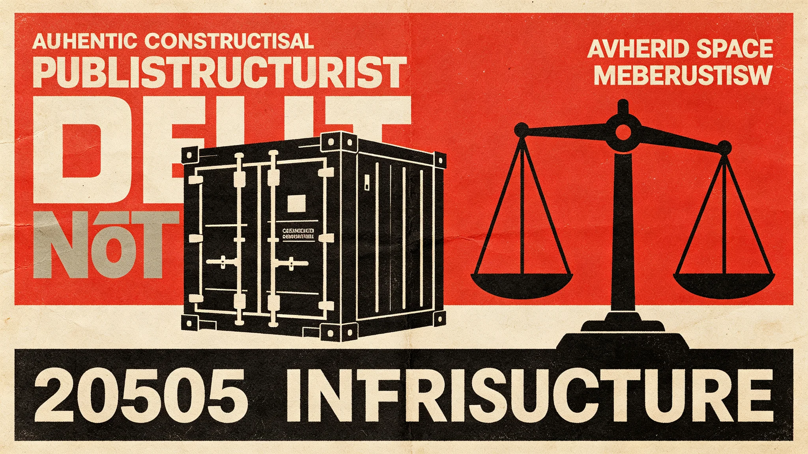

# 跨星系资源争端分级管辖与强制调解制度修订公报

**发布机构**：联合体跨星系资源争端仲裁庭 · 立法处
**文件编号**：ARB-LAW-3324-005
**日期**：3324年9月1日
**文件等级**：跨星系公开

## 一、修订背景

《新边疆矿产资源"先勘先得"登记与联合体仲裁管辖》（见GS-3118-01）确立了第四恒星系方向资源争端的仲裁基础。三十年来，争端量随拓荒与跨系贸易上升，且争端类型从单纯矿权扩展到轨道泊位、水体管道、富冰小行星、电磁频谱。仲裁庭第三庭（关卓，见GS-3322-01）十年间签发71件裁决，退卷11件。仲裁庭经立法处起草、跨星系议会法律委员会三读，对管辖分级与调解制度作如下修订。

## 二、争端分级

| 级别 | 标的额/影响 | 管辖 |
|---|---|---|
| 一级 | 标的<10万星元，或单一星区内 | 星区仲裁庭 |
| 二级 | 标的10—100万星元，或跨两星区 | 跨星系仲裁庭分庭 |
| 三级 | 标的>100万星元，或跨三恒星系，或涉及天体归属 | 跨星系仲裁庭主庭 |
| 四级 | 涉及第五恒星系方向、或疑似独立文明天体 | 暂停管辖，接触事务局另议 |

## 三、强制调解前置

1. **调解前置**：二级以上争端在仲裁前，须先经30日强制调解，调解不成方得仲裁。
2. **调解员**：由仲裁庭指定非本案仲裁员担任，双方可各提一名回避。
3. **调解不公开**：调解过程不公开，调解不成后仲裁庭不参考调解中陈述。
4. **第五恒星系方向**：四级争端不适用调解——接触期不仲裁，仅冻结登记（见GS-3303-01）。

## 四、通信延迟下的程序

跨星系通信时延可达数小时至数天（见GS-3126-01通信延迟送达），修订：

- 二级以上争端的送达与答辩，按各路线时延分别设定答辩期，不一刀切。
- 缺席审判效力沿用GS-3126-01口径。
- 富冰小行星等边界天体争端，须先完成三维权属测绘（见GS-3325-01），测绘未完成不得仲裁。

## 五、与既有制度衔接

- 本修订不替代"先勘先得"登记（见GS-3118-01），仅为其下的争端解决程序。
- 不替代《跨星系资源托管》（见GS-3328-01）——冻结期间由托管产业过渡。
- 不适用第五恒星系方向资源——该方向冻结登记（见GS-3303-01）。

## 六、罚则

- 不接受强制调解直接申请仲裁者，仲裁庭退回。
- 调解中作虚假陈述者，按《跨星系伪证法》追责。
- 本修订由仲裁庭立法处解释，每年9月1日向跨星系议会法律委员会报告。

## 七、仲裁员回避

- 仲裁员与争议任何一方有三年以内雇佣关系者，须回避。
- 调解员不得在后续仲裁中担任仲裁员。
- 回避申请须在立案后10日内提出，逾期不受理。

## 八、年度案件量

| 级别 | 3323年 |
|---|---|
| 一级 | 42件 |
| 二级 | 18件 |
| 三级 | 3件 |
| 四级（第五恒星系方向） | 0 |

平均审理周期：一级45日，二级90日，三级180日。跨星系时延为主要延误因素。

## 九、调解不公开

调解过程不公开，调解不成后仲裁庭不参考调解中陈述。调解处说明："坐下来谈的时候说的话，不能成为法庭上的证据。否则没人敢谈。"

## 十、不适用第五恒星系方向

该方向资源冻结登记（见GS-3303-01），无争端可仲裁。本制度明确排除。

## 十一、年度案件量

| 级别 | 3323年 |
|---|---|
| 一级 | 42 |
| 二级 | 18 |
| 三级 | 3 |
| 四级 | 0 |

平均审理周期：一级45日，二级90日，三级180日。跨星系时延为主要延误。

## 十二、调解与仲裁

- 一级：双方自行调解，不公开。
- 二级：调解处介入，调解不成转仲裁。
- 三级：仲裁庭裁决，落印生效。
- 四级：冻结，不受理。
调解过程不公开，调解中陈述不进仲裁。

## 十三、年度案件

本年度一级四十二件，二级十八件，三级三件，四级零。平均审理周期一级四十五日，二级九十日，三级一百八十日。跨星系时延为主要延误。

## 十四、案件回顾

本年度一级四十二件，二级十八件，三级三件。调解不公开。跨星系时延为主要延误。

## 十五、结语

分级管辖修订完成。调解不公开。跨星系时延为主要延误。

分级管辖修订完成。调解不公开。

调解处同时说明：坐下来谈的时候说的话，不能成为法庭上的证据。调解不公开。

一级四十二件，二级十八件，三级三件，四级零。

调解处同时说明：坐下来谈的时候说的话，不能成为法庭上的证据。

法制处同时说明：调解不公开，否则没人敢谈。

法制处同时说明：本制度不适用第五恒星系方向。

法制处同时说明：调解不公开。

法制处同时说明：坐下来谈的时候说的话，不能成为法庭上的证据。

法制处同时说明：本制度不适用第五恒星系方向。

法制处同时说明：调解不公开。

法制处同时说明：本制度不适用第五恒星系方向。

法制处同时说明：调解不公开。

法制处同时说明：本制度不适用第五恒星系方向。

法制处同时说明：调解不公开。

法制处同时说明：本制度不适用第五恒星系方向。

法制处同时说明：调解不公开。

---

**编制**：仲裁庭立法处
**会签**：跨星系议会法律委员会
**日期**：3324年9月1日
