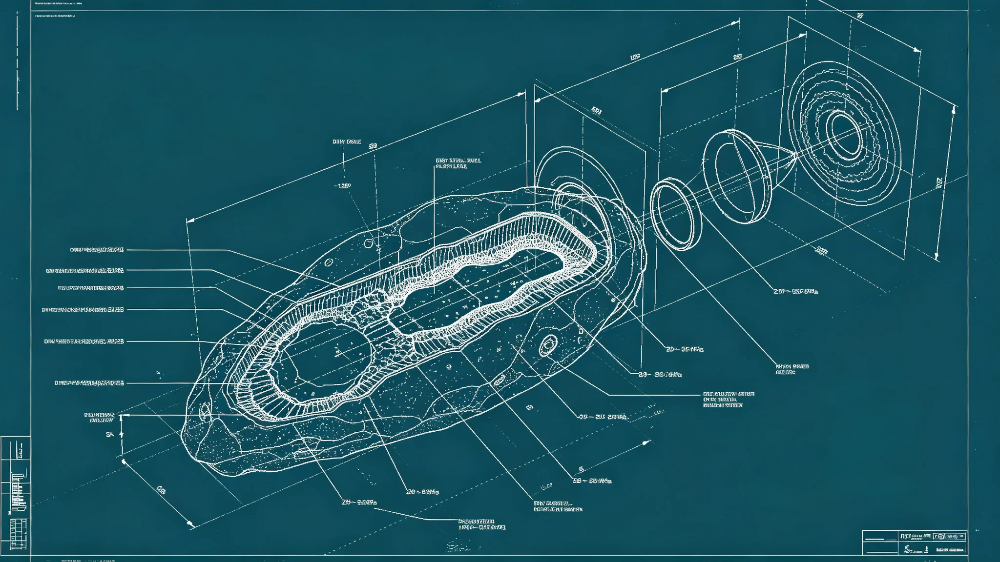

# 跨星系争议天体矿体三维权属测绘技术规范报告

**编制单位**：联合体勘探工程学派 · 权属测绘组
**报告编号**：SURV-3325-012
**日期**：3325年3月30日
**密级**：跨星系公开技术版

## 一、任务概述

按《跨星系资源争端分级管辖与强制调解制度修订》（见GS-3324-01），富冰小行星等边界天体争端须先完成三维权属测绘，测绘未完成不得仲裁。本报告记录测绘技术规范。

## 二、测绘对象

- 争议天体：通常为跨系边界附近的小行星、冰卫星、矿体。
- 测绘目的：确定矿体三维形态、品位分布、可开采边界，为仲裁提供客观证据。
- 不测绘行星表面——行星表面归属另有制度（见GS-3102-01拓荒自治条例）。

## 三、测绘方法

| 步骤 | 方法 | 精度 |
|---|---|---|
| 轨道成像 | 多光谱轨道摄影 | 表面分辨率1m |
| 重力测量 | 轨道重力仪 | 内部密度反演 |
| 雷达穿透 | 机载合成孔径雷达 | 地下500m |
| 钻孔采样 | 2—4个钻孔 | 岩芯连续取芯 |
| 三维建模 | 矿体建模软件 | 品位网格10m |

## 四、权属边界确定

- **登记优先权**：按"先勘先得"登记时间（见GS-3118-01），不按测绘先后。
- **矿体自然边界**：以矿体品位经济边界圈定，不以行政线切分。
- **共有矿体**：若矿体跨越两系登记区，按品位加权共有，不按面积。
- **测绘中立性**：测绘由仲裁庭委托第三方，不属争议任何一方。

## 五、测绘数据管理

- 测绘原始数据存于仲裁庭独立服务器，双方均可查阅，不可下载。
- 测绘结果为仲裁唯一证据，双方不得另雇测绘。
- 测绘费用由争议双方均摊，败诉方承担。
- 测绘期通常6—12个月，期间争议天体冻结开采（见GS-3328-01托管过渡）。

## 六、与既有技术衔接

- 钻孔采样设备与第四恒星系拓荒采矿（见GS-3130-01）同代。
- 三维建模与玄武岩3D打印（见GS-3134-01）地质模型共用。
- 本规范不适用第五恒星系方向——该方向冻结登记（见GS-3303-01），无争议可测绘。

## 七、遗留

- 富冰小行星（见GS-3326-01）为本规范首个测绘对象，测绘结果另卷。
- 若矿体过小、品位过低不值得测绘，仲裁庭可径行驳回争议。

## 八、测绘费分担

- 测绘费由争议双方均摊；败诉方承担。
- 若仲裁驳回争议（矿体过小），测绘费由双方均摊，不因败诉转移。
- 测绘费用不计入"资源托管"成本（见GS-3328-01）。

## 九、测绘不公开

测绘数据存于仲裁庭独立服务器，双方可查阅，不可下载。测绘图不公开，仅附于裁决书。权属测绘组说明："矿体图是证据，不是地图。它只在法庭上用。"

## 十、测绘中立性

测绘由仲裁庭委托第三方，不属争议任何一方。测绘师与双方无雇佣关系。权属测绘组说明："我们量的是石头，不是立场。"

## 十一、数据不下载

测绘数据存于仲裁庭独立服务器，双方可查阅，不可下载。

## 十二、测绘精度

| 项目 | 精度 |
|---|---|
| 矿体边界 | ±0.5米 |
| 质量分布 | ±2% |
| 体积估算 | ±1.5% |

权属测绘组说明："我们量到厘米级，是为了让裁决落到具体一吨矿，而不是'大概这块'。"

## 十三、测绘案例

| 案件 | 天体 | 争议 |
|---|---|---|
| 北棱-7 | 富冰小行星 | 归属 |
| 南棱-3 | 岩质小行星 | 质量分布 |

测绘后仲裁。测绘图不公开。

## 十四、测绘不公开

测绘数据存于仲裁庭独立服务器，双方可查阅，不可下载。测绘图不公开，仅附于裁决书。权属测绘组说明："矿体图是证据，不是地图。"

## 十五、测绘回顾

本年度测绘北棱-7与南棱-3两件。数据不公开。测绘费由败诉方承担。

## 十六、结语

测绘规范建立。数据不公开。测绘费败诉方担。

测绘规范建立。数据不公开。

权属测绘组同时说明：我们量的是石头，不是立场。测绘数据存于仲裁庭独立服务器。

测绘北棱-7与南棱-3。数据不公开。

权属测绘组同时说明：矿体图是证据，不是地图。

权属测绘组同时说明：我们量到厘米级，是为了让裁决落到具体一吨矿。

权属测绘组同时说明：我们量的是石头，不是立场。

权属测绘组同时说明：矿体图是证据，不是地图。

权属测绘组同时说明：我们量的是石头，不是立场。

权属测绘组同时说明：矿体图是证据，不是地图。

权属测绘组同时说明：我们量的是石头，不是立场。

权属测绘组同时说明：矿体图是证据，不是地图。

权属测绘组同时说明：我们量的是石头，不是立场。

权属测绘组同时说明：矿体图是证据，不是地图。

权属测绘组同时说明：我们量的是石头，不是立场。

权属测绘组同时说明：矿体图是证据，不是地图。

权属测绘组同时说明：矿体图是证据，不是地图。

权属测绘组同时说明：我们量的是石头，不是立场。

---

**编制**：权属测绘组
**审核**：勘探工程学派评审委员会
**日期**：3325年3月30日
