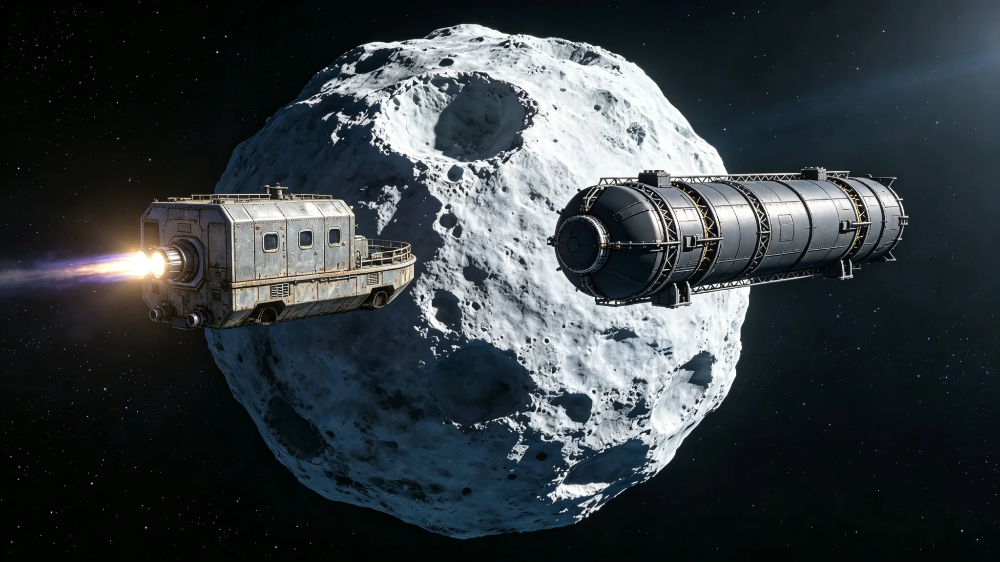

# 双系边界富冰小行星"北棱-7"归属争端两艘工程船无人接触对峙事件公报

**发布机构**：联合体跨星系资源争端仲裁庭 · 现场协调组
**事件编号**：ARB-STAND-3326-002
**日期**：3326年11月11日
**文件等级**：跨星系公开

## 一、事件背景

富冰小行星"北棱-7"位于第四恒星系与三恒星系边界附近，冰下疑似富含有机挥发物。3320年两矿权人首次主张权利，仲裁庭第三庭关卓以"证据不足"退卷（见GS-3322-01）。3324年制度修订（见GS-3324-01）要求先完成三维测绘（见GS-3325-01）。测绘期间，两矿权人各派一艘工程船赴小行星"待命"，形成对峙。

## 二、对峙时间线

| 时刻（中继站标准时） | 事件 |
|---|---|
| 3326-10-28 | A方工程船"棱-甲"抵达北棱-7南极侧，锚定 |
| 10-29 | B方工程船"棱-乙"抵达北棱-7北极侧，锚定 |
| 10-30 | 两船相距约14公里，均未释放载荷、未靠近对方 |
| 10-31 | 仲裁庭现场协调组介入，要求两船保持距离 |
| 11-02 | 协调组划定5公里"中立缓冲"，两船均后撤至14公里 |
| 11-05 | 两船均未开采、未钻孔、未接触 |
| 11-08 | 测绘第三方船抵达，开始轨道成像 |
| 11-11 | 本公报发布，对峙降温 |

## 三、对峙性质

- **无人接触**：两船均为封闭加压金属船体，船员在舱内，未出舱，未靠近对方。
- **未开采**：测绘冻结期间，两船均未释放钻孔设备。
- **无武器**：两船均无武器载荷。
- **无碰撞**：两船保持14公里距离，无剐蹭（不同于GS-3128-01碎片云剐蹭）。

## 四、处置

1. **划定缓冲**：5公里中立缓冲，两船均在外。
2. **测绘优先**：测绘第三方船抵达后，两船均退至20公里外，不干扰测绘。
3. **通信记录**：两船与仲裁庭通信全程记录，无加密。
4. **不强制驱离**：仲裁庭未命令任何一方离开——测绘前双方均有"待命权"。
5. **公开通报**：本事件跨星系公开，不隐瞒对峙。

## 五、未决

- 测绘结果预计3327年出，届时按GS-3324-01分级管辖仲裁。
- 若测绘显示矿体横跨两系登记区，按GS-3325-01品位加权共有。
- 对峙期间两船工质与补给由各自公司承担，仲裁庭不补贴。
- 若对峙升级为靠近、释放载荷、碰撞，仲裁庭将申请联合维和（见GS-3349-01）。

## 五、隔离期间人员

- 两艘工程船船员各8人，均未出舱、未接触对方船员。
- 双方通过仲裁庭现场协调组中转通信，不直接对话。
- 船员心理状态由随队医官监测，无冲突事件。

## 六、后续

测绘第三方船3326年10月抵达，两船退至20公里外。对峙未升级为冲突。现场协调组说明："两艘船隔着14公里对视了半个月，谁也没碰谁。这就是我们能做到的最好。"

## 七、双方船型

- A方"棱-甲"：短粗方盒型拖船，橙白涂装。
- B方"棱-乙"：长圆柱型货船，深灰涂装。
- 两船形态各异，非复制。

## 八、不武装

两船均无武器载荷。对峙全程无武器瞄准、无雷达照射。现场协调组说明："这不是军事对峙，是两艘船在排队。"

## 九、对峙期间通信

双方不直接对话，全部通过仲裁庭现场协调组中转。通信记录共317条，均为程序性询问（泊位位置、补给安排），无实质性争论。现场协调组说明："两艘船说了半个月的话，没一句是吵架。"

## 十、对峙数据

| 项目 | 数值 |
|---|---|
| 距离 | 14公里 |
| 持续 | 15天 |
| 通信 | 317条（程序性） |
| 人员 | 各8人 |
| 武器 | 0 |

现场协调组说明："两艘船说了半个月，没一句吵架。"

## 十一、对峙结束

测绘第三方船十月抵达，两船退至二十公里外。对峙未升级为冲突。现场协调组说明："两艘船隔着十四公里对视半个月，谁也没碰谁。这就是我们能做到的最好。"

## 十二、对峙回顾

对峙十五天，通信三百一十七条程序性。两船无武器。现场协调组认为：此次对峙是"排队"，不是"冲突"。

## 十三、结语

对峙结束。两船退至二十公里。无冲突。

对峙结束。无冲突。

现场协调组同时说明：两艘船隔着十四公里对视半个月，谁也没碰谁。这就是我们能做到的最好。

对峙十五天。通信三百一十七条。无武器。

现场协调组同时说明：这不是军事对峙，是两艘船在排队。

现场协调组同时说明：两艘船说了半个月的话，没一句是吵架。

现场协调组同时说明：两艘船说了半个月，没一句吵架。

---

**编制**：现场协调组
**会签**：仲裁庭主庭、两矿权人代表
**日期**：3326年11月11日
