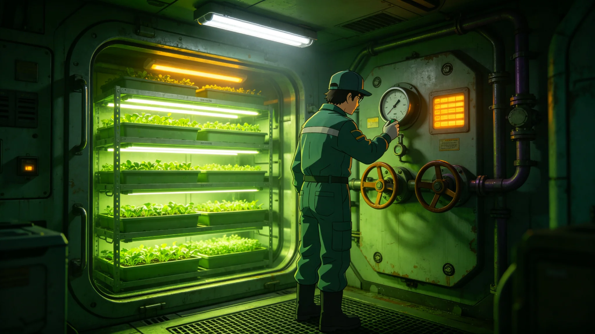

# 深空未知天体撞击风险下定居点生态系统应急保全预案公报

**发布机构**：联合体生态学派 · 定居点生态应急处
**文件编号**：ECO-EMG-3330-006
**日期**：3330年10月10日
**文件等级**：跨星系公开

## 一、背景

深空预警观测岗（见GS-3329-01）长期监测未知天体与碎片云。轨道防御系统（见GS-3195-01）可拦截大部分近距天体，但若拦截失败、或撞击发生在定居点附近，定居点封闭生态系统（水培农场、微藻舱、人工水体）可能因冲击波、粉尘、失压而崩溃。生态应急处制定本预案，保定居点生态系统在撞击风险下不致全毁。

## 二、风险分级

| 级别 | 威胁 | 生态动作 |
|---|---|---|
| 黄色 | 近距天体接近，拦截概率>90% | 生态舱转入低功耗待机 |
| 橙色 | 拦截概率70—90% | 关闭非必要生态舱，保留核心 |
| 红色 | 拦截概率<70%，或撞击可能波及定居点 | 核心生态舱密封隔离，人员撤离 |
| 黑色 | 撞击已发生 | 事后评估，不预演 |

## 三、生态保全动作

1. **核心舱优先**：保留种子库、微藻主舱、基因库（见GS-3186-01），关闭观赏性生态公园。
2. **密封隔离**：核心生态舱气闸关闭，与外部加压舱段物理隔离，防止冲击波粉尘进入。
3. **低功耗待机**：水培灯降至最低维持光，减少工质消耗。
4. **数据备份**：生态系统运行数据实时同步至中继站，即使舱体毁，数据不毁。
5. **不抢救动植物**：应急保全只保种子与基因库，不抢救观赏植物与宠物。

## 四、与既有应急预案衔接

- 与穹顶失压事故（见GS-3120-01）应急流程互锁：失压时先保人员，后保生态。
- 与矿场滑坡（见GS-3147-01）无伤亡撤离口径一致：生态保全不优先于人员。
- 与轨道防御系统（见GS-3195-01）联动：拦截成功后24小时内解除生态待机。

## 五、演练

- 每年在三大定居点各演练一次黄色—橙色切换，红色为桌面推演。
- 演练不通知公众，仅生态应急处与安全部队参与。
- 演练数据报跨星系议会安全委员会备查。

## 六、不做什么

- 不向公众发布撞击恐慌——风险分级由安全部队统一发布，生态应急处不另发声。
- 不提前"疏散生态"——生态舱无人居住，无疏散一说。
- 第五恒星系方向定居点不适用——该方向无定居点（见GS-3303-01）。

## 七、演练记录

| 演练次 | 级别 | 结果 |
|---|---|---|
| 第一次 | 黄—橙切换 | 合格，12分钟完成 |
| 第二次 | 黄—橙切换 | 合格，11分钟 |
| 桌面推演 | 红色 | 未实战 |

## 八、不通知公众

生态应急演练不通知公众，仅生态应急处与安全部队参与。理由：避免引发不必要恐慌。演练数据报跨星系议会安全委员会备查。生态应急处说明："保种子库，不保感情。警报响的时候，没有人有空惋惜植物。"

## 九、种子库不开放

种子库平时不开放，仅生态应急处有权限。生态应急处说明："门常锁着，是为了警报响的时候，门能开。"

## 十、与地球种子库的区别

地球驯化种子库（见GS-3186-01）保存人类作物；本库保存的是定居点原位生态备份。生态应急处说明："前者是怕我们没饭吃，后者是怕这里的东西没了。"

## 十一、预案不公开

预案细节不公开，仅生态应急处与安全部队掌握。跨星系公开仅"预案已制定"一份公报。生态应急处说明："预案不能让人知道我们怎么保命，否则人家就知道我们怕什么。"

## 十二、种子库

| 项目 | 内容 |
|---|---|
| 位置 | 第四恒星系前哨地下 |
| 容量 | 2万份 |
| 备份 | 双份 |
| 访问 | 仅生态应急处 |

平时不开放，警报时30分钟内可启。

## 十三、演练总结

本年度两次黄—橙切换演练均合格，桌面推演红色级未实战。生态应急处认为预案可行，但不通知公众。种子库平时锁闭，警报时三十分钟内可启。

## 十四、预案回顾

本年度两次演练合格。种子库完好。预案不公开。

## 十五、结语

预案制定。种子库封存。演练合格。

预案制定。演练合格。

生态应急处同时说明：保种子库，不保感情。警报响的时候，没有人有空惋惜植物。

两次演练合格。种子库完好。预案不公开。

生态应急处同时说明：门常锁着，是为了警报响的时候门能开。

生态应急处同时说明：前者是怕我们没饭吃，后者是怕这里的东西没了。

生态应急处同时说明：警报响的时候，没有人有空惋惜植物。

---

**编制**：生态应急处
**会签**：安全协调委员会、生态学派咨询组
**日期**：3330年10月10日
