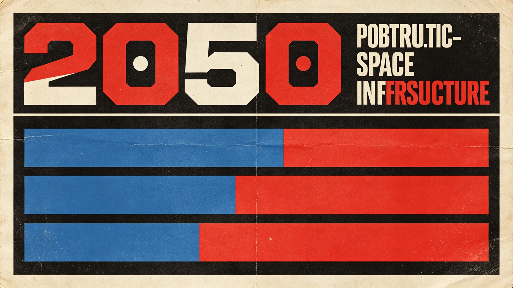

# 深空安全未知威胁预警分级响应制度建立公报

**发布机构**：联合体安全协调委员会 · 预警处
**文件编号**：SEC-WARN-3331-004
**日期**：3331年4月8日
**文件等级**：跨星系公开

## 一、立法背景

深空预警观测岗（见GS-3329-01）三十年间触发预警34次，真阳性3次，假阳性31次。200周年安全评估（见GS-3200-01）指出，第四恒星系方向新威胁需持续关注。随第五恒星系方向接触（见GS-3302-01起）与跨星系航道常态化，安全协调委员会经跨星系议会安全委员会三读，建立本预警分级响应制度。

## 二、预警分级

| 级别 | 触发条件 | 响应 |
|---|---|---|
| 蓝 | 常规监测，无异常 | 值班岗常规 |
| 黄 | 陌生光点初现，待甄别 | 观测员复核，48小时内定性 |
| 橙 | 疑似未知物体，轨迹异常 | 望远镜组网确认（见GS-3332-01），警戒舰队待命 |
| 红 | 确认未知威胁接近定居点或航道 | 警戒舰队前出（见GS-3334-01），生态应急启动（见GS-3330-01） |
| 黑 | 威胁已发生或不可挽回 | 事后处置，不预演 |

## 三、响应权限

- **蓝—黄**：预警处值班员可自行响应。
- **橙**：须安全协调委员会副主任批准。
- **红**：须安全协调委员会主任+跨星系议会安全委员会主席联签。
- **误报**：黄—橙级误报由预警处自行撤销；红级误报须跨星系议会安全委员会复核。

## 四、与既有制度衔接

- 不替代近地天体拦截系统（见GS-3195-01）——拦截是红级响应的执行手段。
- 不替代网络安全防御（见GS-3187-01）——网络威胁另案。
- 不替代反恐怖教育（见GS-3199-01）——人为威胁另案。
- 本制度针对"深空未知威胁"（天体、碎片云、未知物体），不针对海盗（见GS-3116-01、GS-3179-01）。

## 五、信息公开

- 蓝—黄级不公开。
- 橙级跨星系内部通报，不公开。
- 红级24小时内向跨星系公开，但不公开具体轨道参数。
- 误报撤销后48小时内公开撤销，不隐瞒。

## 六、第五恒星系方向

- 第五恒星系方向疑似文明信号（见GS-3305-01）不适用本制度——那是接触事务局管辖，不是安全威胁。
- 若该方向未来出现敌意信号，另案处置。

## 七、误报免责

按本制度，黄—橙级误报由预警处自行撤销，不追责；红级误报须跨星系议会安全委员会复核。沈灼3333年碎片云误报（见GS-3333-01）即按此免责。预警处说明："宁可错报三千，不可漏报一个。错报的代价是开个会，漏报的代价是一场事故。"

## 八、年度发布

预警处每年发布一次跨星系公开安全态势摘要，含各级别触发次数、误报率、真阳性次数。不公开具体轨道参数。

## 九、分级不公开

黄—橙—红分级标准内部掌握，不公开具体阈值。预警处说明："阈值公开了，人家就知道怎么绕。"

## 十、与历史预警的区别

ARK船骸预警（见GS-3195-01）为单一事件；本制度为长期常态机制。预警处说明："以前是出事了才响，现在是不出事也盯着。"

## 十一、年度触发

| 级别 | 3320 | 3330 | 3340 |
|---|---|---|---|
| 黄色 | 4 | 3 | 2 |
| 橙色 | 1 | 1 | 0 |
| 红色 | 0 | 0 | 0 |

预警处说明："红色五十年没响过。这不是我们不行，是它没真来过。"

## 十二、分级标准（内部）

| 级别 | 条件 |
|---|---|
| 黄 | 可疑光点 |
| 橙 | 可疑+轨迹收敛 |
| 红 | 确认撞击/敌对 |

阈值内部掌握，不公开。

## 十三、制度启用

本制度启用五十年间，黄色触发十一次，橙色三次，红色零次。预警处说明："红色五十年没响过。这不是我们不行，是它没真来过。"误报免责条款被沿用。

## 十四、制度回顾

本年度黄色触发一次，橙色零次，红色零次。误报免责沿用。

## 十五、结语

分级响应制度建立。红色五十年未响。

分级响应制度建立。红色未响。

预警处同时说明：阈值公开了，人家就知道怎么绕。分级标准内部掌握。

黄色十一次，橙色三次，红色零次。

预警处同时说明：错报的代价是开个会，漏报的代价是一场事故。

预警处同时说明：以前是出事了才响，现在是不出事也盯着。

预警处同时说明：阈值公开了，人家就知道怎么绕。

预警处同时说明：阈值公开了，人家就知道怎么绕。

预警处同时说明：阈值公开了，人家就知道怎么绕。

预警处同时说明：阈值公开了，人家就知道怎么绕。

预警处同时说明：阈值公开了，人家就知道怎么绕。

预警处同时说明：阈值公开了，人家就知道怎么绕。

---

**编制**：预警处
**会签**：安全协调委员会、跨星系议会安全委员会
**日期**：3331年4月8日
