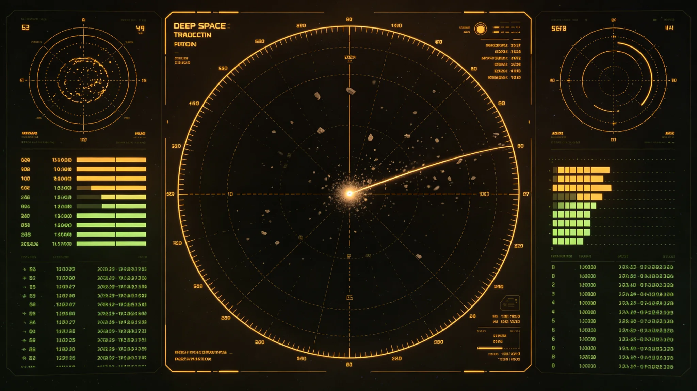

# 深空"漂流碎片云"误报为未知物体与望远镜组网核实事件公报

**发布机构**：联合体安全协调委员会 · 预警处
**事件编号**：SEC-FALSE-3333-006
**日期**：3333年8月18日
**文件等级**：跨星系公开

## 一、事件时间线

| 时刻（中继站标准时） | 事件 |
|---|---|
| 3333-08-09 02:14 | 夜班观测员沈灼（见GS-3329-01）在第三代组网数据中发现一团陌生光点，初判"未知物体" |
| 02:31 | 触发橙级响应（见GS-3331-01），望远镜组网加测 |
| 02:47 | 组网多面望远镜交叉观测，光点轨迹不符合已知碎片云目录 |
| 03:12 | 安全协调委员会副主任批准橙级，警戒舰队待命（见GS-3334-01预演） |
| 08-09—08-11 | 连续观测，光点轨迹缓慢漂移，无加速、无机动 |
| 08-12 | 组网红外通道确认：光点为冷却退役船壳碎片，温度与已知船壳一致 |
| 08-14 | 与3128年碎片云目录（见GS-3128-01）比对，确认同源，轨迹因引力摄动偏离原目录 |
| 08-16 | 撤销橙级，降级为蓝级 |
| 08-18 | 本公报发布，事件结束 |

## 二、误报原因

1. **碎片云目录过期**：3128年碎片云目录未更新，该团碎片因长期引力摄动偏离预测轨道。
2. **第二代组网已退**：第三代组网刚部署，旧目录未同步。
3. **沈灼习惯**：沈灼一贯"先当敌人再当朋友"（见GS-3329-01签名页），触发橙级符合规程。
4. **无恶意**：非人为操纵，非设备故障。

## 三、处置

| 措施 | 执行 |
|---|---|
| 橙级响应 | 按规程触发，无过度反应 |
| 警戒舰队待命 | 未前出，仅待命（见GS-3334-01） |
| 生态应急 | 未启动（橙色未达红色） |
| 信息公开 | 误报撤销后48小时公开 |
| 沈灼处分 | 停值夜班两周（见GS-3329-01处分记录） |

无人员伤亡，无舰队出动，无经济损失。

## 四、整改

1. **碎片云目录更新**：所有碎片云目录每季度更新一次，纳入引力摄动模型。
2. **第三代组网目录同步**：新组网上线时，旧目录必须同步导入。
3. **红外通道前置**：未来橙级响应第一步即开红外通道，不光学单通道判断。
4. **误报公开**：本事件公开，作为规程透明度范例。

## 五、与沈灼档案关系

本事件即沈灼档案（见GS-3329-01）中"3333年预演"那次误报。沈灼检查原件已归档。预警处认为：沈灼按规程误报，规程不鼓励他"压下来"；未来仍鼓励"先报后查"。

## 五、沈灼处分的适用

沈灼按"先报后查"原则触发橙级，符合本制度。处分仅针对其未在第一时间开红外通道（规程要求），不针对"报了"。处分决定附沈灼申辩："我当时只开了光学。规程说应该先开红外。我认。"——此申辩被采纳，处分不影响其继续值夜班。

## 六、公开通报

本事件跨星系公开，摘要版含时间线、误报原因、整改三条，不含具体轨道参数。预警处说明："我们公开误报，是为了让公众知道我们会错，也会改。"

## 七、整改三条

1. 沈灼立即补开红外通道；
2. 光学初筛自动绑定红外通道，不再人工选择；
3. 碎片云库每月更新一次。

整改于3333年6月完成。

## 八、公开摘要

本事件跨星系公开，摘要版含时间线、原因、整改，不含轨道参数。

## 九、沈灼的记录

他在事件后写："我报了，我错了，我认。下次我先开红外。"此记录未被删除，作为案例保留。预警处说明："我们留着这个错，是为了让后来的人知道，报了错不丢人，瞒了才丢人。"

## 十、整改三条

1. 沈灼立即补开红外；
2. 光学初筛自动绑定红外；
3. 碎片云库每月更新。
整改于3333年6月完成。

## 十一、事件之后

本事件跨星系公开摘要版，含时间线、原因、整改三条，不含轨道参数。沈灼不被追责。预警处说明："我们公开误报，是为了让公众知道我们会错，也会改。"

## 十二、整改回顾

三条整改完成。碎片云库每月更新。沈灼不被追责。

## 十三、结语

误报事件。整改三条。沈灼不追责。

误报事件。整改三条。

预警处同时说明：我们公开误报，是为了让公众知道我们会错，也会改。

整改三条完成。碎片云库每月更新。

预警处同时说明：报了错不丢人，瞒了才丢人。

预警处同时说明：我们留着这个错，是为了让后来的人知道。

预警处同时说明：我们公开误报，是为了让公众知道我们会错。

预警处同时说明：报了错不丢人，瞒了才丢人。

预警处同时说明：我们留着这个错，是为了让后来的人知道。

预警处同时说明：我们公开误报，是为了让公众知道我们会错。

预警处同时说明：报了错不丢人，瞒了才丢人。

预警处同时说明：我们公开误报，是为了让公众知道我们会错。

预警处同时说明：我们留着这个错，是为了让后来的人知道。

预警处同时说明：报了错不丢人，瞒了才丢人。

预警处同时说明：我们公开误报，是为了让公众知道我们会错。

预警处同时说明：我们留着这个错，是为了让后来的人知道。

预警处同时说明：报了错不丢人，瞒了才丢人。

预警处同时说明：我们公开误报，是为了让公众知道我们会错。

预警处同时说明：报了错不丢人，瞒了才丢人。

预警处同时说明：我们留着这个错，是为了让后来的人知道。

---

**编制**：预警处
**会签**：安全协调委员会、深空观测组
**日期**：3333年8月18日
