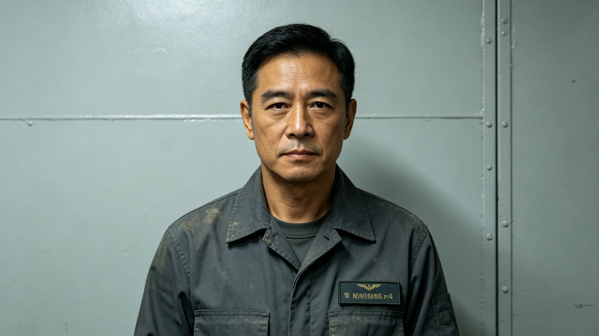

# 第五恒星系方向首任驻节领事温启明任前考勤与体检档案

**归档单位**：联合体外事会 · 领事人事处
**档案袋编号**：CON-5-0001
**立卷日期**：3336年6月6日

## 一、岗位履历卡

| 项目 | 登记内容 |
|---|---|
| 姓名 | 温启明 |
| 出生星区 | 三恒星系，比邻星b轨道定居点 |
| 出生年 | 3265年 |
| 入外事会年 | 3290年 |
| 既往岗位 | 第四恒星系方向领事助理六年；跨星系议会法律委员会秘书四年 |
| 拟任岗位 | 第五恒星系方向首任驻节领事（驻中继站，不驻行星表面） |
| 派遣条件 | 仅驻中继站加压舱，不接触行星表面，不与疑似文明面对面 |

履历卡背面批注："该员无外交前线履历，无公开演讲记录；申请本岗理由：'我不擅长说话，适合听。'"——阅卷人圈出此句。

## 二、既往考勤（3290—3336）

| 年度区间 | 应出勤 | 实出勤 | 迟到 | 早退 | 病假 |
|---|---|---|---|---|---|
| 3290—3300 | 约3400 | 3398 | 3 | 1 | 6 |
| 3301—3310 | 约3400 | 3400 | 0 | 0 | 2 |
| 3311—3336 | 约8500 | 8499 | 1 | 0 | 4 |

考勤员附记："该员累计迟到4次，均为跨时区连线首班；无早退记录。"

## 三、任前体检（3336年5月）

- 骨密度：比邻星b地表出生，正常范围。
- 辐射剂量：累计0.35 Sv，未超阈。
- 心理评定：接触期外交专项——评定官关注"在疑似文明面前是否会过度表达善意"。结论：中等克制，无表现欲，可担驻节岗。
- 语言能力：联合体通用语流利，无第五恒星系方向语言——该方向无已知语言。
- 前庭：合格。

## 四、处分记录（零次）

温启明四十年间无处分。人事处备注："该员无处分，亦无突出业绩——领事的本分是不搞出业绩。"

## 五、驻节职责

按GS-3303-01与GS-3306-01，温启明在第五恒星系方向中继站的职责：

1. 接收与甄别该方向信号，24小时内上报接触事务局。
2. 不发未经双人复核的应答。
3. 不与疑似文明对象面对面——若对方发射载具至中继站，领事在加压舱内远程对话，不共舱。
4. 不代表联合体作任何承诺。
5. 不发表公开意见，不接受采访。

## 六、签名页

温启明签收："我去那里，是为了不说话。对方说什么，我记下来，交给制度；我自己不解释。"签名日期3336年6月6日。

## 八、领事不发言

温启明任内不接受任何采访、不发表公开意见。中继站访客（仅限接触事务局人员）与他对话，内容全部记录上报。人事处说明："领事的声音，就是接触事务局的声音。他自己的声音，先收着。"

## 九、换班

领事四年一换。温启明3340年任满，继任领事另派。交接清单注明：无未决事项，无未回复信号。

## 十、温启明不发言

任内不接受采访、不发表公开意见。人事处说明："领事的声音，就是接触事务局的声音。他自己的声音，先收着。"

## 十一、换班

领事四年一换。3340年任满，继任领事另派。交接清单注明：无未决事项，无未回复信号。

## 十二、温启明的体检

| 项目 | 3336年 |
|---|---|
| 骨密度 | 正常 |
| 晶状体 | 正常 |
| 心理 | 稳 |
| 血压 | 正常 |

结论：适合驻节。人事处备注："他不紧张，也不兴奋。这是当领事最好的状态。"

## 十三、领事职责

| 项目 | 内容 |
|---|---|
| 驻节 | 第四恒星系方向中继站 |
| 任期 | 4年 |
| 权限 | 仅信号接收与转达 |
| 限制 | 不发言、不承诺、不签字 |

温启明3340年任满，继任另派。

## 十四、领事到任

温启明本年到任第四恒星系方向中继站，四年任期。任内不接受采访，不发表公开意见。人事处说明："领事的声音，就是接触事务局的声音。他自己的声音，先收着。"

## 十五、到任回顾

温启明到任半年，无信号，无事件。他不发言。

## 十六、结语

温启明到任。不发言。四年任期。

温启明到任。不发言。

人事处同时说明：领事的声音，就是接触事务局的声音。他自己的声音，先收着。

温启明到任半年。无信号，无事件。

人事处同时说明：领事不代表联合体作任何承诺。

人事处同时说明：他不紧张，也不兴奋，这是当领事最好的状态。

人事处同时说明：领事的声音，就是接触事务局的声音。

人事处同时说明：领事不代表联合体作任何承诺。

---

**立卷**：领事人事处
**复核**：与驻节日志（另卷）互锁
**日期**：3336年6月6日
