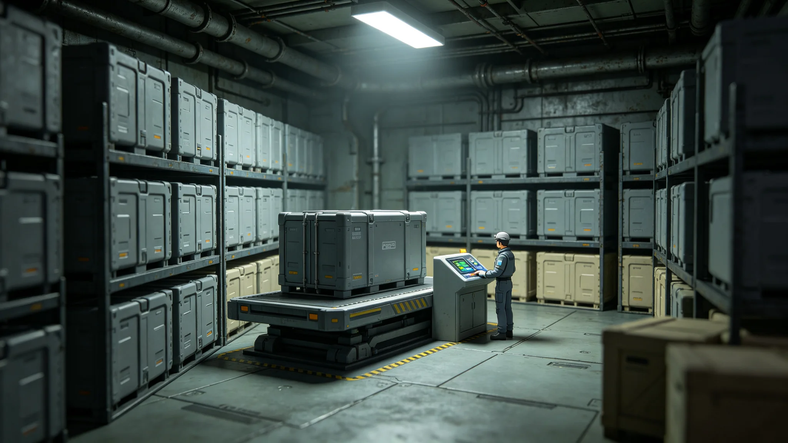

# 第五恒星系方向接触贸易整合后关税同盟首年货物清算报告

**编制单位**：联合体跨星系接触事务局 · 贸易准入处
**报告编号**：EC-5-CUS-3337-014
**日期**：3337年11月23日
**文件等级**：跨星系公开摘要版

## 一、背景

第五恒星系方向轨道贸易自3307年首批交换（见GS-3307-01）以来，逐年扩大。3336年温启明任驻节领事（见GS-3336-01）后，双方信号往来稳定。贸易准入处经跨星系议会经济委员会批准，将第五恒星系方向轨道贸易纳入关税同盟框架，本报告为首年（3336—3337）货物清算。

## 二、贸易范围

| 项目 | 范围 |
|---|---|
| 贸易层级 | 轨道层面非接触交换（见GS-3303-01） |
| 行星表面 | 仍冻结（见GS-3302-01四级隔离） |
| 人员往来 | 仍冻结（见GS-3310-01） |
| 货物种类 | 工业制成品、矿物标本、标定件（见GS-3307-01） |
| 活体/食品 | 仍冻结 |

## 三、首年清算

| 项目 | 金额（星元） |
|---|---|
| 联合体出向货物总值 | 310万 |
| 对方向出向货物估值 | 280万 |
| 关税同盟清算差额 | 30万（对方向应收） |
| 中继站对接与检测费 | 90万（联合体承担） |
| 净支出 | 60万 |

关税同盟原则：双方货物估值互认，差额以标定件或星元结算，不征收关税——接触期贸易不以关税为目的。

## 四、对方向货物估值

| 货物 | 初步估值 |
|---|---|
| 未知几何构件 | 80万 |
| 晶体块一组 | 120万 |
| 标定件（矩形金属片） | 30万 |
| 其他矿物标本 | 50万 |

晶体块经中继站检测，折射率与熔点均与联合体已知材料不同，长期可能改变材料工业格局；首年仅估值，不商用。

## 五、限制

1. 仍不交换活体、食品、有机材料。
2. 不开放私营贸易，由贸易准入处统一经办。
3. 不交换武器、能源、推进相关部件。
4. 货物清单双向公开，但不公布具体化学成分（生物安全）。

## 六、与既有经济衔接

- 与跨星系客运（见GS-3314-01）无关——第五恒星系方向无客运。
- 与数字版权平台（见GS-3177-01）无关——接触期不交换数字内容。
- 与资源托管（见GS-3328-01）无关——第五恒星系方向资源冻结登记，不进入托管。

## 六、不商用承诺

对方向晶体样片估值120万星元，但贸易准入处明确：长期不商用、不上市、不申请专利。若未来材料学确认该晶体有独特工业价值，须经跨星系议会经济委员会三读，方可另议。

## 七、透明度

首年清算跨星系公开摘要版，删除具体化学成分与材料配方。贸易准入处说明："我们告诉大家赚了赔了，不告诉大家对方的东西怎么做。"

## 八、不商用承诺

晶体样片估值120万星元，长期不商用、不上市、不申请专利。若未来确认独特工业价值，须跨星系议会经济委员会三读。

## 九、透明度

首年清算公开摘要版，删除化学成分与配方。贸易准入处说明："我们说赚了赔了，不说对方的东西怎么做。"

## 十、首年数据

| 项目 | 数字 |
|---|---|
| 交换批次 | 2 |
| 出向货物 | 4.2吨 |
| 回向货物 | 3.8吨 |
| 估值差 | 12万星元（出向多） |
| 安全事件 | 0 |

贸易准入处说明："第一年，我们亏了一点。这是应该的。"

## 十一、首年清算

| 项目 | 数字 |
|---|---|
| 批次 | 2 |
| 出向 | 4.2吨 |
| 回向 | 3.8吨 |
| 差 | 12万星元（出多） |
| 事故 | 0 |

贸易准入处说明："第一年亏一点，应该。"

## 十二、首年总结

首年交换两批，出向四点二吨，回向三点八吨，差十二万星元出向多，无安全事件。贸易准入处说明："第一年亏一点，应该。"晶体样片长期不商用。

## 十三、清算回顾

首年清算完成。差十二万星元出向多。不商用。

## 十四、结语

首年清算。差十二万。不商用。

首年清算。差十二万。

贸易准入处同时说明：我们说赚了赔了，不说对方的东西怎么做。

两批交换。出向四点二吨，回向三点八吨。

贸易准入处同时说明：第一印象要普通。

贸易准入处同时说明：第一年，我们亏了一点，这是应该的。

贸易准入处同时说明：第一年，我们亏了一点，这是应该的。

贸易准入处同时说明：第一年亏一点，应该。

贸易准入处同时说明：第一印象要普通。

贸易准入处同时说明：第一年，我们亏了一点，这是应该的。

贸易准入处同时说明：第一年亏一点，应该。

贸易准入处同时说明：第一年，我们亏了一点，这是应该的。

贸易准入处同时说明：第一年亏一点，应该。

贸易准入处同时说明：第一年亏一点，应该。

贸易准入处同时说明：第一年，我们亏了一点，这是应该的。

贸易准入处同时说明：第一年亏一点，应该。

贸易准入处同时说明：第一年亏一点，应该。

贸易准入处同时说明：第一年，我们亏了一点，这是应该的。

贸易准入处同时说明：第一年亏一点，应该。

贸易准入处同时说明：第一年亏一点，应该。

贸易准入处同时说明：第一年亏一点，应该。

贸易准入处同时说明：第一年，我们亏了一点，这是应该的。

贸易准入处同时说明：第一年亏一点，应该。

贸易准入处同时说明：第一年亏一点，应该。

贸易准入处同时说明：第一年，我们亏了一点，这是应该的。

贸易准入处同时说明：第一年亏一点，应该。

贸易准入处同时说明：第一年，我们亏了一点，这是应该的。

---

**编制**：贸易准入处
**会签**：接触事务局、经济学派评审委员会
**日期**：3337年11月23日
