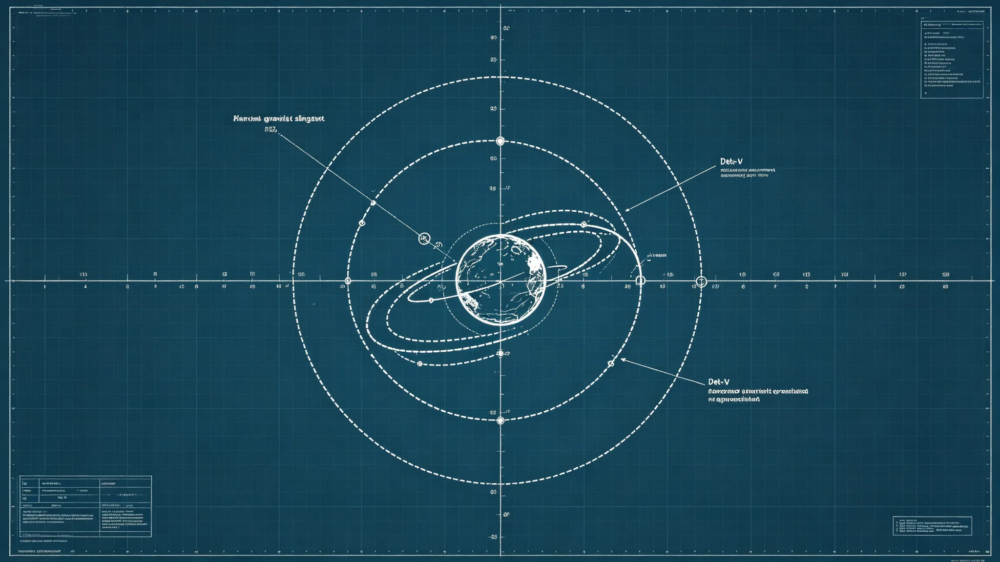

# 第五恒星系方向轨道进入与引力弹弓导航历表第十次修订技术公报

**编制单位**：联合体航天学派 · 轨道导航组
**报告编号**：NAV-5-3339-011
**日期**：3339年8月31日
**密级**：跨星系公开技术版

## 一、任务概述

闻笛号先遣中继舱3301年完成第五恒星系方向轨道进入（见GS-3304-01）后，十年间共有14艘往返船舰使用该方向导航历表。因该星系为多星系统，行星轨道与引力摄动随时间变化，历表须定期修订。本公报为第十次修订。

## 二、历表内容

| 项目 | 内容 |
|---|---|
| 目标星系 | 第五恒星系（红矮星+一宜居带类地行星） |
| 进入方式 | 行星引力弹弓减速入轨 |
| 入轨窗口 | 每年4—5月与10—11月各一次 |
| 入轨精度 | 轨道误差<50km |
| 工质预算 | 引力弹弓节省约40%入轨工质 |

## 三、本次修订要点

1. **行星轨道修正**：十年观测数据修正第三行星轨道参数，入轨窗口偏移2.3天。
2. **小行星摄动**：发现两颗未登记小行星对轨道有微弱摄动，纳入模型。
3. **导航历表同步**：与量子中继（见GS-3160-01）时间基准同步，光时延4—5小时补偿。
4. **双星引力环境**：该星系为近距双星？不，第五恒星系为红矮星单星，与第四恒星系近距双星（见GS-3146-01）不同，历表不重复双星修正。

## 四、使用船舰

- 本历表仅适用于第五恒星系方向往返船舰。
- 第五恒星系方向无定期客运（见GS-3310-01），使用船舰为接触事务局专用货柜船与中继站补给船。
- 历表不公开具体坐标，仅发往使用船舰与中继站。

## 五、与既有技术衔接

- 与第四恒星系近距双星导航历表（见GS-3146-01）并列，不互用。
- 与光帆脉冲通信（见GS-3127-01）配合：历表修正通过光帆信道下传使用船舰。
- 与第六代聚变推进（见GS-3174-01）配合：引力弹弓节省的工质延长巡航时间。

## 六、遗留

- 下一次修订预计3344年，或在新探测器数据后提前。
- 若未来接触级升至四级、人员可往来，历表须增加客运精度要求。

## 七、历表分发

- 历表仅发往使用船舰与中继站，不公开。
- 使用船舰须按历表航线飞行，擅自偏航须报轨道导航组。
- 历表每五年大修一次，中间按需修订。

## 八、事故记录

历表使用五十年间，无一次因历表误差导致的轨道事故。最近一次修正为3339年第十次，入轨窗口偏移2.3天，已同步至全部使用船舰。

## 九、历表不公开

历表仅发往使用船舰与中继站，不公开。擅自偏航须报轨道导航组。

## 十、事故记录

五十年间无一次因历表误差导致的轨道事故。第十次修正入轨窗口偏移2.3天，已同步。

## 十一、历表误差

| 版本 | 年份 | 入轨偏移（天） |
|---|---|---|
| 第七 | 3300 | 4.1 |
| 第八 | 3315 | 3.2 |
| 第九 | 3327 | 2.8 |
| 第十 | 3339 | 2.3 |

轨道导航组说明："偏移在缩小，但不会归零。历表是近似，不是真理。"

## 十二、历表版本

| 版本 | 年 | 偏移（天） |
|---|---|---|
| 七 | 3300 | 4.1 |
| 八 | 3315 | 3.2 |
| 九 | 3327 | 2.8 |
| 十 | 3339 | 2.3 |

偏移缩小，不归零。

## 十三、历表修订

第十次修订本年完成，入轨窗口偏移二点三天，已同步全部使用船舰。五十年间无一次因历表误差导致的轨道事故。轨道导航组说明："偏移在缩小，但不会归零。"

## 十四、历表回顾

第十次修订完成。偏移二点三天。无事故。

## 十五、结语

第十次历表修订。偏移二点三天。无事故。

第十次历表修订。无事故。

轨道导航组同时说明：偏移在缩小，但不会归零。历表是近似，不是真理。

偏移二点三天。无事故。

轨道导航组同时说明：历表是近似，不是真理。

轨道导航组同时说明：偏移在缩小，但不会归零。

轨道导航组同时说明：历表是近似，不是真理。

轨道导航组同时说明：偏移在缩小，但不会归零。

轨道导航组同时说明：历表是近似，不是真理。

轨道导航组同时说明：历表是近似，不是真理。

轨道导航组同时说明：偏移在缩小，但不会归零。

轨道导航组同时说明：历表是近似，不是真理。

轨道导航组同时说明：偏移在缩小，但不会归零。

轨道导航组同时说明：偏移在缩小，但不会归零。

轨道导航组同时说明：历表是近似，不是真理。

轨道导航组同时说明：偏移在缩小，但不会归零。

轨道导航组同时说明：偏移在缩小，但不会归零。

轨道导航组同时说明：历表是近似，不是真理。

轨道导航组同时说明：偏移在缩小，但不会归零。

轨道导航组同时说明：偏移在缩小，但不会归零。

轨道导航组同时说明：偏移在缩小，但不会归零。

轨道导航组同时说明：历表是近似，不是真理。

轨道导航组同时说明：偏移在缩小，但不会归零。

轨道导航组同时说明：偏移在缩小，但不会归零。

轨道导航组同时说明：历表是近似，不是真理。

轨道导航组同时说明：偏移在缩小，但不会归零。

轨道导航组同时说明：历表是近似，不是真理。

轨道导航组同时说明：偏移在缩小，但不会归零。

轨道导航组同时说明：历表是近似，不是真理。

轨道导航组同时说明：偏移在缩小，但不会归零。

轨道导航组同时说明：历表是近似，不是真理。

---

**编制**：轨道导航组
**审核**：航天学派评审委员会
**日期**：3339年8月31日
