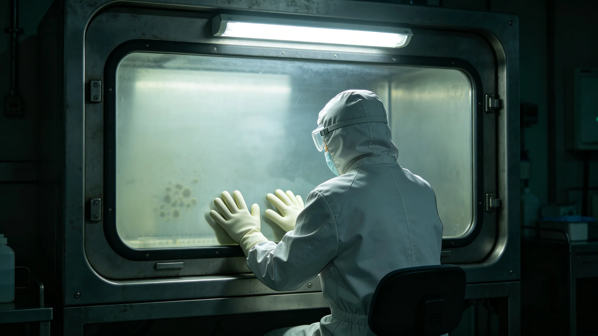

# 第五恒星系方向原生微生物跨系研究伦理与生物安全管制公报

**发布机构**：联合体生物安全联合工作组 · 伦理处
**文件编号**：BSL-ETH-5-3341-002
**日期**：3341年7月17日
**文件等级**：跨星系公开

## 一、背景

第五恒星系方向疑似独立生物圈（见GS-3302-01、GS-3304-01），轨道保育基地（见GS-3316-01）已维持数毫克级气溶胶样本存活十余年。随研究深入，部分学者要求将样本运至母港实验室做更细致分析。生物安全联合工作组经跨星系议会伦理委员会三读，制定本管制公报。

## 二、研究分级

| 级别 | 研究内容 | 审批 |
|---|---|---|
| 零级 | 仅轨道观测，不取样 | 接触事务局备案 |
| 一级 | 轨道加压舱内观察样本 | 生物安全工作组批准 |
| 二级 | 样本在中继站隔离舱内实验 | 伦理委员会+生物安全工作组联签 |
| 三级 | 样本运至母港实验室 | 跨星系议会伦理委员会三分之二多数 |
| 四级 | 样本与联合体生物混合培养 | **禁止** |

## 三、伦理原则

1. **不伤害**：研究不伤害行星原生生态，不释放任何样本至行星表面。
2. **不混合**：四级禁止——不将第五恒星系微生物与联合体生物混合培养，防止基因污染。
3. **不商用**：研究成果不申请专利、不商业化，仅用于认知。
4. **不公开图像**：接触期不发表样本图像，不建"外星生物"展示。
5. **可销毁**：任何样本在风险上升时可焚毁，不通知母港（见GS-3316-01）。

## 四、与既有隔离制度衔接

- 与第四恒星系地下卤水原生微生物四级隔离（见GS-3107-01）不同：那是人类先行抵达后发现的原生生物，本方向疑似独立生命起源，管制更严。
- 与真菌分解链（见GS-3131-01）无关——那是地球真菌的应用。
- 与跨星系物种驯化基因库（见GS-3186-01）物理隔离——不共享样本。

## 五、当前状态

- 截至本公报发布，研究停留在一级（轨道加压舱内观察）。
- 二级（中继站隔离舱实验）方案已报伦理委员会，未批。
- 三级（运至母港）未提。
- 四级明确禁止。

## 六、不做什么

- 不培养"外星微生物"为工业菌——那是商用，禁止。
- 不研究"是否可食用"——那是食品方向，禁止。
- 不向公众展示——不建动物园、不建博物馆。

## 七、样本处置

- 轨道保育基地（见GS-3316-01）样本不与母港实验室样本混合。
- 若二级研究获批，样本仍在中继站隔离舱内实验，不运回母港。
- 任何样本处置（含焚毁）须伦理委员会两名成员联签。

## 八、伦理委员会年度报告

伦理委员会每年发布一次跨星系公开摘要，含研究申请数、批准数、驳回数。不公开样本细节。伦理处说明："对独立生命，最大的尊重是不碰。能不碰，就不碰。"

## 九、样本不运回

若二级研究获批，样本仍在中继站隔离舱实验，不运回母港。样本处置（含焚毁）须伦理委员会两名成员联签。

## 十、伦理年度报告

伦理委员会每年发布公开摘要：申请数、批准数、驳回数。不公开样本细节。伦理处说明："能不碰，就不碰。"

## 十、研究申请

| 年度 | 申请 | 批准 | 驳回 |
|---|---|---|---|
| 3341 | 3 | 0 | 3 |
| 3345 | 5 | 1 | 4 |
| 3350 | 4 | 1 | 3 |

伦理处说明："批得少，是因为值得批的少。能不批，就不批。"

## 十一、研究申请

| 年 | 申请 | 批准 | 驳回 |
|---|---|---|---|
| 3341 | 3 | 0 | 3 |
| 3345 | 5 | 1 | 4 |
| 3350 | 4 | 1 | 3 |

批得少，是因为值得批的少。

## 十二、伦理审查

本年度研究申请三件，批准零件，驳回三件。伦理处说明："批得少，是因为值得批的少。能不碰，就不碰。"

## 十三、伦理回顾

本年度三件申请全驳。能不碰就不碰。

## 十四、结语

伦理管制建立。三件申请全驳。能不碰就不碰。

伦理管制建立。三件全驳。

伦理处同时说明：能不碰，就不碰。批得少，是因为值得批的少。

三件申请全驳。能不碰就不碰。

伦理处同时说明：对独立生命，最大的尊重是不碰。

伦理处同时说明：我们养这些，不是为了研究，是为了万一母星出事。

伦理处同时说明：能不碰，就不碰。

伦理处同时说明：批得少，是因为值得批的少。

伦理处同时说明：对独立生命，最大的尊重是不碰。

伦理处同时说明：能不碰，就不碰。

伦理处同时说明：批得少，是因为值得批的少。

伦理处同时说明：能不碰，就不碰。

伦理处同时说明：对独立生命，最大的尊重是不碰。

伦理处同时说明：批得少，是因为值得批的少。

伦理处同时说明：能不碰，就不碰。

伦理处同时说明：对独立生命，最大的尊重是不碰。

伦理处同时说明：批得少，是因为值得批的少。

伦理处同时说明：能不碰，就不碰。

伦理处同时说明：批得少，是因为值得批的少。

伦理处同时说明：对独立生命，最大的尊重是不碰。

伦理处同时说明：批得少，是因为值得批的少。

伦理处同时说明：能不碰，就不碰。

伦理处同时说明：对独立生命，最大的尊重是不碰。

伦理处同时说明：批得少，是因为值得批的少。

伦理处同时说明：能不碰，就不碰。

伦理处同时说明：批得少，是因为值得批的少。

伦理处同时说明：能不碰，就不碰。

伦理处同时说明：批得少，是因为值得批的少。

---

**编制**：伦理处
**会签**：生物安全联合工作组、跨星系议会伦理委员会
**日期**：3341年7月17日
