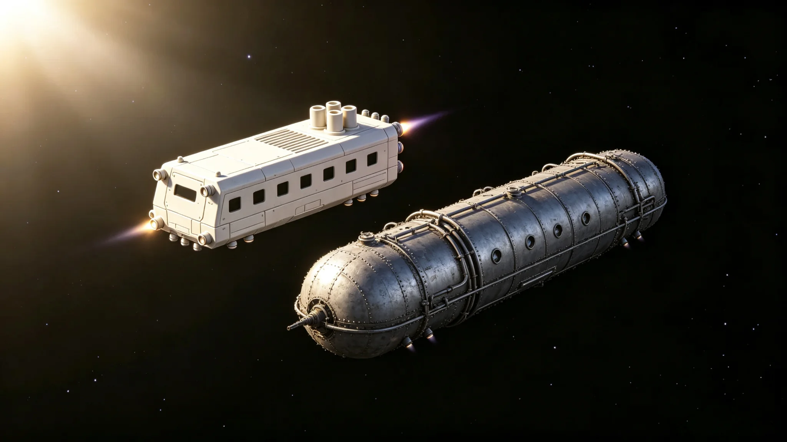

# 跨星系航道武装护航常态化编制调整与护航配额公报

**发布机构**：联合体安全协调委员会 · 护航处
**文件编号**：SEC-ESC-3342-009
**日期**：3342年4月14日
**文件等级**：跨星系公开

## 一、背景

跨星系海盗经百年清剿（见GS-3116-01、GS-3179-01）已基本肃清，但随跨星系客运与货运量上升（见GS-3314-01），偏远航道偶有零星劫掠尝试。警戒舰队前出第四恒星系方向（见GS-3334-01）后，护航处将"应急护航"转为"常态化护航"。本公报为编制调整。

## 二、护航编制

| 航线 | 护航舰配置 | 护航频率 |
|---|---|---|
| 三恒星系—第四恒星系定期线 | 1艘巡逻舰+1艘观测艇 | 每周2班 |
| 三恒星系内部航道 | 1艘巡逻舰 | 每周1班 |
| 第四恒星系内部航道 | 1艘巡逻艇 | 每周2班 |
| 第五恒星系方向 | **不护航** | 该方向无商船（见GS-3303-01） |

所有护航舰为封闭加压金属船体，无开放式结构，无轮子，形态各异，同时亮尾喷不超过1艘。

## 三、护航配额

- 客运船与货运船按航线申请护航，不另收费——护航由联合体安全预算列支。
- 私营货船须登记方可申请护航，未登记船只不护。
- 军事船舰不申请护航——自身有武装。
- 第五恒星系方向货柜船由接触事务局专用舰护送，不在本配额内。

## 四、与既有军事体系衔接

- 与第四恒星系拓荒航线护航巡逻（见GS-3108-01）合并：原护航巡逻船编入本编制。
- 与三恒星系联合巡逻机制（见GS-3164-01）联动：本编制负责航道护航，联合巡逻负责内部治安。
- 与警戒舰队前出（见GS-3334-01）分工：警戒舰队应对深空未知威胁，护航处应对航道劫掠。
- 与轨道防御系统（见GS-3195-01）分工：轨道防御拦天体，护航拦人。

## 五、人员与轮值

- 护航人员约80人，按服役年限与代际轮换（见GS-3110-01）。
- 护航舰不驻常驻家庭，人员轮值。
- 护航人员不携带家属——航道非定居点。

## 六、不做什么

- 不护航私人游艇——护航仅对登记客货船。
- 不进入第五恒星系方向——接触期不武装进入。
- 不主动攻击——护航仅伴随，发现劫掠才防御。

## 六、护航不收费

护航由联合体安全预算列支，不向承运人收费。理由：航道安全是公共品。护航处说明："船主买船票，不买安全。安全本来就该在。"

## 七、护航不越权

护航舰仅伴随，不登船检查、不扣押。发现劫掠时，先警告后拦截；不得主动搜查合规商船。

## 八、护航不收费

护航由联合体安全预算列支，不向承运人收费。护航处说明："船主买船票，不买安全。安全本来就该在。"

## 九、护航不越权

护航舰仅伴随，不登船、不扣押。发现劫掠先警告后拦截，不主动搜查合规商船。

## 十、护航数据

| 项目 | 3342年 |
|---|---|
| 护航班次 | 210 |
| 遇袭 | 0 |
| 拦截 | 1 |
| 登船 | 0 |

护航处说明："拦了一次，是因为那次真该拦。"

## 十一、护航数据

| 项目 | 3342 |
|---|---|
| 班次 | 210 |
| 遇袭 | 0 |
| 拦截 | 1 |
| 登船 | 0 |

护航不收费，不越权。

## 十二、护航常态化

本年度护航班次二百一十次，遇袭零次，拦截一次，登船零次。护航不收费，不越权。护航处说明："船主买船票，不买安全。安全本来就该在。"

## 十三、护航回顾

二百一十次护航。拦截一次。不收费不越权。

## 十四、结语

护航常态化。二百一十次。不收费不越权。

护航常态化。不收费不越权。

护航处同时说明：船主买船票，不买安全。安全本来就该在。

二百一十次护航。拦截一次。

护航处同时说明：不主动搜查合规商船。

护航处同时说明：这不是让他们离家，是让家不在这里。

护航处同时说明：船主买船票，不买安全。

护航处同时说明：安全本来就该在。

护航处同时说明：不主动搜查合规商船。

护航处同时说明：船主买船票，不买安全。

护航处同时说明：安全本来就该在。

护航处同时说明：船主买船票，不买安全。

护航处同时说明：不主动搜查合规商船。

护航处同时说明：安全本来就该在。

护航处同时说明：船主买船票，不买安全。

护航处同时说明：不主动搜查合规商船。

护航处同时说明：安全本来就该在。

护航处同时说明：船主买船票，不买安全。

护航处同时说明：安全本来就该在。

护航处同时说明：不主动搜查合规商船。

护航处同时说明：安全本来就该在。

护航处同时说明：船主买船票，不买安全。

护航处同时说明：不主动搜查合规商船。

护航处同时说明：安全本来就该在。

护航处同时说明：船主买船票，不买安全。

护航处同时说明：安全本来就该在。

护航处同时说明：不主动搜查合规商船。

护航处同时说明：安全本来就该在。

护航处同时说明：船主买船票，不买安全。

护航处同时说明：安全本来就该在。

护航处同时说明：不主动搜查合规商船。

护航处同时说明：船主买船票，不买安全。

护航处同时说明：安全本来就该在。

护航处同时说明：不主动搜查合规商船。

护航处同时说明：船主买船票，不买安全。

护航处同时说明：安全本来就该在。

---

**编制**：护航处
**会签**：安全协调委员会、跨星系议会安全委员会
**日期**：3342年4月14日
