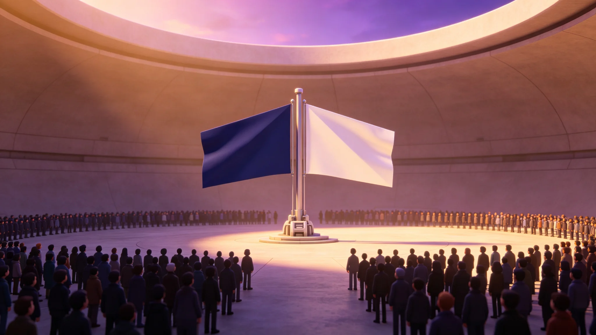

# 三恒星系文明联合体新整合星区"星旗共升"大典规程公报

**发布机构**：联合体跨星系文化委员会 · 大典处
**文件编号**：CUL-GALA-3343-001
**日期**：3343年12月31日
**文件等级**：跨星系公开

## 一、规程缘起

联合体成立以来，已整合三恒星系与第四恒星系拓荒点（见GS-3101-01起）。3343年，随第四恒星系拓荒点正式升格为联合体成员星区，跨星系文化委员会决定举办"星旗共升"大典，将新整合星区旗帜与联合体旗帜共升。本公报为大典规程。

## 二、大典原则

1. **非庆祝胜利**：星旗共升是确认行政整合，不是军事胜利。
2. **不强制观礼**：大典自愿参加，不组织单位列队。
3. **无政要致辞**：不设主席台，不邀请政要讲话。
4. **升旗而非阅兵**：大典核心为升旗，不阅兵、不游行。
5. **不公开新星区公民面**：新整合星区公民个人不被展示。

## 三、大典流程

| 环节 | 时长 | 内容 |
|---|---|---|
| 入场 | 30分钟 | 观礼者自愿入场，无引导 |
| 升旗 | 10分钟 | 联合体旗与新整合星区旗同时升起，无乐队 |
| 默立 | 2分钟 | 纪念拓荒过程中逝去的先代 |
| 须知宣读 | 10分钟 | 宣读新星区公民权、纳税、检疫义务（见GS-3138-01、GS-3309-01、GS-3310-01） |
| 散场 | 30分钟 | 不设宴会、不设合影墙 |

全程约80分钟。

## 四、升旗规格

- 联合体旗与新整合星区旗尺寸相同，不一大一小。
- 旗色：联合体旗为深蓝底，新星区旗由其自定，不强制。
- 升旗为机械自动，无旗手——避免个人英雄化。
- 升旗后旗帜长期悬挂于大典广场，不降下。

## 五、不做什么

- 不阅兵——与军事无关。
- 不放烟花——深空无大气，烟花无意义，且浪费工质。
- 不刻名——与GS-3320刻石厅同调，不刻观礼者姓名。
- 第五恒星系方向不参与——该方向接触期，未整合（见GS-3303-01）。

## 六、与既有大典分卷

- 本大典为"星区整合"确认，与GS-3155-01两百年纪念大典（周年纪念）、GS-3306-01初见礼（跨文明信号接触）、GS-3313-01新公民颁证（个人身份）、GS-3327-01落印（司法裁决）分卷保存。
- 未来第五恒星系方向若整合，另办大典，不沿用本次流程。

## 七、大典不转播

星旗共升不转播、不直播、不录像。跨星系公开仅事后一份文字公报。大典处说明："旗升上去，是给在场的人看的，不是给屏幕看的。不在场的人，读公报就够了。"

## 八、新整合星区不改名

大典不要求新整合星区改其名称、不要求其改旗帜。旗色由其自定。大典处说明："整合不是合并成一个样子。是两个样子，并排升上去。"

## 九、大典不转播

不转播、不直播、不录像。公开仅事后文字公报。大典处说明："旗升上去，是给在场的人看的。"

## 十、新整合星区不改名

不要求新整合星区改名、不改旗。旗色由其自定。大典处说明："整合不是合并成一个样子。是两个样子并排升上去。"

## 十、大典流程

| 步骤 | 内容 |
|---|---|
| 1 | 两旗就位 |
| 2 | 升旗机械启动 |
| 3 | 两旗同时升至顶 |
| 4 | 在场人静默30秒 |
| 5 | 散场 |

不致辞、不奏乐、不录像。大典处说明："30秒，够了。"

## 十一、大典流程

1. 两旗就位；
2. 机械升旗；
3. 同时到顶；
4. 静默30秒；
5. 散场。
不致辞、不奏乐、不录像。

## 十二、大典完成

星旗共升大典本年举行，两旗同时升至顶，在场人静默三十秒，散场。不致辞，不奏乐，不录像。跨星系公开仅事后一份文字公报。

## 十三、大典回顾

大典完成。两旗同升。不转播。

## 十四、结语

星旗共升大典。两旗同升。不转播。

星旗共升大典。不转播。

大典处同时说明：旗升上去，是给在场的人看的。不在场的人，读公报就够了。

两旗同升。静默三十秒。散场。

大典处同时说明：整合不是合并成一个样子。

大典处同时说明：三十秒，够了。

大典处同时说明：旗升上去，是给在场的人看的。

大典处同时说明：三十秒，够了。

大典处同时说明：整合不是合并成一个样子。

大典处同时说明：旗升上去，是给在场的人看的。

大典处同时说明：三十秒，够了。

大典处同时说明：旗升上去，是给在场的人看的。

大典处同时说明：整合不是合并成一个样子。

大典处同时说明：三十秒，够了。

大典处同时说明：旗升上去，是给在场的人看的。

大典处同时说明：整合不是合并成一个样子。

大典处同时说明：三十秒，够了。

大典处同时说明：旗升上去，是给在场的人看的。

大典处同时说明：三十秒，够了。

大典处同时说明：整合不是合并成一个样子。

大典处同时说明：三十秒，够了。

大典处同时说明：旗升上去，是给在场的人看的。

大典处同时说明：整合不是合并成一个样子。

大典处同时说明：三十秒，够了。

大典处同时说明：旗升上去，是给在场的人看的。

大典处同时说明：三十秒，够了。

大典处同时说明：整合不是合并成一个样子。

大典处同时说明：三十秒，够了。

大典处同时说明：旗升上去，是给在场的人看的。

大典处同时说明：三十秒，够了。

大典处同时说明：整合不是合并成一个样子。

大典处同时说明：三十秒，够了。

---

**编制**：大典处
**会签**：跨星系文化委员会、跨星系议会
**日期**：3343年12月31日
