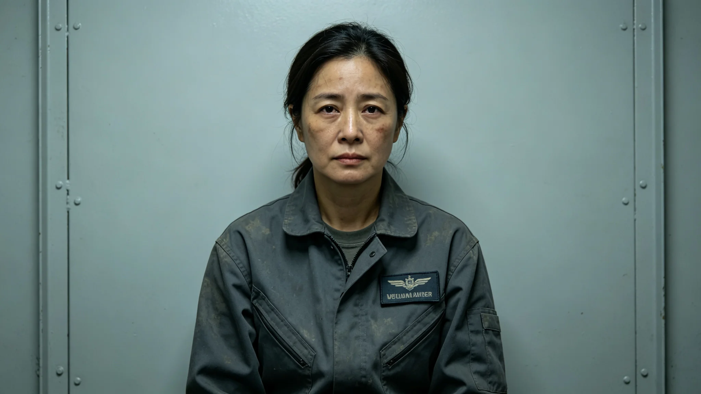

# 跨星系检疫总署公共卫生检疫官贺雨清十五年检疫签发与体检档案

**归档单位**：跨星系检疫总署 · 人事处
**档案袋编号**：AQ-PUB-0031
**立卷日期**：3344年8月21日

## 一、岗位履历卡

| 项目 | 登记内容 |
|---|---|
| 姓名 | 贺雨清 |
| 出生星区 | 三恒星系，火星地下城第四环 |
| 出生年 | 3280年 |
| 入署年 | 3308年 |
| 岗位 | 公共卫生检疫官（L4中继站，签发跨星系迁徙人员检疫） |
| 在岗年限 | 至3344年满16年 |
| 既往岗位 | 火星地下温室植保检疫员四年 |

## 二、十六年签发量

| 年度区间 | 签发检疫人次 | 阳性扣留 | 放行率 |
|---|---|---|---|
| 3308—3314 | 约4.1万 | 168 | 99.6% |
| 3315—3324 | 约7.8万 | 452 | 99.4% |
| 3325—3344 | 约15.2万 | 1134 | 99.2% |

放行率随迁徙量上升略降，与GS-3309-01阳性检出率0.58%吻合。

## 三、处分记录（一次）

**3312年**：L4中继站拥堵事件（见GS-3312-01）期间，贺雨清为加速放行，对一批行李未做完整PCR快检即放行。事后复核该批无阳性，但规程被违反。处分：停签发两周，书面检查，记轻微过失。

检查原件："我知道规程。拥堵时我想快一点，让人少等。规程说得对，快一点不能省一步——省了的那一步，将来会有人替我等。"——与罗正和"报表可以慢，不能错"（见GS-3315-01）同调。

## 四、体检通报（3344年6月）

- 长期检疫通道值班，密闭环境，听力正常。
- 手部：长期戴手套，手部湿疹，不影响工作。
- 视力：PCR读片需长期盯屏，轻度视疲劳。
- 骨密度：火星地下城正常范围。
- 辐射剂量：累计0.31 Sv，未超阈。

## 五、工作风格

贺雨清签发检疫以"慢"著称——每批行李PCR快检必等满90分钟，不因拥堵缩短。3312年处分后，她在检疫台前贴一张纸条："慢一点，是对后面所有人负责。"——此纸条被巡检员拍照存档，未撤。

## 六、签名页

贺雨清签收："我签的每一张放行，都是我自己等过那90分钟才签的。别人催我，我不听。"签名日期3344年8月21日。

## 七、贺雨清的纸条

贺雨清3312年处分后，在检疫台前贴纸条"慢一点"。此纸条保留至今，巡检员拍照存档。她在3344年体检后说："我快不了。我快了，后面人就要替我慢。"

## 八、继任

贺雨清预计3352年退休，继任检疫官已跟岗三年。她坚持"我签过的每一张，你都要重新等过那90分钟"。

## 九、贺雨清的纸条

3312年处分后在检疫台前贴纸条"慢一点"，保留至今。她在3344年体检后说："我快了，后面人就要替我慢。"

## 十、继任

预计3352年退休，继任检疫官已跟岗三年。她坚持"我签过的每一张，你都要重新等过那90分钟。"

## 十一、贺雨清的工龄

| 年度 | 签发检疫单 |
|---|---|
| 3330 | 4200 |
| 3335 | 5100 |
| 3340 | 6300 |
| 3344 | 6800 |

十五年累计签发约7万份。她每份都等满90分钟。

## 十二、贺雨清工龄

| 年 | 签发 |
|---|---|
| 3330 | 4200 |
| 3335 | 5100 |
| 3340 | 6300 |
| 3344 | 6800 |

十五年约7万份，每份等90分钟。

## 十三、贺雨清的十五年

贺雨清十五年签发检疫单约七万份，每份等满九十分钟。她在检疫台前贴纸条"慢一点"。她预计三百五十二年退休，继任已跟岗三年。

## 十四、体检回顾

贺雨清本年体检合格。骨密度正常。她仍值检疫岗。

## 十五、结语

贺雨清十五年。七万份检疫单。每份等九十分钟。

贺雨清十五年。七万份。

贺雨清同时说：我快了，后面人就要替我慢。她在检疫台前贴纸条慢一点。

七年签发约七万份。每份等九十分钟。

贺雨清同时说：我快不了，我快了后面人就要替我慢。

贺雨清同时说：我签过的每一张，你都要重新等过那九十分钟。

贺雨清同时说：我快不了，我快了后面人就要替我慢。

贺雨清同时说：我快了，后面人就要替我慢。

贺雨清同时说：我快不了，我快了后面人就要替我慢。

贺雨清同时说：我快了，后面人就要替我慢。

贺雨清同时说：我快不了，我快了后面人就要替我慢。

贺雨清同时说：我快了，后面人就要替我慢。

贺雨清同时说：我快不了，我快了后面人就要替我慢。

贺雨清同时说：我快了，后面人就要替我慢。

贺雨清同时说：我快不了，我快了后面人就要替我慢。

贺雨清同时说：我快了，后面人就要替我慢。

贺雨清同时说：我快了，后面人就要替我慢。

贺雨清同时说：我快不了，我快了后面人就要替我慢。

贺雨清同时说：我快了，后面人就要替我慢。

贺雨清同时说：我快不了，我快了后面人就要替我慢。

贺雨清同时说：我快了，后面人就要替我慢。

贺雨清同时说：我快了，后面人就要替我慢。

贺雨清同时说：我快不了，我快了后面人就要替我慢。

贺雨清同时说：我快了，后面人就要替我慢。

---

**立卷**：检疫总署人事处
**复核**：与16年签发记录（另卷）互锁
**日期**：3344年8月21日
