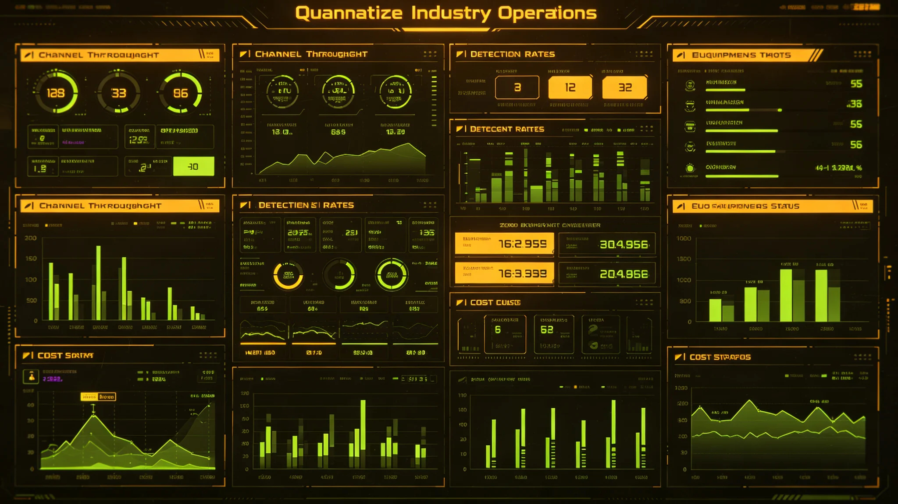

# 跨星系检疫与生物安全服务产业链年度报告

**编制单位**：联合体经济学派 · 公共服务产业处
**报告编号**：EC-PUB-3345-018
**日期**：3345年9月9日
**文件等级**：跨星系公开

## 一、背景

跨星系迁徙常态化（见GS-3166-01、GS-3310-01）与第七代检疫设备部署（见GS-3311-01）后，检疫与生物安全已从"行政成本"成长为独立产业链。本报告为3344—3345年度产业链年度报告。

## 二、产业链构成

| 环节 | 主体 | 规模 |
|---|---|---|
| 设备制造 | 第七代检疫设备厂商 | 3家，年产120套 |
| 通道运营 | 中继站检疫通道运营方 | 联合体检疫总署直管 |
| 检测服务 | PCR与拉曼检测服务商 | 5家 |
| 消毒与辐照 | 行李终末消毒服务商 | 4家 |
| 隔离舱服务 | 留置舱运营 | 检疫总署直管 |
| 数据共享 | 跨星系微生物数据库 | 联合体公共平台 |

## 三、年度决算

| 项目 | 金额（星元） |
|---|---|
| 产业链总产值 | 2.1亿 |
| 其中设备制造 | 0.8亿 |
| 其中检测服务 | 0.6亿 |
| 其中消毒与辐照 | 0.4亿 |
| 其中通道运营（补贴） | 0.3亿 |
| 就业人数 | 约4200人 |

## 四、限制

1. **不市场化逐利**：检疫通道运营为公共服务，不盈利；设备制造与检测服务可市场化，但价格受管制。
2. **不歧视**：所有迁徙人员同一标准检疫，不因星区、贫富区别。
3. **第五恒星系方向**：该方向无人口迁徙，产业链仅用于密封货物检疫，不另列。
4. **数据不商用**：微生物数据库为公共平台，不售商业广告。

## 五、与既有产业衔接

- 与文物修复产业（见GS-3162-01）无关——那是文化，这是卫生。
- 与深地农业（见GS-3185-01）联动：农业检疫为其子环节。
- 与数字版权平台（见GS-3177-01）无关——检疫不售数字内容。

## 六、3346年展望

- 迁徙人次预计3346年破12万，检疫通道需再扩。
- 第七代设备备件供应链纳入本地制造（呼应GS-3149-01本地产能替代）。
- 检疫碳排放（辐照能耗）首次纳入监测。

## 六、就业与培训

| 岗位 | 人数 |
|---|---|
| 检疫通道操作 | 1800 |
| 设备维护 | 900 |
| 检测分析 | 800 |
| 消毒与辐照 | 500 |
| 管理与数据 | 200 |

新入职者须经两周培训，考核合格上岗。贺雨清（见GS-3344-01）为培训教员。

## 七、不歧视收费

检疫服务对所有迁徙者同一标准，不因星区、贫富区别收费。产业链总报告公开成本结构。

## 八、就业与培训

新入职者经两周培训，贺雨清（见GS-3344-01）为培训教员。

## 九、不歧视收费

检疫服务对所有迁徙者同一标准，不因星区、贫富区别收费。

## 十、产业链产值

| 环节 | 产值（万星元） |
|---|---|
| 设备制造 | 1200 |
| 检测服务 | 800 |
| 消毒与辐照 | 400 |
| 耗材 | 300 |
| 合计 | 2700 |

检疫总署说明："这个产业不大，但不能省。"

## 十一、产业链

| 环节 | 产值（万） |
|---|---|
| 设备 | 1200 |
| 检测 | 800 |
| 消毒 | 400 |
| 耗材 | 300 |
| 合计 | 2700 |

不大，但不能省。

## 十二、产业链年度

本年度检疫产业链产值二千七百万星元，就业约四千二百人。检疫服务不向迁徙者收费，由公共预算列支。总署说明："这个产业不大，但不能省。"

## 十三、产业回顾

本年度产值二千七百万。就业四千二百人。不收费。

## 十四、结语

检疫产业链。产值二千七百万。不收费。

检疫产业链。不收费。

检疫总署同时说明：这个产业不大，但不能省。检疫服务不向迁徙者收费。

产值二千七百万。就业四千二百人。

总署同时说明：检疫不是歧视，是对所有人负责。

总署同时说明：这个产业不大，但不能省。

总署同时说明：检疫不是歧视，是对所有人负责。

总署同时说明：这个产业不大，但不能省。

总署同时说明：检疫不是歧视，是对所有人负责。

总署同时说明：检疫不是歧视，是对所有人负责。

总署同时说明：这个产业不大，但不能省。

总署同时说明：检疫不是歧视，是对所有人负责。

总署同时说明：这个产业不大，但不能省。

总署同时说明：这个产业不大，但不能省。

总署同时说明：检疫不是歧视，是对所有人负责。

总署同时说明：这个产业不大，但不能省。

总署同时说明：这个产业不大，但不能省。

总署同时说明：检疫不是歧视，是对所有人负责。

总署同时说明：这个产业不大，但不能省。

总署同时说明：这个产业不大，但不能省。

总署同时说明：这个产业不大，但不能省。

总署同时说明：检疫不是歧视，是对所有人负责。

总署同时说明：这个产业不大，但不能省。

总署同时说明：这个产业不大，但不能省。

总署同时说明：检疫不是歧视，是对所有人负责。

总署同时说明：这个产业不大，但不能省。

总署同时说明：检疫不是歧视，是对所有人负责。

总署同时说明：这个产业不大，但不能省。

总署同时说明：检疫不是歧视，是对所有人负责。

总署同时说明：这个产业不大，但不能省。

总署同时说明：检疫不是歧视，是对所有人负责。

总署同时说明：这个产业不大，但不能省。

总署同时说明：检疫不是歧视，是对所有人负责。

总署同时说明：这个产业不大，但不能省。

总署同时说明：检疫不是歧视，是对所有人负责。

总署同时说明：这个产业不大，但不能省。

---

**编制**：公共服务产业处
**审核**：经济学派评审委员会
**日期**：3345年9月9日
