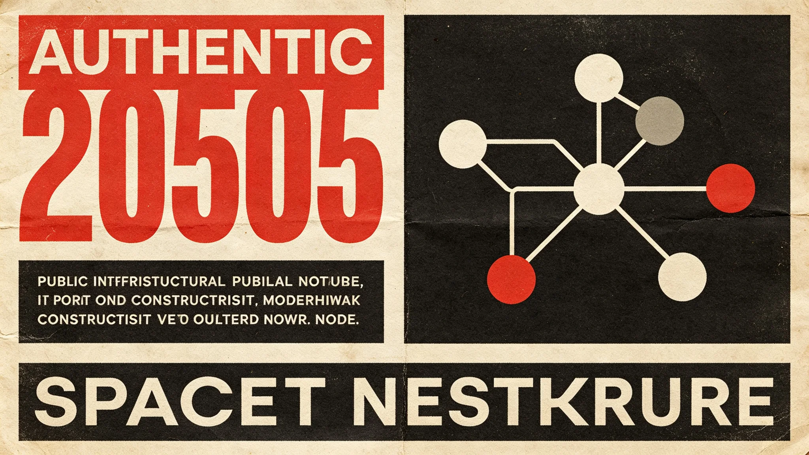

# 跨星系紧急状态联动指挥权限制度修订公报

**发布机构**：联合体安全协调委员会 · 法制处
**文件编号**：SEC-EMG-3346-005
**日期**：3346年11月11日
**文件等级**：跨星系公开

## 一、修订背景

十年间，跨星系紧急事件频发：L4中继站拥堵（见GS-3312-01）、碎片云误报（见GS-3333-01）、移民船微生物超标滞港（见GS-3348-01同类）。各事件中，指挥权限有时不清——调度中心、检疫总署、安全部队、接触事务局谁主谁从，靠临时协调。安全协调委员会经跨星系议会法律委员会三读，修订本制度。

## 二、紧急状态分级

| 级别 | 触发 | 指挥权 |
|---|---|---|
| 四级（蓝） | 常规事件 | 事发单位自行 |
| 三级（黄） | 单系统事件，不跨星区 | 事发星区主管部门 |
| 二级（橙） | 跨星区事件，或多系统联动 | 安全协调委员会副主任 |
| 一级（红） | 跨星系事件，或威胁定居点 | 安全协调委员会主任+跨星系议会主席联签 |
| 零级（黑） | 已发生灾难 | 事后处置，不预演 |

## 三、联动指挥

1. **单一指挥**：二级以上紧急状态，由安全协调委员会指定一个主指挥单位，其余单位配合，不多头指挥。
2. **通信延迟**：跨星系时延下，主指挥可在远端决策，事发单位有就地处置权（见GS-3126-01通信延迟送达口径）。
3. **信息公开**：二级以上24小时内跨星系公开，一级立即公开。
4. **误报不追责**：按规程升级后误报，不追责（见GS-3333-01）。

## 四、各事件类型的主指挥

| 事件类型 | 主指挥 |
|---|---|
| 交通拥堵/航班延误 | 迁徙管理署调度中心 |
| 生物安全/检疫泄漏 | 检疫总署 |
| 深空未知威胁 | 预警处+舰队处 |
| 资源争端对峙 | 仲裁庭现场协调组 |
| 接触期事件 | 接触事务局 |
| 自然灾害/事故 | 事发星区主管 |

## 五、与既有制度衔接

- 不替代《深空安全预警分级响应》（见GS-3331-01）——那是预警，本制度是指挥。
- 不替代《反恐怖与极端思想预防教育》（见GS-3199-01）——那是预防，本制度是应急。
- 第五恒星系方向事件主指挥为接触事务局（见GS-3303-01），本制度不另设。

## 六、罚则

- 紧急状态下拒不服从主指挥者，按《跨星系紧急状态法》追责。
- 谎报紧急状态者，从重。
- 本修订由安全协调委员会法制处解释，每年11月11日向跨星系议会法律委员会报告。

## 七、事后复盘

每次二级以上紧急状态结束后30日内，主指挥单位提交复盘报告，跨星系议会法律委员会评阅。复盘不追责，但记录改进点。法制处说明："紧急状态考的不是反应快，是事后记得改。"

## 八、不无限升级

紧急状态解除后，指挥权自动交回日常单位，不拖延收权。

## 九、事后复盘

二级以上紧急状态结束后30日内提交复盘报告，法律委员会评阅。复盘不追责，记录改进点。法制处说明："考的不是反应快，是事后记得改。"

## 十、不无限升级

紧急状态解除后，指挥权自动交回日常单位，不拖延收权。

## 十、历史触发

| 事件 | 级别 |
|---|---|
| 3312拥堵 | 二级 |
| 3333误报 | 二级 |
| 3348滞港 | 二级 |
| 3350 | 无 |

三十年触发三次二级，无三级以上。法制处说明："制度用了三次，每次都用对了。"

## 十一、历史触发

| 事件 | 级别 |
|---|---|
| 3312拥堵 | 二 |
| 3333误报 | 二 |
| 3348滞港 | 二 |

三次二级，无三级以上。

## 十二、制度启用

三十年触发三次二级，无三级以上。法制处说明："制度用了三次，每次都用对了。"事后复盘不追责，记录改进点。

## 十三、制度回顾

本年度无触发。复盘不追责。

## 十四、结语

紧急状态权限修订。三十年触发三次二级。

紧急状态权限修订。三次二级。

法制处同时说明：紧急状态考的不是反应快，是事后记得改。

三十年三次二级。无三级以上。

法制处同时说明：紧急状态解除后，指挥权自动交回。

法制处同时说明：制度用了三次，每次都用对了。

法制处同时说明：紧急状态考的不是反应快，是事后记得改。

法制处同时说明：制度用了三次，每次都用对了。

法制处同时说明：紧急状态考的不是反应快，是事后记得改。

法制处同时说明：紧急状态考的不是反应快，是事后记得改。

法制处同时说明：制度用了三次，每次都用对了。

法制处同时说明：紧急状态考的不是反应快，是事后记得改。

法制处同时说明：制度用了三次，每次都用对了。

法制处同时说明：制度用了三次，每次都用对了。

法制处同时说明：紧急状态考的不是反应快，是事后记得改。

法制处同时说明：制度用了三次，每次都用对了。

法制处同时说明：制度用了三次，每次都用对了。

法制处同时说明：紧急状态考的不是反应快，是事后记得改。

法制处同时说明：制度用了三次，每次都用对了。

法制处同时说明：制度用了三次，每次都用对了。

法制处同时说明：制度用了三次，每次都用对了。

法制处同时说明：紧急状态考的不是反应快，是事后记得改。

法制处同时说明：制度用了三次，每次都用对了。

法制处同时说明：制度用了三次，每次都用对了。

---

**编制**：法制处
**会签**：安全协调委员会、跨星系议会法律委员会
**日期**：3346年11月11日
