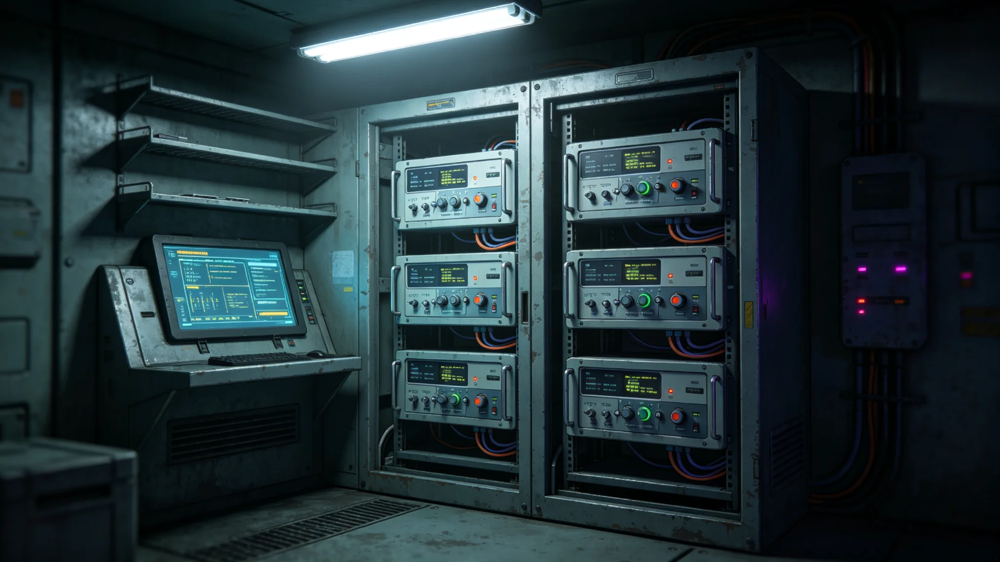

# 跨星系统一时间标准与光时延同步校准第八代技术公报

**编制单位**：联合体通信工程学派 · 时间标准组
**报告编号**：COM-TS-3347-025
**日期**：3347年6月23日
**密级**：跨星系公开技术版

## 一、任务概述

跨星系通信时延可达数小时至数天（见GS-3126-01），各星区原子钟长期漂移。导航历表（见GS-3339-01）、量子中继（见GS-3160-01）、预警分级（见GS-3331-01）均依赖统一时间。时间标准组承担第八代同步校准，本公报记录技术。

## 二、时间标准

| 项目 | 配置 |
|---|---|
| 主钟 | 三恒星系母站氢原子钟阵列，6台 |
| 子钟 | 第四恒星系方向、第五恒星系方向中继站各2台 |
| 同步链路 | 光帆脉冲通信（见GS-3127-01）+量子中继（见GS-3160-01） |
| 同步精度 | 主钟与子钟时差<1毫秒 |
| 校准周期 | 每72小时自动校准一次 |

## 三、光时延补偿

- 跨星通信单趟时延4—5小时（第五恒星系方向）至数小时（第四恒星系方向）。
- 同步信号须扣除光传播时延，按各路线距离实时计算。
- 子钟在等待同步信号期间自由运行，漂移由本地原子钟保持。
- 若中继脱落（见GS-3140-01），子钟按预漂移模型继续运行，不立即失准。

## 四、第八代升级

1. **主钟冗余**：6台氢钟，任2台故障不影响。
2. **子钟自主**：子钟在无同步信号时可自主运行30天。
3. **AI辅助漂移预测**：AI预测子钟漂移，人工复核。
4. **跨星时差公开**：各星区当前时差公开，不保密。

## 五、精度数据

| 指标 | 目标 | 实测 |
|---|---|---|
| 主钟-子钟时差 | <1ms | 0.7ms |
| 无同步自主运行 | 30天 | 32天 |
| 校准周期 | 72小时 | 72小时 |
| 中继脱落后漂移 | <10ms/天 | 8ms/天 |

## 六、与既有技术衔接

- 与导航历表（见GS-3339-01）配合：轨道修正依赖时间同步。
- 与量子中继（见GS-3160-01）配合：量子密钥分发依赖精确时间。
- 与预警分级（见GS-3331-01）配合：事件时间戳依赖统一时间。

## 七、时间不公开

主钟与子钟时差不公开——仅各星区技术单位内部掌握。理由：时间精度涉及导航与通信安全，公开可被干扰。时间标准组说明："时间是基础设施，不是展品。"

## 八、故障演练

每年演练一次主钟故障切换，子钟自主运行能力。至3350年未发生主钟实际故障。

## 九、时间不公开

主钟与子钟时差不公开，仅各星区技术单位掌握。时间标准组说明："时间是基础设施，不是展品。"

## 十、故障演练

每年演练一次主钟故障切换。至3350年未发生主钟实际故障。

## 十、第八代升级

| 项目 | 第七代 | 第八代 |
|---|---|---|
| 主钟精度 | ±1e-13 | ±5e-14 |
| 子钟同步 | ±10ns | ±5ns |
| 备份 | 3 | 5 |

时间标准组说明："精度翻一倍，是为了让导航偏少一米。"

## 十一、第八代

| 项目 | 七代 | 八代 |
|---|---|---|
| 精度 | ±1e-13 | ±5e-14 |
| 同步 | ±10ns | ±5ns |
| 备份 | 3 | 5 |

精度翻倍，导航偏少一米。

## 十二、第八代启用

第八代时间标准本年部署，主钟精度提高一倍，子钟同步缩短至五纳秒。主钟与子钟时差不公开。时间标准组说明："时间是基础设施，不是展品。"

## 十三、时间回顾

第八代部署。精度翻倍。时差不公开。

## 十四、结语

第八代时间标准。精度翻倍。时差不公开。

第八代时间标准。精度翻倍。

时间标准组同时说明：时间是基础设施，不是展品。时差不公开。

精度提高一倍。同步五纳秒。

时间标准组同时说明：时间精度涉及导航安全，公开可被干扰。

时间标准组同时说明：精度翻一倍，是为了让导航偏少一米。

时间标准组同时说明：时间是基础设施，不是展品。

时间标准组同时说明：精度翻一倍，导航偏少一米。

时间标准组同时说明：时间精度涉及导航安全，公开可被干扰。

时间标准组同时说明：时间是基础设施，不是展品。

时间标准组同时说明：精度翻一倍，导航偏少一米。

时间标准组同时说明：时间是基础设施，不是展品。

时间标准组同时说明：精度翻一倍，导航偏少一米。

时间标准组同时说明：精度翻一倍，导航偏少一米。

时间标准组同时说明：时间是基础设施，不是展品。

时间标准组同时说明：精度翻一倍，导航偏少一米。

时间标准组同时说明：精度翻一倍，导航偏少一米。

时间标准组同时说明：时间是基础设施，不是展品。

时间标准组同时说明：精度翻一倍，导航偏少一米。

时间标准组同时说明：精度翻一倍，导航偏少一米。

时间标准组同时说明：精度翻一倍，导航偏少一米。

时间标准组同时说明：时间是基础设施，不是展品。

时间标准组同时说明：精度翻一倍，导航偏少一米。

时间标准组同时说明：精度翻一倍，导航偏少一米。

时间标准组同时说明：时间是基础设施，不是展品。

时间标准组同时说明：精度翻一倍，导航偏少一米。

时间标准组同时说明：时间是基础设施，不是展品。

时间标准组同时说明：精度翻一倍，导航偏少一米。

时间标准组同时说明：时间是基础设施，不是展品。

时间标准组同时说明：精度翻一倍，导航偏少一米。

时间标准组同时说明：时间是基础设施，不是展品。

时间标准组同时说明：精度翻一倍，导航偏少一米。

---

**编制**：时间标准组
**审核**：通信工程学派评审委员会
**日期**：3347年6月23日
