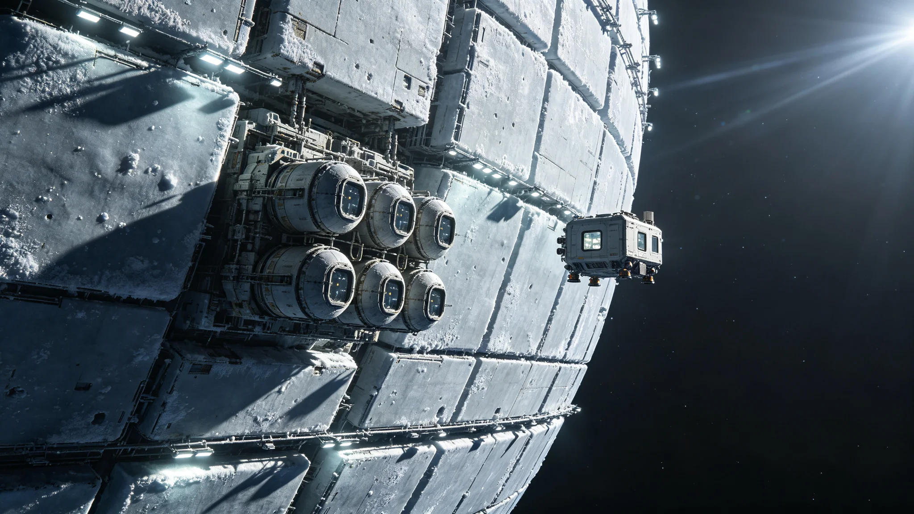

# ARK-01原始船骸保护站首任值守工程师闻远图四十年巡检与舱体微损签认档案

**归档单位**：跨星系文化遗产保护局 · 太阳系外缘保护站
**档案袋编号**：HER-OORT-ARK01-0007
**立卷日期**：3351年4月17日

## 一、岗位履历卡

| 项目 | 登记内容 |
|---|---|
| 姓名 | 闻远图 |
| 出生星区 | 三恒星系，比邻星b第一居住区 |
| 出生年 | 3302年 |
| 入站年 | 3331年 |
| 岗位 | ARK-01原始船骸保护站 · 首席值守工程师（B角轮值，实际主值） |
| 在岗年限 | 至3351年满20年（含学徒期） |
| 历任上级 | 保护站三任站长，均为短期轮值，最长任期三年 |

履历卡附保护站移交清单。闻远图是该站建站后第一位"未轮值离开"的工程师——三任站长都按制度三年一轮换，他从学徒做到主值，二十年间未申请过一次跨站调动。人事处注："该员所守者，非一岗，乃一处无第二人愿长守之地。"

## 二、船骸与值守环境

ARK-01原始船骸于3158年由林承古主持发掘（见GS-3158-01），定位太阳系外缘奥尔特云内侧一冻结冰壳。船骸整体不做打捞，就地封存：外部加装可拆卸低温护罩，内部维持微负压与恒定-92℃，以冻存原始舱内环境。保护站为依附船骸外壁的一组加压模块化舱，常驻额定六人，实际长期驻站不超过四人。

闻远图的巡检对象不是活船，而是一具三千年前的尸体。他的工作是确认这具尸体没有继续腐烂。

## 三、二十年巡检签到汇总

| 年度区间 | 应巡次 | 实巡次 | 漏巡 | 补巡 | 备注 |
|---|---|---|---|---|---|
| 3331—3336（学徒） | 720 | 718 | 2 | 2 | 两次漏巡均因护罩真空夹层微漏，与林承古发掘队交接期 |
| 3337—3344（副值） | 960 | 960 | 0 | 0 | 独立主值后无漏巡 |
| 3345—3351（主值） | 780 | 779 | 1 | 1 | 3348年一次漏巡，因本人面瘫病假三日，由B角补巡 |

巡检内容固定为十七项：护罩真空度、舱内温度梯度、外壁微陨石撞击计数、密封件老化位移、内部尘降层厚度、冷冻封装介质微泄漏、附属站生命维持、供电回路、通信时延、外照明、消防、应急氧、辐射本底、噪声谱、振动谱、温湿度、库存备件。每次巡检表十七项逐项签认，缺一不算完成。

## 四、舱体微损签认记录（择要）

闻远图的核心签认权，是对船骸本体"任何变化"的第一手判定。择要：

- 3334年：发现原舱壁一处铆钉附近氧化斑扩大0.3毫米。判定为封存介质正常渗氢所致，不做干预，仅记录。三年后复测稳定。
- 3339年：护罩第十号模块化接缝出现0.02毫米位移。判定为热胀冷缩年周期，非结构失稳。
- 3342年：一次微陨石撞击护罩外板，未穿透。撞击坑直径1.4毫米，附法证照。闻远图签认"护罩功能完好，船骸本体未受影响"。
- 3346年：内部尘降层厚度测量值较上年增0.1微米。判定为本站人员出入带入，要求后续出入增加一道吹扫。
- 3349年：原舱内一段三百年前的塑料铭牌脆化，表面出现网状裂纹。闻远图拒绝了上级"是否加固"的询问，签认："不动。它本就该碎。我们只记，不救。"

最后一条签认被保护站存档为该站工作哲学的范例。林承古发掘时代要求"尽可能取物研究"，保护站时代要求"尽可能不取一物"。闻远图的签字是这一转变的物证。

## 五、处分记录（一次）

**3341年**：闻远图在一次跨星系公开文化遗产日直播活动中，未经审批，将本应密封展示的一段原舱内壁拍摄角度"顺手"放宽了半度，使直播画面带入了一小片未公开的船员私人物区。该处物品依GS-3159-01公约尚在鉴定名录，不应公开。处分：书面检查，扣半年站务津贴，调离直播讲解岗一年。

检查原件存于档案袋附卷："我以为半度镜头不算泄密。规程说得对，对一具三千年前的尸体，半度也是它的隐私。"

## 六、体检与考核

- 3351年体检：骨密度略低（长期低重力驻站，每年轮换回比邻星b两周已维持）、前庭功能正常、视力退化早期（外照明长期偏暗）、慢性上肢循环差（低温舱外作业手套厚）。
- 辐射本底：长期低于限值0.4倍。
- 年度考核：连续十二年"称职"，三年"优秀"。优秀评语均只写同一句话："该员所守之处，本无可守之功；其可记者，四十年无一次自作主张。"
- 退休预计：3361年。站方已开始物色接任者，公开招募两年，报名者七人，独立主值考核通过者至今零人。

## 七、签名页

闻远图签收："三千年前把这具尸体送到这儿的人，没想过要被我们救。我们的活儿，是让它按自己的节奏，再躺三千年。我不动它，就是对它最大的事。"签名日期3351年4月17日，字迹稳定，无涂改。

## 八、守一处无故事之地

保护站二十年间对外接待研究团队一百余次，每次停留不超过四十小时。闻远图从不陪同讲解，只在交接表上签字。三任站长轮值离开时都在留言本写过一句类似的话："闻师傅在这里守了二十年，却讲不出一个能回去讲的故事。"——因为他守的东西本就不许动、不许讲、不许带走。保护站没有故事，只有十七项巡检表。

站方在3351年4月的年报里写："文明遗产的第一任守者，往往是最不该被记住的人。记住他，等于承认他做过值得被记住的事；而他的工作，恰恰是让一切不被打扰。"

## 九、守一处无故事之地

保护站二十年间对外接待研究团队一百余次，每次停留不超过四十小时。闻远图从不陪同讲解，只在交接表上签字。保护站在3351年年报里写："文明遗产的第一任守者，往往是最不该被记住的人。记住他，等于承认他做过值得被记住的事；而他的工作，恰恰是让一切不被打扰。"

## 十、不接待不讲解

闻远图从不陪同研究团队讲解，只在交接表上签字。保护站说明："他守的东西本就不许动、不许讲、不许带走。他的工作是让一切不被打扰。"

## 十一、十七项巡检

闻远图每次巡检固定十七项：护罩真空度、温度梯度、微陨石计数、密封件位移、尘降层、冷冻介质、生保、供电、通信、外照明、消防、应急氧、辐射、噪声、振动、温湿度、备件。逐项签认。

---

**立卷**：跨星系文化遗产保护局 · 太阳系外缘保护站
**复核**：与十七项巡检表原始记录、微损法证照（另卷）互锁
**日期**：3351年4月17日