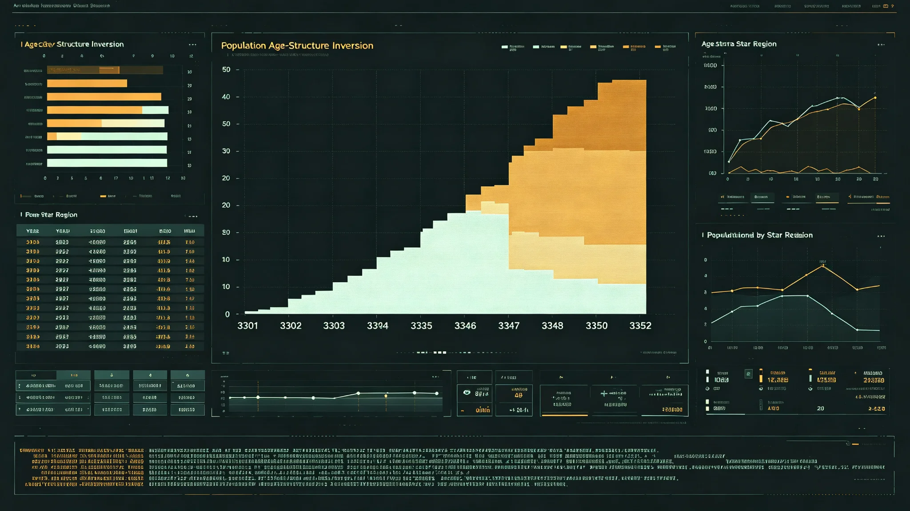

# 跨星系人口结构倒挂与生育意愿登记制度修订公报

**发布机构**：三恒星系文明联合体跨星系人口委员会
**发布日期**：3353年3月1日
**文件等级**：跨星系公开

## 一、修订背景

联合体人口自3280年代起出现结构倒挂：六十岁以上人口占比于3301年首次超过二十岁以下人口占比，此后差距逐年扩大。截至3352年末，三恒星系总人口约4,120万，其中六十岁以上占41.2%，二十岁以下占18.6%，劳动年龄（二十至六十）占40.2%。跨星系迁徙以青壮年为主，部分缓解了母星区倒挂，但第四、第五恒星系方向定居点因人口冻结，倒挂更显著。

人口委员会认为，倒挂本身不是危机——危机是制度仍按"年轻人口扩张"假设设计。本次修订不是鼓励生育，而是把生育意愿从隐性家庭决策变为可登记、可规划、可承接的公共事项。

## 二、现行制度问题（修订前）

修订前，生育为家庭自主事项，公共部门不掌握意愿数据，只在孩子出生后登记户籍。由此产生三个问题：

1. **资源错配**：托儿所、儿科、青少年活动设施按历史出生率规划，实际出生连年低于规划，设施闲置；而老年照护床位连年紧缺。
2. **迁徙家庭被动**：跨星系迁徙家庭因不知目的地托儿资源，常在迁徙后两年内被迫再迁徙，增加检疫与运力压力。
3. **意愿黑箱**：政策制定者无法区分"不愿生"与"想生但受资源/照护/迁徙成本所限"，两类需要不同应对，旧制度无法分辨。

## 三、修订要点

**（一）生育意愿自愿登记**

- 年满二十二岁的联合体公民，可自愿在跨星系人口登记系统登记本人及配偶的生育意愿：无意愿、五年内有意愿、十年内有意愿、不确定。
- 登记完全自愿，不登记不影响任何权利、不进入任何考核、不与配给挂钩。
- 登记信息仅用于区域资源规划，不向雇主、学校、保险开放。

**（二）意愿—资源匹配**

- 各星区按登记意愿分布，提前三年规划托儿所、儿科、青少年活动设施增量。
- 跨星系迁徙家庭在迁徙申请时可查询目的地"同意愿密度"，辅助决策。
- 登记意愿可随时修改、撤回；撤回后数据从规划基数中剔除。

**（三）不鼓励、不惩罚、不评级**

- 本制度不提供生育补贴、不设生育指标、不对星区出生数排名、不将登记意愿与任何评优挂钩。
- 委员会明确："我们不劝说任何人生或不生。我们只在有人愿意生的时候，把托儿的屋子提前盖好。"

## 四、预期与边界

| 项目 | 预期 |
|---|---|
| 首年登记率 | 占有意愿人口的35%—45%（自愿，不追高） |
| 数据用途 | 仅资源规划，不进入任何强制流程 |
| 隐私 | 登记信息十年后自动脱密，仅留区域聚合数 |
| 迁徙衔接 | 与GS-3310迁徙配额、GS-3366基础设施投资联动 |

边界声明：本制度不改变"生育是家庭自主决定"这一根本原则。委员会在公报中强调，若登记率长期低于预期，说明居民认为资源不是瓶颈，委员会不得据此加码推动生育——制度只解决"接得住"，不解决"愿不愿"。

## 五、实施安排

- 3353年第二季度：三恒星系母星区先行试点登记。
- 3354年：推广至第四、鲸鱼座τ方向定居点。
- 3355年：第五恒星系方向不纳入（该方向人口冻结，不适用）。
- 3363年：首次五年评估，根据登记率与实际出生差决定是否调整。

## 六、与既有制度衔接

- 户籍登记（见GS-3138-01）维持不变，出生后登记照常。
- 跨星系自由迁徙（见GS-3166-01）不受影响。
- 低生育下的照护义务，另见GS-3382抚养共同体制度（修订中）。

## 七、附则

委员会在公报末附一句："倒挂不是病，是时间的形状。我们能做的，是让屋子在人来之前盖好，而不是等人来了再盖。"

## 七、登记数据隐私

生育意愿登记信息十年后自动脱密，仅留区域聚合数。不进入任何商业数据库。人口委员会强调："登记意愿是私人的，聚合统计是公共的。我们只用公共的那部分。"

## 八、不鼓励不惩罚

生育意愿登记不补贴、不指标、不排名。人口委员会说明："我们不催人生，也不罚人不生。我们只在有人愿意生时，把托儿的屋子提前盖好。"

## 九、登记不挂钩

生育意愿登记与雇主、学校、保险完全隔离。不登记不影响任何权利。十年后自动脱密。

## 十、前四次修订沿革

本次为生育相关登记制度自3280年代以来的第五次修订。3287年首次建立出生后户籍即时登记；3298年增设跨星系迁徙子女随迁随读通道；3310年配合迁徙配额（GS-3310）调整迁徙家庭随迁子女登记时限；3329年将儿科床位规划由历史出生率改为滚动预测。前四次均围绕"出生之后"做文章，本次首次把登记节点前移至"出生之前的意愿"。委员会在公报中注明：前四次解决的是孩子已经出生之后怎么办，这次解决的是孩子还没出生、屋子还没盖好之前怎么办。

## 十一、各星区试点准备数据

3353年第一季度试点准备阶段，三系母星区已完成登记终端布设：比邻星b方向1,240个社区登记点，鲸鱼座τ方向地下城市分层780个登记点，太阳系方向主带与火星定居点合计460个登记点。各登记点均配备离线登记副本，跨星通信中断期间可本地登记，通信恢复后补录。委员会抽查120个登记点，终端离线副本完整率100%，登记员培训完成率98.4%，未完成的1.6%为轮休顶替人员，已于3353年2月底补训完毕。

## 十二、监督与反馈机制

- 每季度公布一次区域聚合登记数（仅留区间，不留点位），接受公民查阅。
- 公民如发现登记信息被雇主、学校、保险调取，可向人口委员会隐私核查处投诉，受理后十五个工作日内答复。
- 3363年首次五年评估前，每两年发布一次登记率与实际出生差对照，若偏差超过两成，公开说明偏差来源。
- 本制度不设专职执法队伍，登记为自愿，违规调取按既有隐私法追责，不另立新罚则。

---

**发布**：三恒星系文明联合体跨星系人口委员会
**日期**：3353年3月1日