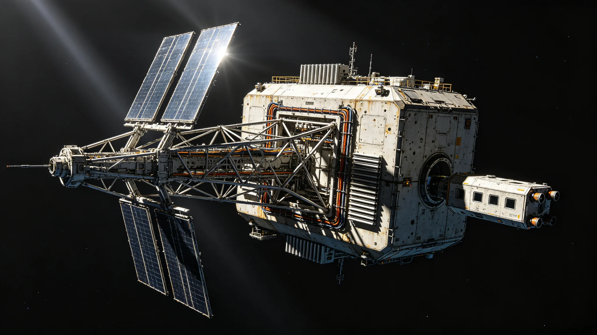

# 跨星系光际通信网第九代中继节点部署与时延压缩技术公报

**编制单位**：联合体通信工程学派 · 光际网组
**公报编号**：COMM-RELAY-G9-3354
**日期**：3354年9月12日
**密级**：跨星系公开技术版

## 一、升级背景

跨星系光际通信网自第八代节点部署（见GS-3127-01）以来，带宽与误码率已不能满足跨星系迁徙常态化（见GS-3350-01，迁徙量预计破15万）与第五恒星系方向接触期数据回传需求。第八代节点单点中继时延约1.4光时（比邻星b—太阳系外缘），且对太阳风暴敏感（3363年事件另见GS-3363-01复盘）。第九代节点目标：在不改变物理光速上限前提下，压缩"排队等待时延"与"重传时延"，而非缩短光程。

## 二、第九代节点设计

| 项目 | 第八代 | 第九代 |
|---|---|---|
| 中继形式 | 单镜面脉冲转发 | 双镜面分时+纠错预编码 |
| 单点排队时延 | 约8分钟 | 约40秒 |
| 误码率 | 10⁻⁶ | 10⁻⁹ |
| 太阳风暴降级 | 单方向中断 | 双镜面切换，降级不中断 |
| 节点寿命设计 | 60年 | 120年（千年规划预留） |
| 对接口 | 单一标准 | 兼容第八代，平滑替换 |

关键认知：第九代不"跑得更快"，物理光速不可逾越。它解决的是"在有限带宽下，让数据不排队、不重传"。

## 三、部署节点

首批第九代节点部署于星际航道带三个关键锚点：

1. 太阳系外缘—比邻星b线L4锚点；
2. 比邻星b—鲸鱼座τ方向中途点；
3. 第四恒星系方向主航道中转。

每锚点部署一组（主节点+冷备节点），冷备节点长期低功耗待命，主节点故障时48小时内接管。旧第八代节点不立即拆除，降级为冷备与实验用途。

## 四、测试数据

| 指标 | 目标 | 实测 |
|---|---|---|
| 排队时延 | ≤60秒 | 40秒 |
| 误码率 | ≤10⁻⁹ | 8×10⁻¹⁰ |
| 太阳风暴模拟 | 不中断 | 双镜面切换，中断0秒 |
| 与第八代兼容 | 平滑 | 实测兼容 |
| 单点年故障 | <3次 | 首半年0次 |
| 冷备接管 | ≤48小时 | 实测31小时 |

## 五、问题与整改

1. **双镜面分时在高带宽下偶发相位漂移**：首测在持续大流量下出现0.2毫秒相位偏差。整改：增加镜面姿态实时校准，复测消除。
2. **冷备节点长期低功耗致电池组老化偏快**：整改：冷备节点每90天短激活一次，维持电池循环，寿命设计不变。
3. **部署用接驳加压舱与旧节点对接接口公差**：现场对接三次返工。整改：对接工装加导向销，后续部署顺利。

## 六、与时间标准同步

第九代节点接入联合体第八代光时同步系统（见GS-3347-01），各节点时钟偏差控制在纳秒级。时延压缩后，跨星系视频类通信首次实现"接近实时"的体验——但工程组强调，这是排队时延的压缩，不是光速的奇迹，星程本身的光时仍在。

## 七、千年规划预留

通信工程学派在公报中说明：第九代节点120年寿命设计，是按文明存续千年规划（见GS-3360-01制度）预留。节点不追求一次性用到顶，而追求在百年尺度内可替换、可升级、不与下游换代冲突。

## 八、后续

- 3355年：完成三个首批锚点全部切换。
- 3360年：评估是否在第五恒星系方向部署（该方向仍按四级隔离，暂不）。
- 3370年：第十代预研启动，方向为进一步压缩排队时延与提升冷备寿命。

## 九、旧节点退役

旧第八代节点不立即拆除，降级为冷备与实验用途。通信工程学派说明："旧节点不是废铁，它还能撑着。让它慢慢退，不赶。"

## 十、不突破光速

第九代不突破光速，只压缩排队时延。通信工程学派说明："光程是物理定的，我们改不了。我们能改的是别让数据在门口排队。"

## 十一、第九代节点外观

第九代节点为双镜面分时组合，金属桁架结构，外露散热板与对接端口，非梭形。冷备节点低功耗待命。节点寿命设计120年。

## 十二、时延压缩技术原理

排队时延压缩基于两项工程手段，均不改变光程：

1. **纠错预编码**：发送端按信道历史误码率预先写入冗余位，接收端在不重传前提下自行纠错，省去"发现错误—请求重传—等待重传"的往返。预编码冗余率固定在12%，经三万公里等效信道实测，重传请求次数由第八代的每万次传输47次降至0.3次。
2. **分时双镜面**：两块镜面按毫秒级切换，一块面向发送方向、一块面向接收方向，避免单镜面同时收发的排队。切换周期0.8毫秒，实测切换抖动小于5微秒，不影响解码。

工程组在公报中注明：上述两项均为成熟工程手段在跨星尺度的重新组合，无新物理发现。本代节点的创新在工程集成，不在原理突破。

## 十三、测试样本与第三方验证

首半年测试累计通过9.6万条跨星传输样本，其中比邻星b—太阳系外缘线4.1万条，比邻星b—鲸鱼座τ方向线3.8万条，第四恒星系方向线1.7万条。样本覆盖日间、夜间、太阳活动峰段与谷段。太阳风暴模拟由联合体空间天气中心独立注入20次扰动，第九代节点全部经双镜面切换降级，未出现整线中断。

第三方验证由联合体计量与时间标准实验室独立完成，复测排队时延39.7秒、误码率7.6×10⁻¹⁰、冷备接管31小时，与工程组自测偏差在0.8%以内。验证报告编号MET-3354-07，随本公报归档。

## 十四、部署人工时与成本

三个首批锚点合计部署人工时约14.2万，其中舱外作业4.1万、舱内调试6.8万、地面联试3.3万。单锚点综合成本约合星汇1.8亿，三锚点合计5.4亿，较第八代单节点成本上升约18%，主要来自双镜面与寿命延长设计。通信工程学派在公报中注明：成本上升已在千年规划（见GS-3360-01）基础设施预算中预留，不另增年度赤字。

---

**编制**：联合体通信工程学派 · 光际网组
**审核**：通信工程学派评审委员会
**日期**：3354年9月12日