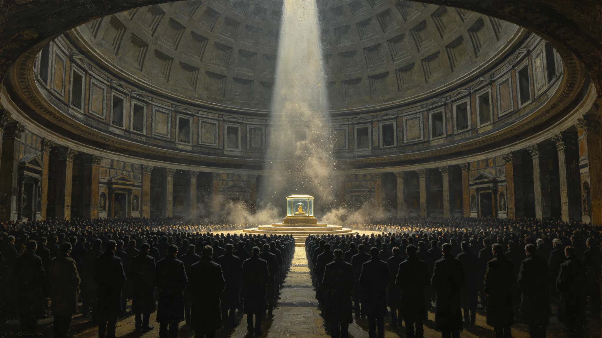

# ARK-01原舱"启程咒"周年诵念与原物封存仪式规程公报

**发布机构**：三恒星系文明联合体文化委员会
**发布日期**：3355年1月20日
**文件等级**：跨星系公开

## 一、规程缘起

ARK-01原舱内随船封存的一件诵念文本残片，经林承古发掘队（见GS-3158-01）修复后确认为当年启航日全船共诵的"启程咒"残句。残片依遗产公约（见GS-3159-01）就地封存于船骸保护站（见GS-3351-01），不展出、不复制、不转写全文。

考虑到该残句对联合体公共记忆的意义，文化委员会制定本周年诵念规程：每年一次，由各星区自愿参加的公民，在不接触原物、不复制原文的前提下，凭修复后公布的音韵记谱合诵残句可公开部分。

## 二、可公开与不可公开边界

| 项目 | 处置 |
|---|---|
| 残句全文 | 不公开，封存于船骸保护站 |
| 音韵记谱（仅音律节奏，不含语义） | 经鉴定后可公开 |
| 诵念时长、节拍、声部 | 可公开 |
| 诵念时是否持原物 | 严禁，原物不离开保护站 |
| 是否现场直播 | 严禁，仅现场参与，不转播 |

文化委员会强调："诵的是声音，不是内容。我们纪念的是那个动作，不是那句话。"

## 三、仪式流程

**（一）时间**：每年启航周年日，各星区地方时同一时刻同步开始，时长固定为残句公布音韵对应的四分二十秒。

**（二）地点**：各星区自设诵念点，不集中、不主会场。唯一硬性要求：诵念点须封闭加压，与外环境隔绝，不在露天。

**（三）参加**：自愿，无报名、无名额、无仪式服装、无领诵。参加者自行到场，到点合诵。

**（四）诵念**：按公开音韵记谱，不要求懂其语义。合诵一次，结束即散，不演讲、不致辞、不纪念合影。

**（五）散场**：仪式结束后五分钟内清场，不留花束、不留留言、不设献花处。

## 四、纪律

- 严禁在诵念现场录制音视频外传。
- 严禁将公开音韵记谱再创作、谱曲、用于任何商业或宣传用途。
- 严禁以"还原原文"为名推测残句语义并公开。
- 违反者按文化遗产保护公约处理。

## 五、与其他仪式关系

- 本仪式独立于"年轮节"（见GS-3129-01）、"家书节"（见GS-3176-01）、"祖父星夜祭"（见GS-3169-01）。
- 不与其他仪式合并、不互为前后段。
- 各星区可自行决定是否设诵念点，不设不评。

## 六、第一届实施

3355年为本规程第一届。三恒星系母星区设诵念点17处，第四恒星系方向定居点设4处，鲸鱼座τ方向设3处，老地球野化区不设（无人常住）。参加总人数约2,300人，无组织、无统计、无宣传。文化委员会不发布"参加人数"，仅在年报记"规程已执行"。

## 七、附则

文化委员会在公报末写："三千年前的人诵这句话时，不知道自己会不会到。今天我们诵，也不知道我们的后人会不会到。我们只把这个四分二十秒，一年一年地传下去。"

## 六、诵念纪律补充

- 诵念时不要求整齐，各星区节奏略有出入可接受。
- 不设领诵，各人按记谱自诵。
- 诵念中不鼓掌、不致意、不互相看。
- 结束即散，不寒暄。

文化委员会说明："这不是合唱比赛。合诵的意义在于同时做一件同一件事，不在于做得整齐。"

## 七、不直播不录制

诵念现场不录播、不直播。各星区可自行决定是否设诵念点，不设不评。文化委员会说明："这是给自己听的，不是给别人看的。"

## 八、不重复其他仪式

启程咒诵念独立于年轮节、家书节、归航节。不合并、不互前后。文化委员会说明：每个仪式有自己的时间，挤在一起就都不庄重了。

## 九、第一届诵念点分布与到场情况

3355年第一届实际设诵念点27处，分布如下：比邻星b方向新海市等11处，太阳系方向主带、火星定居点合计6处，鲸鱼座τ方向地下城市分层3处，第四恒星系方向定居点4处，第五恒星系方向不设（按四级隔离），老地球野化区不设。各点到场人数由现场自愿签到簿留底，文化委员会仅汇总区间：单点位到场最少者不足十人，最多者约四百人，全体系合计约2,300人。文化委员会不公布逐点精确人数，理由是公布了就会有人比，比了就变味。

诵念结束后各点清场均在五分钟内完成，未出现留花、留言、合影。现场无安保事件，无录制外传举报。船骸保护站原物封存柜全程未开启，巡检记录随本年度保护站年报归档。

## 十、规程历史沿革

本规程并非从零设立。3159年遗产公约（见GS-3159-01）订立之初，文化委员会即对原舱封存物定下"不展出、不复制、不转写全文"三原则，但未规定周年纪念方式。此后近两百年间，各星区民间自发在启航周年日聚集诵念残句可公开部分，形式不一，有的点设领诵、有的点配乐、有的点对外直播。3352年，民间自发诵念点已达40余处，形式分歧加大，出现争议：有人认为应统一编配，有人认为不应干涉民间自发。文化委员会经两年调研，于3355年制定本规程，把已经存在两百年的民间实践收束为统一边界，而非新造一个仪式。

## 十一、文化象征与边界

规程起草组在说明中写明本仪式的三条边界：第一，诵念的是声音，不是语义，残句全文永不开封；第二，仪式不集中、不主会场、不直播，避免演变为表演；第三，不设纪念物、不发证书、不统计参加人数，避免演变为公民义务或政治表态。三条边界的共同指向，是让这个仪式在千年尺度上不被"办好"——越被办得热闹，离它要纪念的东西越远。

## 十二、后续安排

- 3356年起，本规程每年固定执行，不再逐年发文，仅在文化委员会年报中记一行"规程已执行"。
- 每十年由文化委员会组织一次规程评估，仅评估边界是否被违反，不评估仪式"办得好不好"。
- 若某星区连续十年无人自发设诵念点，文化委员会不代设、不催设，仅在年报中记该星区"本年无诵念点"。

---

**发布**：三恒星系文明联合体文化委员会
**日期**：3355年1月20日