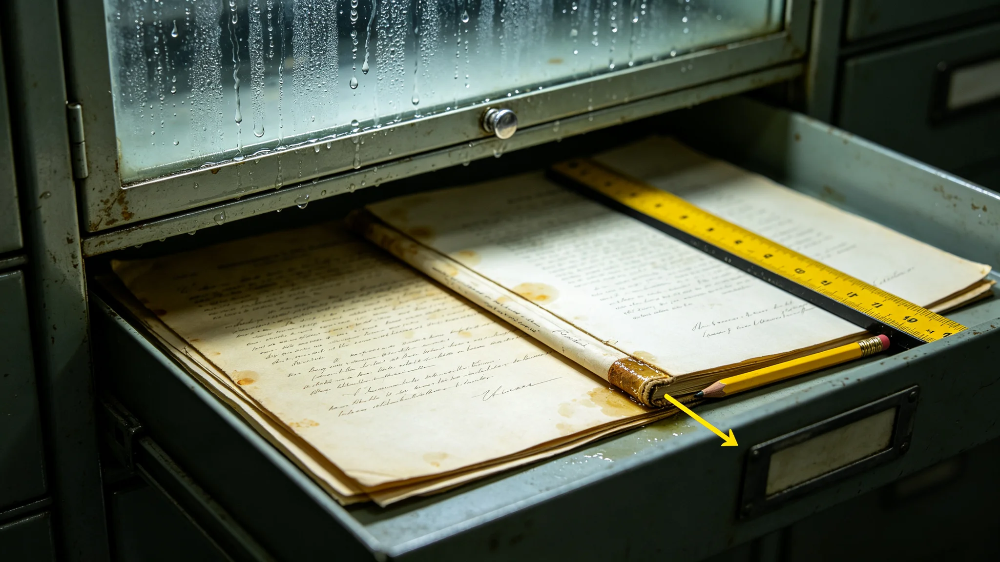

# 三恒星系联合档案馆恒温柜组局部结露致三件初代文书污损事件处置报告

**编制单位**：三恒星系联合档案馆 · 应急处置组
**报告编号**：ARCH-INC-3356-014
**日期**：3356年5月8日
**密级**：跨星系公开（脱敏）

## 一、事件时间线

| 时刻 | 事件 |
|---|---|
| 3356-04-19 02:11 | 恒温库B区第7组柜温湿度传感器报湿度异常升高，系统自动报警 |
| 02:14 | 夜班值守员到场，发现第7组柜内壁结露 |
| 02:31 | 关闭第7组柜电源，启动应急除湿 |
| 03:05 | 开柜检查，发现柜内三件初代文书表面有水痕 |
| 03:40 | 三件文书转移至备用恒温柜，密封暂存 |
| 04:20 | 通知文物修复组与设备组 |
| 04-20 全天 | 三件文书进入法证记录与干燥评估 |
| 05-08 | 本处置报告定稿 |

事件无人员伤亡，无其他柜组受影响。

## 二、事故原因

设备组拆检结论：第7组柜恒温加湿模块的一枚电磁阀密封圈在长期运行后老化，缓慢渗漏液态冷凝水入柜内。传感器报的是"湿度升高"，但渗漏已在传感器阈值边缘运行约六周，未触发主报警。

对比3191年档案馆结构渗水事件（见GS-3191-01），那次是建筑结构问题；本次是柜内设备老化，属不同故障模式。设备组在报告中指出："我们修好了墙，却没盯紧柜子。"

## 三、受影响文书

| 编号 | 文书 | 污损程度 |
|---|---|---|
| DOC-0042（初代） | 早期跨星线通航记录抄件 | 边缘水痕，字迹可辨，未透 |
| DOC-0117（初代） | 早期人口迁徙登记册散页 | 中部水痕，三处字迹轻微晕染 |
| DOC-0203（初代） | 早期文化活动签到簿 | 封底水痕，内页干燥，仅装订线受潮 |

三件文书均为初代（联合体成立初期）纸质原件，依遗产公约须保原件。数字存档（见GS-3190-01）已有完整扫描件，但原件污损本身是不可恢复的损失。

## 四、处置

1. **干燥**：三件文书在恒温恒湿条件下缓慢干燥，未使用热风，避免纸张二次脆化。干燥周期十四天。
2. **修复**：修复组对三处轻微晕染字迹做了最小干预——不补字、不描红，仅固定纸张。修复师岑素文（见GS-3388-01）签字："能不碰就不碰。晕了就晕了，那是它该留的痕。"
3. **设备整改**：全馆恒温柜组电磁阀密封圈纳入年度更换清单，不再以"未漏"为合格标准。
4. **传感器整改**：为每组柜加装独立湿度梯度传感器，不只报阈值，还报变化率。本次事故的根因是"缓慢渗漏未报变化率"。
5. **备份柜**：每件初代文书的数字副本在三个星区异地备份，本次事件后已确认副本完好。

## 五、整改措施

- 全馆四百二十组恒温柜，三年内完成密封圈更换与传感器升级。
- 夜班值守增加一项"柜内目视抽查"，每周一轮，不依赖自动报警。
- 设备组设立"老化件寿命台账"，对超过设计寿命的密封件、阀门、管线强制更换，不论是否工作正常。

## 六、损失评估

三件文书原件均未永久损坏，字迹可读。直接损失为三处轻微晕染与装订线受潮。设备整改与传感器升级预计耗资相当于全馆年度预算的6%。档案馆认为代价可接受："三件初代文书的晕痕，换来的是以后四百二十组柜子都不会再慢漏。"

## 七、教训归档

本事件与3191渗水事件一并归档，作为档案馆"建筑与设备双重老化"教学案例。修复组在报告末写："墙漏了我们修墙，柜子漏了我们修柜子。真正要修的，是我们以为'没报警就是没事'的习惯。"

## 七、传感器整改细节

为每组柜加装独立湿度梯度传感器，不只报阈值，还报变化率。本次事故根因是缓慢渗漏六周未报变化率。整改后，任何缓慢渗漏24小时内触发报警。

## 八、不美化损失

三件文书轻微晕染，不修复、不补色。修复师岑素文签字："晕了就晕了，那是它该留的痕。"

## 九、三件文书处置

DOC-0042边缘水痕、DOC-0117三处字迹微晕、DOC-0203封底受潮。修复师岑素文按"不补色不描红"原则固定。数字存档另卷完好。

## 十、应急响应流程核验

事件处置组按既有《档案馆应急处置规程》执行，逐项核验如下：

| 流程环节 | 规程要求 | 实际用时 | 偏差 |
|---|---|---|---|
| 报警至值守到场 | ≤10分钟 | 3分钟 | 符合 |
| 到场至断电除湿 | ≤20分钟 | 17分钟 | 符合 |
| 断电至开柜检查 | ≤40分钟 | 34分钟 | 符合 |
| 开柜至转备用柜 | ≤60分钟 | 35分钟 | 提前 |
| 转柜至通知修复组 | ≤90分钟 | 75分钟 | 符合 |

流程核验结论：本次响应无延误，问题不在应急，在事前。处置组据此将整改重心放在传感器与老化件，而非加派夜班人手。

## 十一、同类故障历史比对

设备组调阅建馆以来全部柜组故障记录，共47起，其中结构渗水3起（均归GS-3191-01类）、传感器误报19起、电源故障8起、密封件渗漏17起。本次为密封件渗漏第18起，但前17起均为快速渗漏、当场报警；本次为首次"缓慢渗漏六周未报变化率"型。设备组在报告中注明：前17起教会我们换密封件，本次教会我们盯变化率——两类教训不能互相替代。

## 十二、整改时间表与预算

| 整改项 | 完成时限 | 预算（星元） |
|---|---|---|
| 全馆420组柜密封圈更换 | 3359年底前 | 1,200万 |
| 湿度梯度传感器加装 | 3358年中前 | 800万 |
| 老化件寿命台账建立 | 3356年底前 | 60万 |
| 夜班目视抽查制度 | 3356年5月起即执行 | 0（在编人员） |
| 三件文书干燥修复 | 3356年5月中旬完成 | 12万 |

整改合计约2,072万，占全馆3356—3358三年预算的6%，已在3356年度决算（见GS-3357-01）中列项，不另申请追加。

## 十三、数字副本完整性确认

事件次日，数字存档组（见GS-3190-01）跨三系异地调取三件文书扫描副本，逐页比对：DOC-0042共142页、DOC-0117共89页、DOC-0203共206页，副本均完整可读，无缺页、无错位。处置组据此在报告中写明：即便原件全损，数字副本仍可支撑研究；但原件的水痕与装帧本身也是档案，不可由扫描件替代——这正是坚持修原件而非废弃原件的理由。

---

**编制**：三恒星系联合档案馆 · 应急处置组
**审核**：文化遗产保护局
**日期**：3356年5月8日