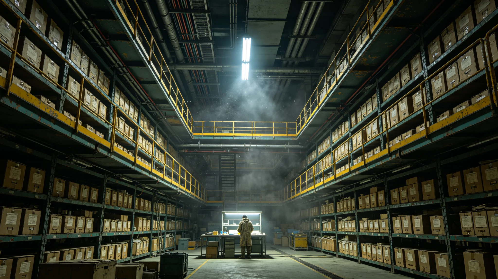

# 跨星系文物修复与千年遗产看护产业3356年度决算报告

**编制单位**：联合体经济委员会 · 文化产业组
**报告编号**：ECON-HERIT-3356
**日期**：3357年11月20日
**密级**：跨星系公开

## 一、产业概况

跨星系文物修复与千年遗产看护产业自3162年规模化（见GS-3162-01）以来，已从考古附属工序发展为独立产业。3356年度，全产业从业约1.8万人，涵盖文物修复、遗产巡检、恒温环境运维、数字存档、千年介质制备五个子行业。本决算报告为3356年度数据。

## 二、年度收支

| 项目 | 3355年 | 3356年 | 同比 |
|---|---|---|---|
| 总产值（星元） | 4.2亿 | 4.6亿 | +9.5% |
| 其中：文物修复 | 1.3亿 | 1.4亿 | +7.7% |
| 其中：遗产巡检（含船骸、档案馆） | 0.9亿 | 1.1亿 | +22% |
| 其中：恒温环境运维 | 0.8亿 | 0.9亿 | +12.5% |
| 其中：数字存档 | 0.7亿 | 0.7亿 | 0% |
| 其中：千年介质制备 | 0.5亿 | 0.5亿 | 0% |
| 就业人数 | 1.7万 | 1.8万 | +5.9% |

巡检支出增长最快，主要原因是3356年档案馆结露事件（见GS-3356-01）后全馆设备整改，带动恒温环境运维订单。

## 三、产业结构

**（一）文物修复子行业**

修复订单量3356年约2,100件，其中初代文书320件、原舱遗物180件、跨星系交换文物（含第五恒星系方向样品）90件。修复平均单件周期：初代文书约14天，原舱遗物约45天。修复师岑素文所在车间为首批订单承接方之一（见GS-3388-01）。

**（二）遗产巡检子行业**

巡检对象含ARK-01船骸保护站（见GS-3351-01）、联合档案馆、各星区遗产点。3356年巡检支出上升，非因遗产恶化，而是因传感器升级与密封圈更换。

**（三）千年介质制备**

承接GS-3190数字化存档需求，3356年新增玻璃光刻介质产能，详见GS-3368-01技术规范。

## 四、与旅游经济边界

依GS-3170考古旅游规范，本产业与旅游产业严格分账：看护、修复、巡检收入不来自门票，而来自文化遗产保护局的公共预算与跨星系文化基金。旅游收入另列，不混入本决算。经济委员会强调："遗产看护不是生意，是公共支出。它不追求盈利，只追求不亏——不亏的意思是，别让遗产在我们手里烂掉。"

## 五、成本结构

| 成本项 | 占比 |
|---|---|
| 人工（修复师、巡检员） | 58% |
| 设备折旧 | 18% |
| 恒温环境能耗 | 12% |
| 材料（修复耗材、千年介质原料） | 9% |
| 管理与运输 | 3% |

人工占比近六成，反映本产业核心资产是人——修复与巡检无法完全自动化。

## 六、问题

1. **修复师断层**：资深修复师平均年龄偏高，年轻人入行意愿低，因修复周期长、见效慢。产业组已建议与统一课程标准（见GS-3173-01）衔接，增设修复学徒通道。
2. **巡检设备依赖进口**：部分高精度湿度梯度传感器仍依赖跨星系进口，3356年交货延迟两个月，整改计划推迟。
3. **千年介质产能不足**：玻璃光刻介质需求增长（见GS-3368-01），产能尚需扩。

## 七、下一年度规划

- 3357年预算按3356年实际支出+9%编制。
- 优先保障档案馆整改与船骸保护站值守。
- 不扩旅游，不做商业化开发。

## 八、修复师断层

产业组建议与统一课程标准（见GS-3173-01）衔接，增设修复学徒通道。修复周期长、见效慢，年轻人入行意愿低。产业组说明："这活儿不挣钱，挣的是一千年后还有人认得这些字。得让愿意干的人，养得起自己。"

## 九、分星区收支明细

| 星区 | 3356年产值（星元） | 占比 | 从业人数 |
|---|---|---|---|
| 比邻星b方向 | 1.8亿 | 39% | 7,200 |
| 太阳系方向（含老地球野化区看护） | 1.4亿 | 30% | 5,400 |
| 鲸鱼座τ方向 | 0.9亿 | 20% | 3,600 |
| 第四恒星系方向 | 0.4亿 | 9% | 1,500 |
| 第五恒星系方向 | 0.1亿 | 2% | 300 |

第五恒星系方向产值最低，与其四级隔离、不开放旅游的定位一致。产业组注明：该方向产值低不是落后，是有意克制——隔离区内只做必要看护，不做产业扩张。

## 十、收支与公共预算关系

3356年度本产业总产值4.6亿中，来自文化遗产保护局公共预算拨款3.1亿，跨星系文化基金补助0.8亿，跨星系交换文物修复付费（由交换双方分摊）0.5亿，其他零星收入0.2亿。产业组强调：本产业近九成收入来自公共支出，无门票、无商业开发收入。经济委员会在决算批复中写明："这笔钱不是投资，是保费。它不产生回报，只防止损失。"

## 十一、审计核验

本决算经联合体审计署派驻文化产业审计组独立核验，审计抽样覆盖修复订单320件中的86件、巡检工单1,240份中的310份、材料采购合同47份中的15份。审计结论：账目无重大不实，三笔跨星运费单价偏高已要求说明，复核后认定为跨星运输旺季舱位溢价，属正常。审计报告编号AUD-3357-04，随本决算归档。

审计组另注一条观察：修复师学徒通道尚未列入正式预算，若3357年仍不开设，资深修复师断层将在十年内显现，建议产业组在3357年预算中单列学徒津贴。产业组采纳，已列入下一年度规划。

## 十二、与上一五年规划对照

3351—3355五年规划原定本产业3356年产值4.8亿、从业1.9万，实际4.6亿、1.8万，均略低于规划。产业组说明：低于规划不是失误，是规划偏乐观。修复师人数受限于培养周期，无法按规划数字速成；产值差0.2亿主要来自千年介质产能尚未扩到位。产业组未因此追加扩招或补贴，理由是"慢一点，比急着把活儿交给没学徒满师的人强"。

---

**编制**：联合体经济委员会 · 文化产业组
**审核**：经济委员会
**日期**：3357年11月20日