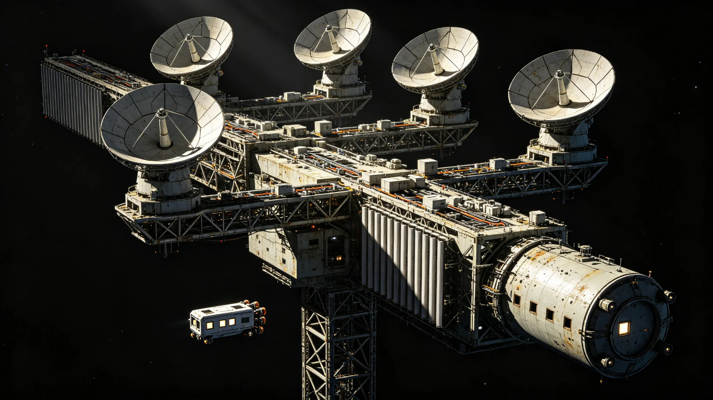

# 跨星系深空未知天体预警望远镜组网第四代扩建与编制调整公报

**发布机构**：联合体安全协调委员会 · 深空预警处
**发布日期**：3359年10月5日
**文件等级**：跨星系公开（脱敏）

## 一、扩建背景

第三代望远镜组网（见GS-3332-01）自3332年运行以来，成功区分了真威胁与碎片云误报（见GS-3333-01），建立了四级分级响应（见GS-3331-01）。但第三代组网对小尺寸（直径<50米）高轨道碎片与未知天体的探测距离仍不足。3350年安全总评估（见GS-3350-01）已将"望远镜组网第四代预研"列入未来规划。本公报即第四代扩建落地。

## 二、第三代局限

| 项目 | 第三代能力 | 局限 |
|---|---|---|
| 探测距离 | 对100米级目标约0.3光时 | 对50米级目标仅0.1光时 |
| 盲区 | 太阳方向约40度 | 太阳附近小目标易漏 |
| 误报率 | 年均1.2次 | 与碎片云区分仍需人工复核 |
| 编制 | 四级分级 | 预警员轮值，见GS-3329-01 |

## 三、第四代升级

**（一）阵列扩建**

在第三代三基点基础上，新增两基点，形成五点组网：原三基点+太阳系外缘一处+第五恒星系方向前出一处（该方向仍按接触期管制，望远镜仅作被动观测，不主动发射信号）。

**（二）探测能力**

| 项目 | 第三代 | 第四代 |
|---|---|---|
| 50米级目标探测距离 | 0.1光时 | 0.4光时 |
| 太阳方向盲区 | 40度 | 12度 |
| 自动区分碎片/未知 | 人工复核 | 初筛自动，复核仍人工 |
| 预警响应时间 | 约4小时 | 约40分钟 |

**（三）编制调整**

- 预警员编制由第三代的每基点6人扩至每基点9人。
- 增设"第五恒星系方向观测专席"1人，专席只观察、不接触、不回复。
- 沈灼（见GS-3329-01）已退，其岗由三名继任者分担。

## 四、部署数据

| 指标 | 目标 | 实测 |
|---|---|---|
| 50米级探测距离 | 0.4光时 | 0.42光时 |
| 太阳方向盲区 | ≤15度 | 12度 |
| 误报率（年） | ≤1次 | 首半年0.4次 |
| 响应时间 | ≤1小时 | 40分钟 |
| 五基点同步 | 误差<1毫秒 | 实测0.3毫秒 |

## 五、纪律与边界

- 第五恒星系方向前出望远镜为被动观测，不发射任何信号，遵守接触期四级隔离（见GS-3302-01）。
- 预警网不针对任何已知文明，只针对未知天体与碎片。
- 误报处理仍按GS-3333-01规程，不追求"零误报"，追求"误报可控"。

## 六、与安全态势衔接

第四代组网建成后，跨星系深空预警响应从4小时压缩至40分钟。安全协调委员会强调："这40分钟不是让我们更慌，是让我们有更多时间确认是不是真的。"

## 七、后续

- 3360年：五基点全部运行。
- 3370年：第五代预研启动，方向为更小目标探测与更远距离。
- 本网不与GS-3397防御盾项目重复：预警管"看得见"，防御管"挡得住"。

## 七、五基点布局

| 基点 | 位置 | 状态 |
|---|---|---|
| 基点一（旧） | 比邻星b方向 | 升级 |
| 基点二（旧） | 鲸鱼座τ方向 | 升级 |
| 基点三（旧） | 第四恒星系方向 | 升级 |
| 基点四（新） | 太阳系外缘 | 新建 |
| 基点五（新） | 第五恒星系方向 | 新建（被动） |

五基点形成五点组网，消除太阳方向盲区。基点五只被动观测，不发射信号，遵守接触期四级隔离。

## 八、预警员编制

每基点9人，第五基点专席1人。沈灼（见GS-3329-01）已退，其岗由三名继任者分担。预警处强调：初筛自动，复核人工；不追求"零误报"，追求"误报可控"。

## 九、不针对文明

预警网不针对任何已知文明，只针对未知天体与碎片。基点五被动观测，不发射信号。预警处说明："我们看得见，不是为了盯谁，是为了别被天上的石头砸了。"

## 十、预警网五基点

| 基点 | 方位 |
|---|---|
| 一 | 比邻星b方向 |
| 二 | 鲸鱼座τ方向 |
| 三 | 第四恒星系方向 |
| 四 | 太阳系外缘 |
| 五 | 第五恒星系方向（被动） |

五点组网消除太阳方向盲区至12度。

## 十一、第四代技术原理概述

第四代探测距离提升不靠单镜口径放大，而靠五点组网的三角测距：同一目标被两点以上同时观测时，可由观测时差反推距离与轨道，单基点无法分辨的"远弱小"目标，在两点三角测量下可解。盲区收窄则靠第五基点置于太阳系外缘，其背阳面可观测太阳方向12度内的目标——第三代三基点均位于太阳一侧，无法背阳观测。

自动初筛算法基于第三代十一年累计的47万条观测样本训练，其中已知碎片云样本31万条、已知轨道天体样本15万条、未确认样本1万条。算法输出三档：确认无害、需人工复核、疑似威胁。第四代建成后，需人工复核的比例由第三代的100%降至约18%，但疑似威胁仍100%人工复核，不自动升级响应。预警处注明："算法帮我们筛掉八成废稿，但拍板的那一下还得是人。"

## 十二、测试方法与样本

- 50米级目标探测距离测试：由无人靶标在0.4光时外释放，五基点同步观测，实测0.42光时可解轨道。
- 太阳方向盲区测试：模拟目标置于太阳方向12—40度区间，12度内可测，15—40度仍有衰减但可粗报。
- 误报率测试：接入3332—3358年全部历史观测数据回灌，算法初筛误报率0.4次/年，较人工复核同期1.2次/年下降。
- 响应时间测试：从模拟目标进入观测到分级响应发布，全链路实测40分钟，其中观测12分钟、初筛6分钟、人工复核18分钟、分级发布4分钟。

## 十三、编制调整明细

| 岗位 | 第三代 | 第四代 | 增减 |
|---|---|---|---|
| 每基点预警员 | 6人 | 9人 | +3人×5基点=+15人 |
| 第五基点专席 | 0 | 1人 | +1 |
| 数据校核员 | 每基点1人 | 每基点2人 | +5人 |
| 设备维护 | 共8人 | 共12人 | +4人 |
| 合计 | 37人 | 63人 | +26人 |

新增编制26人中，跨星调配18人，新招8人，新招均经四级隔离背景审查。第五基点专席1人由联合体安全协调委员会直接指派，任期五年轮换，不得连任两届。

## 十四、与GS-3397防御盾的分工

预警网管"看得见"，防御盾管"挡得住"。两网数据互通但指挥独立：预警网发现疑似威胁后，40分钟内完成分级并通报，是否拦截由防御盾据独立流程决策，预警网不越权下令拦截。安全协调委员会在公报中注明："看见的人不拍板拦不拦，拍板拦不拦的人不靠自己看。两层分开，是怕一层又当裁判又当运动员。"

---

**发布**：联合体安全协调委员会 · 深空预警处
**日期**：3359年10月5日