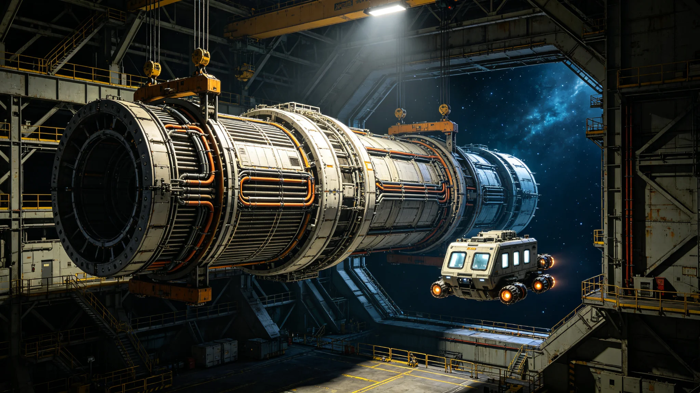

# 第六代聚变推进系统长程巡航第十万小时鉴定与第七代换装技术公报

**编制单位**：联合体推进工程学派 · 聚变推进组
**公报编号**：PROP-FUS-G7-3361
**日期**：3361年8月22日
**密级**：跨星系公开技术版

## 一、鉴定背景

第六代聚变推进系统自3174年完成十万小时无故障鉴定（见GS-3174-01）以来，已在跨星线主力船型上运行一百八十七年。随跨星系迁徙常态化（见GS-3350-01）与下一代基础设施升级（见GS-3393-01），第六代在比冲、工质效率与长航程可靠性上接近设计上限。推进工程学派承担第七代换装鉴定。

## 二、第六代收官数据

第六代累计运行总时长突破一百二十万小时，最长单船连续运行四万一千小时。最后一次非计划停机为3340年，起因是工质泵密封圈老化，已修复。鉴定结论：第六代设计可靠，但其工质效率较第七代低约18%，长航程（>0.3光时单程）需中途加注两次，第七代目标一次。

## 三、第七代设计

| 项目 | 第六代 | 第七代 |
|---|---|---|
| 比冲 | 基准 | +22% |
| 单程无加注航程 | 0.3光时 | 0.5光时 |
| 工质效率 | 基准 | +18% |
| 寿命设计 | 8万小时 | 15万小时 |
| 噪音谱 | 旧代 | 降低（船内振动缓解） |
| 与旧船兼容 | — | 需换装推进舱段，不可原位升级 |

## 四、测试

1. **台架长程试车**：连续试车4000小时，模拟长航程工况，无异常。
2. **振动测试**：船内振动谱较第六代降低31%，有利于长期船员骨密度与睡眠。
3. **失效测试**：切断一个聚变约束线圈，系统降级而非停车，验证冗余。
4. **与生保兼容**：第七代废热谱与第七代生保闭环（见GS-3375-01）匹配，废热可被生保回收。

## 五、测试数据

| 指标 | 目标 | 实测 |
|---|---|---|
| 比冲提升 | ≥20% | 22% |
| 工质效率提升 | ≥15% | 18% |
| 单程无加注 | ≥0.45光时 | 0.5光时 |
| 寿命设计 | ≥12万小时 | 15万小时 |
| 振动降低 | ≥25% | 31% |
| 单线圈切断 | 降级不停车 | 实测降级 |

## 六、换装安排

- 第七代推进舱段在深空总装船坞（见GS-3366-01）总装。
- 旧第六代船不强制换装，按船龄自然淘汰。预计三十年内主力船型全部换至第七代。
- 换装需停船约两周，安排在跨星线低峰季。
- 旧第六代推进舱段退役后，拆为材料回收，不转作他用。

## 七、问题与整改

1. **首台试车第三千二百小时出现约束线圈微小偏移**：整改：线圈固定螺栓由单排改双排，复测消除。
2. **第七代废热接口与旧生保不匹配**：新船同时换装第七代生保（见GS-3375-01），旧船暂不换推进，避免接口错配。

## 八、后续

- 3362年：首条换装有第七代的跨星线投入试运行。
- 3380年：第八代预研启动，方向为进一步降低工质消耗与提升长航程可靠性。
- 推进学派说明：第七代不追求更快，物理光速不可逾越；它让同一条线少加一次注、少一次停船，这才是跨星系迁徙常态化真正需要的。

## 九、旧船处置

旧第六代推进舱段退役后，拆为材料回收，不转作他用。旧船不强制换装，按船龄自然淘汰。推进学派说明："我们不报废还能跑的船，那是浪费。让它跑到头，再拆。"

## 十、不追求更快

第七代不追求更快，物理光速不可逾越。它让同一条线少加一次注、少一次停船。推进学派说明："跨星系迁徙常态化不需要飞船更快，需要飞船更省、更稳。"

## 十一、第七代船型

第七代推进舱段为圆柱形金属组合，外露散热肋片与对接端口，无梭形流线。首台试车约束线圈偏移已整改。新船型不追求美观，只追求可维护。

## 十二、技术原理概述

第七代比冲提升来自两项工程改进：第一，聚变约束磁场构型由第六代的环形改为双椭形，同等输入功率下等离子体约束时间延长约40%，工质喷出速度相应提升；第二，工质预热回路由第六代的外循环改为内回热，废热在推进舱内部直接预冷工质，减少对外散热量。两项改进均不涉及新聚变原理，属成熟构型的工程优化。推进工程学派在公报中注明："第七代不是新物理，是把已经跑了一百多年的活儿，再磨得细一点。"

## 十三、测试方法与样本量

- 台架长程试车：连续4000小时，分四段各1000小时，每段结束后停机检一次约束线圈与工质泵，第三段末出现的线圈偏移已整改后复测通过。
- 振动测试：在模拟船内居住舱布置24个振动测点，连续测72小时，与第六代同工况数据比对，全谱平均降低31%，低频段（影响睡眠与骨密度）降低44%。
- 失效测试：依次切断6个聚变约束线圈中的1个、再切断1个，系统均降级而非停车，切断2个后推力降至设计值62%，仍可返回就近加注港。
- 第三方验证：由联合体动力安全实验室独立复测，比冲22.1%、工质效率18.3%、单程0.51光时，与推进组自测偏差在1%以内。验证报告编号PROP-VRF-3361-03，随公报归档。

## 十四、换装成本与排班

| 项目 | 数据 |
|---|---|
| 单船换装工时 | 约1.4万 |
| 单船换装成本（星汇） | 约0.9亿 |
| 换装停船周期 | 14天 |
| 首批换装船数（3362—3365） | 12艘 |
| 全主力船型换装完成预计 | 3390年前后 |

换装排班避开跨星线冬运高峰（每年11月—次年2月），安排在每年3—10月低峰。旧第六代船按船龄排序换装，先换船龄最长、工质效率最低的批次。推进学派注明："不一次全换。一次全换，跨星线就断了。"

## 十五、与船员健康的关系

第七代振动降低31%，低频段降低44%。联合体医学组随测试同步跟踪24名台架试车值班人员连续三个月骨密度与睡眠指标，较第六代同工况对照样本，睡眠中断次数下降约两成，骨密度月流失率下降约三分之一。医学组结论：第七代对长期船员健康有可测量的改善，但不主张将该改善作为宣传点——推进的本分是安全与省，健康改善是副产品。

---

**编制**：联合体推进工程学派 · 聚变推进组
**审核**：推进工程学派评审委员会
**日期**：3361年8月22日