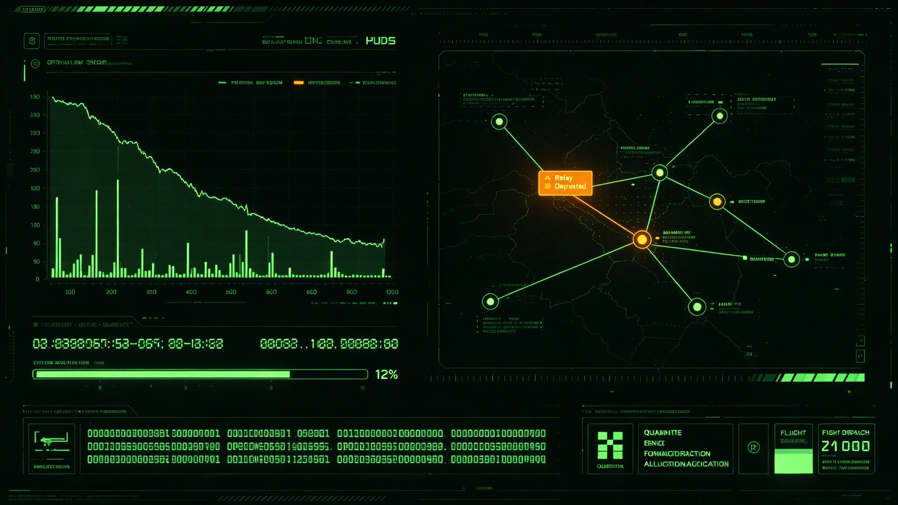

# 跨星系光际通信第三中继节点太阳风暴致全线降级十一天事件复盘报告

**编制单位**：联合体通信工程学派 · 调度中心
**报告编号**：COMM-INC-3363-021　**日期**：3363年7月30日　**密级**：跨星系公开（脱敏）

## 一、降级告警原行与处置时刻表（物证）

> **调度值班日志·原行**（第三节点降级HUD照录）：
> 　3363-06-13 03:00　系统自动降级，切换备用低带宽通道。光路功率骤降。
> 　06-13—06-24　全线降级，跨星线带宽读数 12%。
> 　06-24　粒子流过境完毕，节点光路自动恢复。06-25 全带宽恢复。读数回 100%。

| 时刻 | 事件 |
|---|---|
| 3363-06-12 | 太阳方向爆发一次X级耀斑，日冕物质抛射向航道带方向 |
| 06-13 | 第三中继节点（第四恒星系方向主航道）受粒子流冲击，光路功率骤降 |
| 06-13 03:00 | 系统自动降级，切换至备用低带宽通道 |
| 06-13—06-24 | 全线降级，跨星线通信带宽降至正常的12% |
| 06-24 | 粒子流过境完毕，节点光路自动恢复 |
| 06-25 | 全带宽恢复 |
| 07-30 | 本复盘报告定稿 |

事件持续约11天。无人员伤亡，无数据永久丢失——降级期间数据在两端节点本地缓存，恢复后补传。

## 二、降级影响（读数对照）

| 项目 | 正常 | 降级期 |
|---|---|---|
| 跨星线带宽 | 100% | 12% |
| 实时视频通信 | 支持 | 暂停 |
| 数据同步 | 实时 | 每日一次 |
| 航班调度 | 实时 | 延迟约4小时 |
| 检疫数据回传 | 实时 | 延迟 |

影响最大者，航班调度与检疫数据。期间两班跨星线客运航班推迟离港；检疫数据靠每日一次的低带宽通道回传，未造成检疫事故。

## 三、原因（调查认定）

第三中继节点第九代（见GS-3354-01）虽已设计太阳风暴降级不中断，本次耀斑强度却超出设计裕量约30%。节点双镜面切换机制工作正常，粒子流持续过长（11天），备用通道带宽不足以承载全量业务，只能降级。

对比3140年中继节点脱落事件（见GS-3140-01）：那次机械故障致36小时静默，本次太阳风暴致11天降级，性质不同，暴露同一问题——光际网对太阳活动的韧性仍需提升。

## 四、处置与补传签收存根

1. **降级期间**：调度中心按预案将带宽优先分配给检疫与航班调度，暂停所有非必要业务（含文化活动、远程会议）；
2. **补传**：两端缓存数据恢复后48小时内全部补传，无丢失（补传签收存根附卷，两端节点签认）；
3. **航班**：两班推迟航班安全离港，无事故；
4. **对外通报**：降级期间每日向各星区通报带宽状态，不隐瞒、不夸大（每日发稿存根留档）。

## 五、降级期带宽分配（预案执行·优先级清单）

调度中心按既有《降级期带宽分配预案》执行，值班调度照准，优先级自上而下：

| 优先级 | 业务 | 降级期分配带宽 |
|---|---|---|
| 一 | 检疫数据回传 | 4% |
| 二 | 跨星线航班调度 | 3% |
| 三 | 深冷基因库巡检遥测（见GS-3362-01） | 2% |
| 四 | 联合档案馆数字备份校验 | 1.5% |
| 五 | 各星区行政公文 | 1% |
| 六 | 非必要业务（远程会议、文化活动、个人通信） | 0.5% |
| 合计 | | 12% |

降级期间个人通信延迟约4小时；跨星远程医疗会诊暂停两例，均改由就近医疗点处理，无延误事故。调度中心注明："12%的带宽只够保命的事，别的都得等。"

## 六、整改与预算工单

1. **第三节点加装粒子流屏蔽**：光路方向增设可展开屏蔽罩，下次类似耀斑可降低功率骤降幅值；
2. **备用通道扩容**：带宽由12%扩至30%，确保更长时间降级仍能维持检疫与航班；
3. **太阳活动预警联动**：与深空预警网（见GS-3359-01）联动，耀斑预警提前48小时预切换（联动接口签认在案）；
4. **缓存容量**：两端节点本地缓存扩容至可承载30天降级数据。

| 整改项 | 完成时限 | 预算（星汇） |
|---|---|---|
| 第三节点可展开屏蔽罩加装 | 3364年上半年 | 4,200万 |
| 备用通道带宽扩至30% | 3364年底 | 6,800万 |
| 与深空预警网耀斑预警联动接口 | 3364年中 | 1,100万 |
| 两端缓存扩容至30天 | 3365年中 | 2,300万 |
| 全部中继节点屏蔽升级（下一活动周期前） | 3374年前 | 约4.5亿 |

整改合计约5.94亿，其中第三节点紧急整改1.44亿列入3364年度预算，其余列入千年规划基础设施支出。

## 七、与3140年事件对照

| 项目 | 3140年节点脱落 | 3363年太阳风暴降级 |
|---|---|---|
| 持续时间 | 36小时静默 | 11天降级 |
| 原因 | 机械故障 | 太阳活动 |
| 数据 | 部分丢失 | 零丢失（缓存补传） |
| 预案 | 无 | 有，但时长不足 |
| 教训 | 备件冗余 | 长周期韧性 |

通信工程学派在对照末注明：两次事件不是同一件事，不能用3140的整改去应付3363。3140教会我们备备件，3363教会我们备时间。

## 八、长周期预研与千年规划

本事件推动光际网对千年尺度太阳活动周期的重新评估。通信工程学派已启动"长周期太阳活动韧性"预研，作为千年规划（见GS-3360-01）冗余原则的一部分；预研方向：下一活动周期（约11年后）前，完成全部中继节点屏蔽升级。

经济与社会影响：十一天降级可核算损失约0.8亿星汇，主要来自两班客运推迟的舱位周转损失与检疫数据延迟带来的滞港费用。无人员伤亡，无数据永久丢失。各星区民政部门报告：降级期间居民情绪平稳，未出现恐慌——每日通报清楚，未隐瞒。调度中心注明：这次损失的0.8亿，远低于若发生检疫事故或航班事故的代价。

> 调度中心在报告末写："第九代设计了'不中断'，却没设计'低带宽下能撑多久'。这次11天降级告诉我们：太阳风暴不是瞬间事件，是一场持续十一天的围困。我们的预案要按十一天写，不是按十一分钟写。"每日通报不隐瞒、不夸大——"大家有权知道船晚点了多久，别猜。"

---

**编制**：联合体通信工程学派 · 调度中心　**审核**：通信工程学派评审委员会　**日期**：3363年7月30日

> 记录人注：11天，带宽读数从100%掉到12%，再回到100%。零丢失，两班客运推迟，0.8亿。预案有效，也还不够长。整改工单五项，最远排到3374年前。档案记到此为止。
