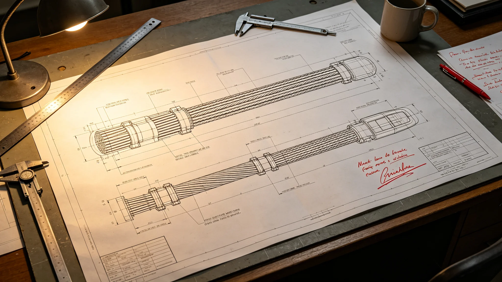

# 跨星系下一代轨道电梯总设计师岑望舒三十年主缆校核与签字涂改档案

**归档单位**：联合体轨道工程学派 · 电梯设计组
**档案袋编号**：ELEV-CHIEF-003
**立卷日期**：3365年5月30日

## 一、履历卡

| 项目 | 登记内容 |
|---|---|
| 姓名 | 岑望舒 |
| 出生星区 | 三恒星系，比邻星b第一居住区 |
| 出生年 | 3300年 |
| 入学派年 | 3324年 |
| 岗位 | 下一代轨道电梯（第五代）总设计师 |
| 在岗年限 | 至3365年满41年 |
| 经手前作 | 第四代轨道电梯联网（见GS-3198-01）副总工 |

岑望舒不是电梯的发明者——轨道电梯从第二代更换主缆（见GS-3153-01）到第四代联网，已历经数代。她的工作是把"能不能用"改成"能不能用一千年"。

## 二、三十年主缆校核记录

第五代电梯的核心不是更高更快，而是主缆寿命从百年尺度提到千年尺度。岑望舒三十年主持主缆材料与疲劳校核：

| 年度 | 校核项 | 结论 |
|---|---|---|
| 3328 | 碳纤维复合主缆首次小样疲劳 | 小样达标，需全尺寸验证 |
| 3335 | 全尺寸主缆挂样疲劳50年等效 | 达标 |
| 3342 | 千年寿命外推模型 | 模型保守，留2倍裕量 |
| 3349 | 主缆与爬升舱接口公差 | 发现0.1毫米偏差，整改 |
| 3356 | 极端热循环下主缆蠕变 | 蠕变在裕量内 |
| 3365 | 第五代主缆定型签认 | 签认 |

## 三、签字涂改记录

岑望舒的签字在档案中保留了两次涂改，均为主缆定型前：

- 3349年：主缆与爬升舱接口公差报告，她最初签"通过"，三日后涂改重签："暂缓，接口公差0.1毫米未消化。"该涂改使第五代电梯首段延迟一年开工。
- 3356年：热循环蠕变报告，她最初签"达标"，次日涂改重签："达标但裕量不足，留2倍。"

设计组附记："她的签字涂改，每次都让项目慢一年，但每次都没在后来出事。"

## 四、处分记录（一次）

**3345年**：岑望舒在一次跨星系公开技术会上，未经学派审批，公开批评第四代电梯（见GS-3198-01）主缆冗余"留得不够，会在两百年后出问题"。第四代已服役，公开批评影响运行信心。处分：书面检查，扣半年津贴，禁止一年内公开技术发言。

检查原件："我说的是对的，但不该在公开会上说。第四代还在用，我不该当着运行的人说他们头顶的缆两百年后会断。"

## 五、体检与考核

- 3365年体检：长期伏案致颈椎劳损，视网膜脱落早期（已手术），其余正常。
- 年度考核：连续22年"优秀"——她是极少数"优秀"次数多的传记人物，因主缆校核直接关系千人生命，她的"不签字"本身就是业绩。
- 第五代电梯尚未建成。她预计在3380年前后完成首段，届时她将近80岁。

## 六、签名页

岑望舒签收："我画的缆，要挂一千年。我不能用我这一辈子去赌它没问题。我能做的，是在签字之前，多犹豫一天。涂改两次，比出事一次强。"签名日期3365年5月30日。

## 七、总设计师的工作

与GS-3380电梯检修工长闻守缆不同，岑望舒在地上画缆，闻守缆在缆上走。她的签字涂改决定缆能不能挂；闻守缆的巡检签字决定缆挂上去之后有没有事。两人四十年未见，但她的涂改和他的巡检，是同一根缆的两头。

设计组在档案袋末写："她不建过一座电梯。她只把每一代电梯的主缆，都往一千年的方向多推了一寸。"

## 七、签字涂改的代价

岑望舒两次签字涂改，每次使项目延迟一年。设计组在档案袋末写："她的涂改让第五代电梯晚了两年首航。但这两年，买的是她后三十年不再涂改。"

## 八、不赶进度

岑望舒两次签字涂改，每次使项目延迟一年。她不为此道歉。设计组说明："她慢，是因为缆要挂一千年。快一年，可能慢一千年。"

## 九、岑望舒签字涂改

3349年接口公差签"通过"后三日复签"暂缓"；3356年蠕变签"达标"次日复签"留2倍裕量"。两次涂改各使项目延迟一年。

## 十、履历时间线补

| 年份 | 履历事项 |
|---|---|
| 3300 | 生于比邻星b第一居住区 |
| 3320—3324 | 联合体普通公民教育，主修结构工程 |
| 3324 | 入轨道工程学派电梯设计组任助理工程师 |
| 3328 | 主持第五代主缆首次小样疲劳校核 |
| 3335 | 升副总设计师，主持全尺寸主缆挂样 |
| 3342 | 主持千年寿命外推模型 |
| 3345 | 公开技术会批评第四代冗余受书面检查 |
| 3349 | 主缆接口公差首次涂改 |
| 3356 | 热循环蠕变二次涂改 |
| 3360 | 任第五代总设计师 |
| 3365 | 第五代主缆定型签认，本档案立卷 |

## 十一、校核方法与样本量

- 3335年全尺寸挂样疲劳：取5根全尺寸主缆段，每段长约120米，挂于地面试验架，按第四代电梯实际载荷谱循环加载至50年等效，累计循环数约1.1×10⁹次。5根试样中4根正常，1根在第4.8×10⁸次出现表面微裂纹，未扩展。岑望舒据该裂纹要求全尺寸主缆表面增加超声探伤每五年一次。
- 3342年千年寿命外推模型：基于50年等效疲劳数据外推至1000年，模型取2倍裕量。她在模型评审会上坚持："五十年的数据外推一千年，不乘2倍，是骗自己。"
- 3356年热循环蠕变：主缆试样在−60℃至+120℃间循环2,000次，蠕变量实测在设计裕量内，她仍要求留2倍。

第三方验证由联合体结构安全实验室独立复测，疲劳数据与设计组自测偏差在3%以内，验证报告编号STRUCT-VRF-3365-02，随档案归档。

## 十二、考勤与考核补录

- 三十年累计全勤，迟到0次，缺席0次。3362年视网膜脱落手术住院期间，遥控签认两份校核报告，未请假。
- 3345年处分后，3346—3365年无再次处分。3345年书面检查原件随档案袋另卷保存，不复印。
- 年度考核连续22年"优秀"，为传记学派档案中极少数多次"优秀"者。考核评语由学派评审委员会集体出具，非个人。评语摘："其'不签字'即业绩。"

## 十三、签名文件摘录

档案袋保留岑望舒签认文件七份，其中两份涂改已在第三节摘录，另五份为纯技术签认：

- 3331年小样疲劳中期报告签："第3根试样表面微裂纹，未扩展。继续观察。"
- 3338年挂样试验架年度巡检签："架体无异常，第4号锚固螺栓需更换。"
- 3345年处分检查末尾自书："批评可以私下说，不能当众说。我记下了。"
- 3350年第五代电梯预算签："本年度主缆材料预算超支8%，因碳纤维批次涨价。同意追加，不砍裕量。"
- 3365年主缆定型签："签。但每五年超声探伤不停，一直到我不在了也不停。"

---

**立卷**：联合体轨道工程学派 · 电梯设计组
**复核**：与三十年主缆校核原始记录（另卷）互锁
**日期**：3365年5月30日