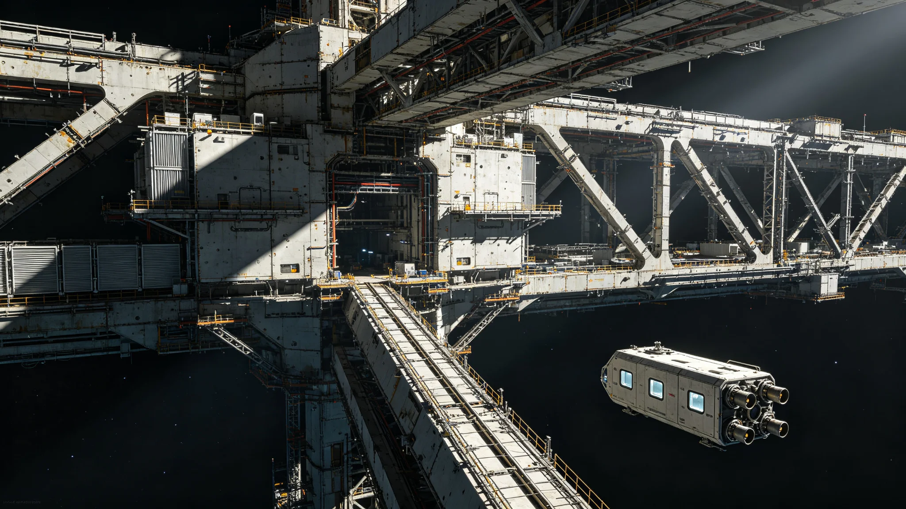

# 三恒星系下一代跨星系基础设施升级二期投资决算与三期规划公报

**发布机构**：联合体经济委员会 · 基础设施投资组
**发布日期**：3366年12月28日
**文件等级**：跨星系公开

## 一、二期背景

第二代基础设施投资（见GS-3193-01）于3193年启动，至3360年前后完成主干。二期投资（3351—3366）在此基础上升级"下一代"：第七代聚变推进换装（见GS-3361-01）、第九代光际通信中继（见GS-3354-01）、第五代轨道电梯首段（见GS-3365-01）、第七代生保闭环（见GS-3375-01）。本公报为二期决算。

## 二、二期总投资

| 项目 | 二期投资（星元） | 占比 |
|---|---|---|
| 第七代聚变推进换装 | 1.1亿 | 31% |
| 第九代光际通信中继 | 0.8亿 | 23% |
| 第五代轨道电梯首段 | 0.7亿 | 20% |
| 第七代生保闭环 | 0.5亿 | 14% |
| 总装船坞与配套 | 0.4亿 | 11% |
| **合计** | **3.5亿** | 100% |

二期决算较预算3.6亿节余0.1亿，节余转三期。

## 三、二期成效

| 指标 | 二期前（3350） | 二期后（3366） |
|---|---|---|
| 跨星线单程无加注航程 | 0.3光时 | 0.5光时 |
| 光际通信排队时延 | 8分钟 | 40秒 |
| 电梯年货运吞吐 | 基准 | +35% |
| 生保闭环故障率 | 基准 | -40% |
| 跨星线单位运力成本 | 基准 | -18% |

## 四、问题

1. **第五代电梯延迟**：因岑望舒签字涂改（见GS-3365-01），首段延迟一年，二期未完工，结转三期。
2. **第七代推进换装慢于计划**：旧船不强制换装，主力船型换至第七代的比例仅40%（计划60%）。投资组接受："不赶进度，按船龄自然换。"
3. **太阳风暴降级**：3363年事件（见GS-3363-01）暴露光际网韧性不足，二期预算外追加0.1亿用于第三节点屏蔽。

## 五、三期规划（3367—3382）

三期方向：

- **轨道电梯**：第五代电梯全段建成，主缆千年寿命（见GS-3391-01疲劳评估）。
- **通信**：第十代光际中继预研，方向为长周期太阳风暴韧性。
- **推进**：第七代主力船型换装至80%。
- **生保**：第七代闭环全星区推广。
- **千年规划冗余**：按GS-3360-01，三期在每项基础设施中预留异地备份。

三期预算按二期实际+12%编制。

## 六、与千年规划

投资组在公报中说明：二期建的是"这一代用的"，三期要开始建"下一千年用的"。每一项基础设施都要问：如果我们这一代人不在了，下一千年的人能不能接着用、能不能修、能不能替换。

## 七、二期节余与三期优先

二期节余0.1亿全部转三期，不挪作他用。三期优先序：

1. 第五代电梯全段（承接二期结转）；
2. 太阳风暴韧性（3363事件教训，见GS-3363-01）；
3. 第七代推进换装至80%；
4. 第七代生保全星区推广。

投资组说明：二期建的是"这一代用的"，三期要开始建"下一千年用的"。每一项基础设施都要问：万一我们这一代人不在了，下一千年的人能不能接着用、能不能修、能不能替换。

## 八、三期不超支

三期预算按二期实际+12%编制，不预留弹性。投资组说明："预留弹性等于鼓励浪费。花多少是多少，不够再说。"

## 九、二期节余

二期预算3.6亿，实际3.5亿，节余0.1亿转三期。节余未用于当期福利，全部锁定千年冗余。投资组说明：省下来的钱不许分，得留给一千年后。

### 附：## 十、三期优先

三期优先序：第五代电梯全段、太阳风暴韧性、第七代推进换装至80%、第七代生保全星区推广。

## 十一、二期分年度投资

| 年度 | 投资（星元） | 主要支出 |
|---|---|---|
| 3351—3355 | 1.0 | 第七代推进台架与首船换装 |
| 3356—3360 | 1.2 | 第九代通信三锚点部署 |
| 3361—3363 | 0.9 | 第五代电梯首段开工与生保闭环测试 |
| 3364—3366 | 0.4 | 总装船坞配套与3363事件追加 |
| 合计 | 3.5 | |

二期投资跨16年，年均约0.22亿，未跨年度赤字。投资组注明："二期不是一次花完的，是一年一年花出来的。一年花太多，当年别的事就没钱干。"

## 十二、审计核验

二期决算经联合体审计署派驻基础设施审计组独立核验，抽样覆盖：推进换装合同21份中的7份、通信节点采购12份中的4份、电梯材料采购34份中的11份、生保测试报告18份中的6份。审计结论：账目无重大不实，3363年追加0.1亿未经预算调整程序已补手续，其余合规。审计报告编号AUD-3366-09，随公报归档。

审计组另注：第五代电梯首段延迟一年，未造成超支，因人工时与材料按年分摊，延迟年份未产生额外支出。投资组据此注明："慢一年不花钱，快一年出事才花钱。"

## 十三、三期预算分项

| 三期项目 | 预算（星元） | 占比 |
|---|---|---|
| 第五代电梯全段 | 1.1 | 29% |
| 太阳风暴韧性升级 | 0.6 | 16% |
| 第七代推进换装至80% | 0.9 | 24% |
| 第七代生保全星区推广 | 0.5 | 13% |
| 千年规划异地备份预留 | 0.4 | 11% |
| 总装船坞与配套 | 0.2 | 5% |
| 不可预见费 | 0.07 | 2% |
| 合计 | 3.77 | 100% |

三期预算按二期实际+12%编制，较二期3.5亿增0.27亿。投资组注明：12%的增量不用于扩大建设规模，用于3363事件暴露的韧性短板与千年规划异地备份。

## 十四、二期对居民生活的间接影响

二期基础设施升级完成后，跨星线单位运力成本下降18%，反映在跨星票价上约为年降幅3%—4%。同期跨星迁徙量（见GS-3350-01预计破15万）实际达14.2万，略低于预计，因第五代电梯延迟致货运吞吐未达规划。投资组注明：基础设施升级的红利不是立竿见影的，它要在十几年里慢慢反映到票价与运力上。

---

**发布**：联合体经济委员会 · 基础设施投资组
**日期**：3366年12月28日