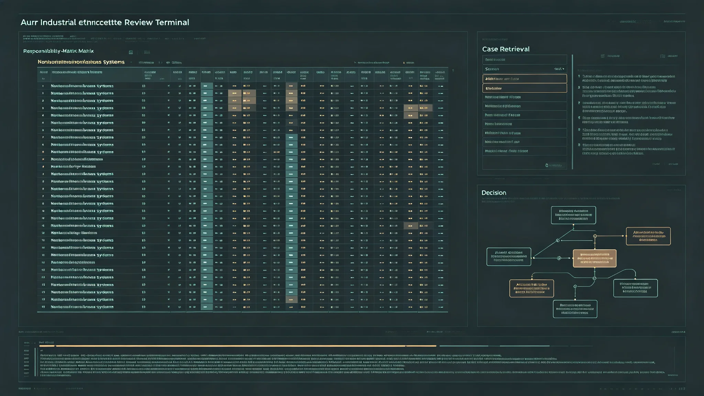

# 联合体人工智能伦理委员会"非自主系统"权责划界制度修订公报

**发布机构**：联合体人工智能伦理委员会
**发布日期**：3367年6月1日
**文件等级**：跨星系公开

## 一、修订背景

联合体运行的大量自动化系统——检疫筛查（见GS-3311-01）、光际通信调度（见GS-3354-01）、电梯爬升控制（见GS-3198-01）、预警网初筛（见GS-3359-01）——均由自动化系统执行。随系统复杂度上升，"系统出错谁负责"成为制度空白。伦理委员会修订权责划界制度。

前提声明：委员会明确，联合体现有自动化系统均为"非自主系统"——它们不具有自主意志、不承担法律人格、不被视为"人"。本制度不讨论"系统是否有意识"，只讨论"系统做错事，纸面上谁签的字"。

## 二、划界原则

**（一）系统不担责**

非自主系统不作为责任主体。它的错误不叫"它的错"，只叫"用它的人的错"或"造它的人的错"。

**（二）签字人担责**

凡自动化系统做出的决定，必须有一名自然人在规程上签字确认。签字人对决定负责。系统可以给建议，但人必须签字。

**（三）设计者担责**

系统设计者对系统的设计缺陷负责。若缺陷源于设计而非使用，由设计者所在学派/机构担责。

## 三、修订要点

**（一）强制签字**

- 检疫放行：系统初筛后，由检疫官签字放行（见GS-3344-01贺雨清岗）。
- 航班调度：系统排班后，由调度长签字确认。
- 电梯爬升：系统自动控制，但异常处理须由值班工程师签字。
- 预警初筛：系统初筛"未知/碎片"后，由预警员签字确认（见GS-3329-01沈灼岗）。

**（二）无签字不生效**

凡系统做出但未经自然人签字的决定，一律不生效。系统不得"自动执行"任何影响他人权利的决定。

**（三）系统不评级人**

系统不得对自然人做绩效评级、不得做录用决定、不得做生育意愿（见GS-3353-01）之外的私人判断。系统只能做事，不能判人。

## 四、与既有制度衔接

- 与网络安全防御（见GS-3187-01）衔接：系统被入侵时，责任在运维签字人，不在系统。
- 与千年规划（见GS-3360-01）一致：我们不把不可逆的决定交给一个不签字的东西。
- 与代际正义（见GS-3172-01）一致：系统不承担对后代的责任，签字人承担。

## 五、问题

1. **签字疲劳**：系统效率高，签字人疲于签字，可能流于形式。委员会要求：签字人有权说"不签"，且"不签"须被尊重，不得施压。
2. **复杂系统黑箱**：部分系统内部推理人难以理解。委员会要求：影响他人权利的系统，其决策须可向签字人解释，不解释清楚的系统不允许上生产。

## 六、附则

委员会在公报末写："系统不会犯错，它只是按我们造它的样子跑。出错的是人——造它的人，签它的人。我们不让系统背锅，因为系统连锅都看不见。"

## 六、系统不评级人

伦理委员会特别强调：系统不得对自然人做绩效评级、录用决定、私人判断。系统只能做事，不能判人。若某系统被发现对人评级，立即下线整改。

## 七、系统可解释

影响他人权利的系统，其决策须可向签字人解释。不解释清楚的系统不上生产。伦理委员会说明："签字人有权说不知道，系统有义务让他知道。"

## 八、签字人培训

凡需在自动化系统决定后签字的岗位，须经伦理培训，重点练习"说不签"。培训不考核签字速度，考核敢不敢不签。

## 九、修订前三次争议案例

本制度修订并非从零起草。3350年代以来，伦理委员会受理三起"系统出错谁负责"争议，均暴露旧制度空白：

| 年份 | 争议 | 旧制度处置 | 暴露问题 |
|---|---|---|---|
| 3352 | 检疫系统误判一名过境者携带违禁微生物，滞留三日后纠正 | 滞留者获补偿，但无人被追责 | 系统误判无签字人，责任悬空 |
| 3358 | 电梯爬升控制系统一次异常停机，事后分析为传感器漂移 | 运维班组受通报，但设计者未介入 | 设计缺陷与使用缺陷未区分 |
| 3364 | 预警网初筛将一块轨道碎片误报为未知天体，半小时后自行纠正 | 预警员签字确认了误报 | 系统给的初筛人来不及质疑就签了 |

三起争议推动本制度修订。委员会在公报中注明："前三起没出大事，但它们把同一个问题问了三遍：纸面上到底谁签的字。"

## 十、权责矩阵

| 决定类型 | 系统角色 | 签字人 | 设计者责任 |
|---|---|---|---|
| 检疫放行 | 初筛 | 检疫官 | 设计缺陷时学派担责 |
| 航班调度 | 排班 | 调度长 | 学派担责 |
| 电梯爬升异常处理 | 自动执行+建议 | 值班工程师 | 学派担责 |
| 预警初筛 | 初筛分级 | 预警员 | 学派担责 |
| 生育意愿登记（见GS-3353-01） | 不参与 | 无 | 无 |
| 人事绩效评级 | 禁止 | 不适用 | 不得上线 |

矩阵的核心：系统可以给建议，签字人可以接受也可以拒绝；设计者对设计缺陷负责，但设计者不在签字现场，设计者责任通过学派事后追溯。

## 十一、执行时间表

- 3367年第三季度：各签字岗位完成伦理培训，重点练习"说不签"。
- 3368年：全部影响他人权利的自动化系统上线前，须通过"可解释性"审查。
- 3372年：首次五年评估，统计"不签"率与"签字后纠错"率。委员会预期"不签"率不应过低——若某岗位"从不不签"，说明签字流于形式，须重新培训。

## 十二、与千年规划的关系

委员会在公报末说明：本制度的千年尺度意义在于，我们不把不可逆的决定交给一个不签字的东西。一千年后的人若发现我们这一代人做了某件不可逆的事，他们要能在纸面上找到签字的那个人——哪怕那个人已经不在了。系统不担责，但签字的责任跟着纸一起保存一千年。

---

**发布**：联合体人工智能伦理委员会
**日期**：3367年6月1日