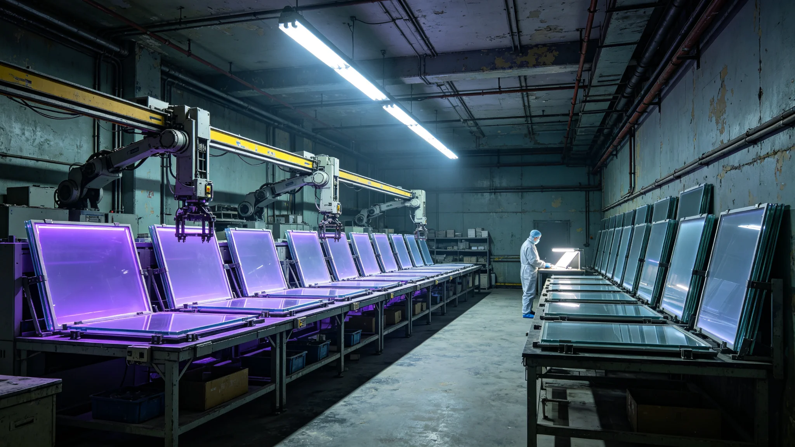

# 跨星系文化遗产"冷光光刻玻璃"千年存档介质技术规范报告

**编制单位**：联合体文化工程学派 · 存档介质组
**报告编号**：CULT-MEDIA-3368-03
**日期**：3368年10月9日
**密级**：跨星系公开技术版

## 一、规范背景

跨星系文化遗产数字化存档系统（见GS-3190-01）已运行约一百八十年。现有数字介质（磁光、半导体）寿命在三十年到一百年之间，需反复迁移。文明存续千年规划（见GS-3360-01）要求知识冗余存续千年。文化工程学派承担"冷光光刻玻璃"千年存档介质技术规范。

## 二、介质原理

冷光光刻玻璃：在高纯石英玻璃内部，用飞秒激光光刻出纳米级三维点阵，以玻璃自身的化学惰性保存点阵。玻璃在真空避光环境下化学稳定，理论寿命远超千年。

关键：它不是"存储数据再读"，而是"把数据刻进石头"。

## 三、技术指标

| 项目 | 指标 |
|---|---|
| 材料 | 高纯石英玻璃 |
| 寿命设计 | 1000年（真空避光） |
| 单盘容量 | 约1TB等效 |
| 读取方式 | 光学显微镜逐点读，无需专用电子设备 |
| 写入方式 | 飞秒激光光刻，一次写入 |
| 备份策略 | 三库异地（见GS-3362-01） |

## 四、测试

1. **加速老化**：在高温高湿下加速老化1000等效年，点阵可读。
2. **辐射耐受**：模拟微陨石与宇宙线照射，点阵不损伤。
3. **振动耐受**：模拟跨星线运输振动，玻璃不裂。
4. **无设备读取**：验证用普通光学显微镜可读，不依赖未来技术。

## 五、测试数据

| 指标 | 目标 | 实测 |
|---|---|---|
| 加速老化1000年 | 可读 | 可读 |
| 辐射耐受 | 不损伤 | 不损伤 |
| 振动 | 不裂 | 不裂 |
| 普通显微镜读取 | 可读 | 可读 |
| 单盘容量 | ≥1TB | 1.2TB |

## 六、问题与整改

1. **写入速度慢**：飞秒激光光刻单盘需约40小时。整改：接受慢，千年存档不求快。
2. **读取需人有显微镜**：未来人若没有显微镜怎么办？整改：每盘附一份"如何用手边材料造一台显微镜"的刻图，刻在同一块玻璃上。
3. **与现有数字存档关系**：玻璃介质不替代现有数字系统（便于检索），只做"最终备份"。日常检索用数字，千年备份用玻璃。

## 七、与千年规划

文化工程学派在报告中说明："数字系统方便我们这代人检索，玻璃盘是给一千年后那个没有我们的人看的。他不需要知道怎么开机，他只需要一架显微镜。"

## 八、部署

- 首批玻璃盘存三库异地（见GS-3362-01）。
- 首批内容：跨星系文化遗产核心数字档案（见GS-3190-01）、深时间遗嘱索引（见GS-3360-01）、文明存续最低冗余公约（见GS-3398-01）。
- 3369年起每年新增一批。

## 九、首批玻璃盘内容

首批玻璃盘存三库异地（见GS-3362-01）：

- 跨星系文化遗产核心数字档案（见GS-3190-01）；
- 深时间遗嘱索引（见GS-3360-01）；
- 文明存续最低冗余公约（见GS-3398-01）。

玻璃盘不存"会过时的数字"，只存"一千年后仍该知道的事"。

## 十、玻璃不联网

玻璃千年介质不接入任何网络，物理离线。读取需用显微镜，不依赖电子设备。文化工程学派说明："联网的存档不算千年存档，只算近期存档。离线才算千年。"

## 十一、读取工具

每块玻璃盘附一份"如何用手边材料造显微镜"的刻图，刻在同一块玻璃上。文化工程学派说明：万一未来人没有显微镜，他能照着造一台。

### 附：## 十二、首批玻璃盘

首批玻璃盘存三库异地，内容为核心数字档案、遗嘱索引、最低冗余公约。不存会过时的数字。

## 十三、技术原理补充

飞秒激光在石英玻璃内部聚焦时，焦点处瞬时功率密度极高，使玻璃局部发生结构相变，形成折射率永久改变的微观点阵。焦点可在玻璃三维空间内任意移动，因此单块玻璃内部可逐层刻写多层点阵，单盘容量由此达到1.2TB。

写入一次后不可改写。文化工程学派在报告中注明：千年介质的代价就是不能改——改一次就得重刻一块。这正是设计意图：千年存档不该被随便改来改去。

## 十四、测试方法与样本

- 加速老化：取20块试样，在85℃、85%相对湿度环境下存放等效1000年，每100等效年抽检一次，全部点阵可读。
- 辐射耐受：用模拟宇宙线与微陨石等效剂量照射10块试样，点阵无可见损伤。
- 振动耐受：将10块试样装于模拟跨星线运输振动台，振动谱与实际跨星货舱一致，连续振动等效十年运输，玻璃无裂、点阵无损。
- 无设备读取：请三名未接受过本介质培训的技师，仅按玻璃盘上刻写的"如何用手边材料造显微镜"刻图，用玻璃、镜片、金属丝自制显微镜，三人中两人成功读出点阵，第三人因自制镜片焦距偏差失败，但按刻图调整后亦成功。

第三方验证由联合体材料实验室独立复测，加速老化数据与介质组自测偏差在2%以内，验证报告编号MAT-VRF-3368-05，随报告归档。

## 十五、制备成本与产能

单块玻璃盘制备成本约0.8万星汇，含高纯石英原料、飞秒激光机时、写入人工。3368年产能约200块/年，按三库异地各存一份计，每年可新增约67份独立存档内容。文化工程学派注明：产能不大，但千年存档不追求快，一年67份够把最该留的东西一年一年刻进去。

## 十六、与数字存档的分工

| 用途 | 介质 | 检索方式 |
|---|---|---|
| 日常查阅、研究、引用 | 数字存档（见GS-3190-01） | 电子检索 |
| 中期备份（百年尺度） | 现有磁光/半导体 | 电子读取 |
| 千年备份 | 冷光光刻玻璃 | 光学显微镜 |

三层并存，不互相替代。数字系统方便，玻璃盘耐久。文化工程学派说明："方便我们这代人的，和方便一千年后的人的，不是同一种东西。"

---

**编制**：联合体文化工程学派 · 存档介质组
**审核**：文化工程学派评审委员会
**日期**：3368年10月9日