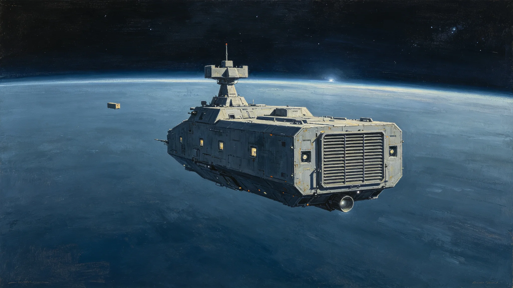

# 跨星系航道武装护航第七代巡逻舰换装与常态化编制调整公报

**发布机构**：联合体安全协调委员会 · 航道护航处
**发布日期**：3369年3月15日
**文件等级**：跨星系公开（脱敏）

## 一、换装背景

跨星系航道武装护航自3342年常态化（见GS-3342-01）以来，海盗基本肃清（见GS-3116-01、GS-3179-01），护航重点从"打海盗"转为"常态化存在与低强度威慑"。旧代巡逻舰在长期巡航中能耗偏高、船员住舱偏小。护航处承担第七代巡逻舰换装。

## 二、旧代局限

| 项目 | 旧代 | 问题 |
|---|---|---|
| 巡航能耗 | 基准 | 偏高，需频繁加注 |
| 船员住舱 | 4人/舱 | 长期巡航心理压力大 |
| 通信 | 第六代 | 与第九代光际网（见GS-3354-01）兼容需改装 |
| 武器 | 旧代 | 足以威慑残余海盗，无需升级 |

## 三、第七代设计

| 项目 | 旧代 | 第七代 |
|---|---|---|
| 巡航能耗 | 基准 | -25% |
| 无加注航程 | 基准 | +40% |
| 船员住舱 | 4人/舱 | 2人/舱 |
| 通信 | 第六代 | 原生第九代 |
| 武器 | 旧代 | 不升级（足够） |
| 船型 | 梭形为主 | 短粗方盒工业型，散热片外露 |

护航处强调：武器不升级。"海盗已经没了，我们不需要更吓人的炮，我们需要住得久一点、跑得省一点。"

## 四、编制调整

- 第七代巡逻舰首批换装6艘，部署三恒星系—第四恒星线。
- 常态化巡逻编队由"重点护航"改为"定期巡航"：不再伴随每艘货船，而是沿航道定期往返。
- 编制人数不变，每舰从12人减至8人（自动化提升，但签字人仍按GS-3367-01伦理制度保留）。
- 旧代巡逻舰退役拆为材料，不转作民用。

## 五、测试数据

| 指标 | 目标 | 实测 |
|---|---|---|
| 能耗降低 | ≥20% | 25% |
| 无加注航程 | ≥+35% | 40% |
| 住舱人数 | ≤2人 | 2人 |
| 通信兼容 | 原生第九代 | 实测兼容 |
| 6舰首航 | 无事故 | 无事故 |

## 六、纪律

- 巡逻舰不主动拦截民用船，只在预警网（见GS-3359-01）提示可疑时前出。
- 不向第五恒星系方向部署武装舰（该方向接触期管制，见GS-3302-01）。
- 护航处说明："我们在航道上存在，不是为了打谁，是为了让走这条路的人知道这条路有人走。"

## 七、后续

- 3375年：完成全部主力巡逻舰换装。
- 3400年：随安全总评估（见GS-3400-01）重新评估护航编制是否还需要。

## 七、巡逻纪律

第七代巡逻舰在航道上执行以下纪律：

- 不主动拦截民用船；
- 不登船检查，除非预警网（见GS-3359-01）提示可疑；
- 不在航道上停靠闲逛，巡逻即巡逻；
- 遇民用船避让，巡逻舰让行。

护航处说明："巡逻舰在航道上存在，不是为了吓人，是为了让人知道这条路有人走。走过去就走，不停。"

## 八、不升级武器

护航处明确：第七代巡逻舰不升级武器。海盗已基本绝迹，升级武器是浪费。护航处说明："我们不需要更吓人的炮，我们需要住得久一点、跑得省一点。"

## 九、第七代船型

第七代巡逻舰为短粗方盒工业型，两侧大型散热片，尾部主推进器常年微亮（不持续尾喷），船身编号喷涂。护航处说明：不追求美观，只追求住得久、跑得省。

## 十、常态化巡逻

第七代巡逻舰首批6艘部署三恒星系—第四恒星线。编队由重点护航改为定期巡航。不主动拦截民用船。

### 附：## 十一、不升级武器

第七代巡逻舰不升级武器。海盗已基本绝迹，升级武器是浪费。需要的是住得久、跑得省。

## 十二、换装成本与排班

| 项目 | 数据 |
|---|---|
| 单舰造价（星汇） | 约0.7亿 |
| 首批6艘合计 | 4.2亿 |
| 单舰换装周期 | 约18个月 |
| 6艘总工期 | 3369—3371 |
| 旧舰拆解回收 | 材料回收率92% |

换装费用由千年规划基础设施预算（见GS-3366-01三期）列支，不另申请追加。旧代巡逻舰退役后逐艘拆解，材料回炉用于新舰，不转作民用——护航处注明：武装舰外壳不得流入民用市场。

## 十三、常态化巡航航线

| 航线 | 巡航频率 | 部署舰数 |
|---|---|---|
| 三恒星系—第四恒星系主航道 | 每月两班往返 | 2艘 |
| 第四恒星系方向前出中转线 | 每月一班 | 2艘 |
| 太阳系外缘—比邻星b线 | 每两月一班 | 1艘 |
| 鲸鱼座τ方向—主航道汇合线 | 每两月一班 | 1艘 |
| 合计 | | 6艘 |

不再伴随单艘货船护航。护航处说明："以前是一艘货船配一艘舰，现在是我们自己沿着航道走，货船跟不跟随它。存在本身就是威慑。"

## 十四、船员编制与轮换

第七代每舰编制8人：舰长1、副长1、轮机2、通信1、警戒2、医官1。8人中含签字人岗位按GS-3367-01伦理制度保留——舰长对巡逻决定签字，警戒员对可疑目标识别签字。

单舰单次巡航周期90天，返回母港休整30天。8人轮班，分两班四班倒，每班在岗12小时。住舱2人一间，较旧代4人一间显著改善。护航处3368年跟踪24名首批换装舰船员心理健康指标，睡眠中断次数较旧代对照样本下降约两成，长期巡航疲劳主诉下降。

## 十五、与第五恒星系方向的边界

第七代巡逻舰不向第五恒星系方向部署武装舰，该方向接触期管制（见GS-3302-01）维持。第五恒星系方向前出望远镜（见GS-3359-01）为被动观测，不武装。护航处注明："那边我们只看，不去。去了就不是看了。"

---

**发布**：联合体安全协调委员会 · 航道护航处
**日期**：3369年3月15日