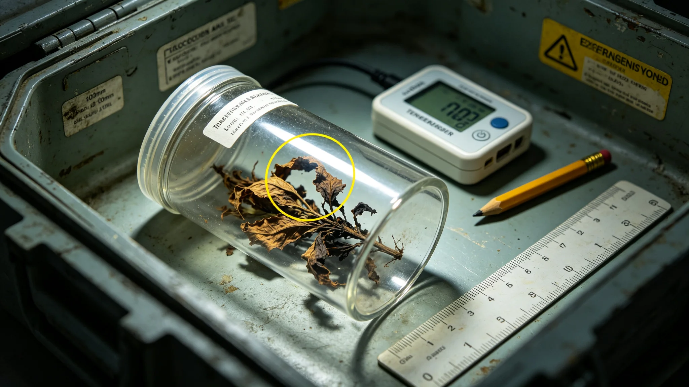

# 第五恒星系方向第二批交换货物中一批原生植物样本温控失准致坏死事件处置报告

**编制单位**：联合体贸易与生物安全联合工作组
**报告编号**：TRADE-INC-3370-009
**日期**：3370年8月14日
**密级**：跨星系公开（脱敏）

## 一、事件时间线

| 时刻 | 事件 |
|---|---|
| 3370-07-20 | 第二批交换货物（含原生植物样本12件）从第五恒星系方向中继站发出 |
| 07-22 | 样本舱温控模块报一次温度异常，自动记录但未报警 |
| 07-25 | 货物抵达三恒星方向检疫通道 |
| 07-25 | 检疫开箱发现12件原生植物样本中7件坏死 |
| 07-26 | 取样封存，启动调查 |
| 08-14 | 本处置报告定稿 |

事件无人员伤亡，无检疫泄漏——坏死样本本身已失活，未对三恒星方向生物圈造成影响。

## 二、坏死情况

| 样本 | 状态 |
|---|---|
| 原生植物样本12件 | 5件存活，7件坏死 |
| 坏死原因 | 温控失准致样本舱温度在48小时内偏离适宜区间约9℃ |
| 检疫 | 存活5件继续按四级隔离（见GS-3302-01）观察；坏死7件封存 |

## 三、原因

样本舱温控模块一枚温度传感器在运输途中漂移，读数偏高，导致制冷误判"已达标"而停止，实际舱温持续升高。与3363年太阳风暴事件（见GS-3363-01）不同，本次为设备老化，与天体事件无关。

对比3348年远禾号微生物超标滞港（见GS-3348-01），那次是检疫阳性；本次是温控事故致样本坏死，性质为"贸易损失"而非"生物安全事故"。

## 四、处置

1. **坏死样本**：7件坏死原生植物样本不丢弃，按生物安全规程封存于第四恒星系方向隔离站，待第五恒星系方向贸易方决定处置。
2. **存活样本**：5件继续隔离观察，不引入生物圈。
3. **温控整改**：交换样本舱全部温控模块加装双传感器冗余，单传感器漂移不致失控。
4. **运输监控**：样本舱温度全程实时回传中继站，不再依赖舱内自动记录。

## 五、与贸易方沟通

- 坏死7件样本已通知第五恒星系方向贸易方，按交换货物清单协商补偿。
- 贸易方未追责，认为温控事故在长航程中可预期。
- 双方同意：后续交换样本舱温控双传感器冗余为强制标准。

## 六、教训

工作组在报告末写："我们把检疫做得很严，却没盯紧样本舱的空调。7件样本坏死不是生物灾难，是提醒我们：对一个四级隔离的方向，连它的植物想活下来，我们都没照顾好。"

## 七、后续

- 3371年：第三批交换货物全部换装双传感器温控舱。
- 本事件不影响第五恒星系方向接触节奏（见GS-3350-01"不赶进度"）。

## 八、贸易方回应

第五恒星系方向贸易方未追责，认为温控事故在长航程中可预期。双方同意：后续交换样本舱温控双传感器冗余为强制标准，写入交换清单附件。工作组说明："对方比我们想得开。他们知道长航程不是野餐，我们的空调坏了，他们没要我们赔，只说下次修好。"

## 九、不培养未知菌株

坏死7件样本封存，不培养、不研究、不取样。按四级隔离（见GS-3302-01），连取样都是扩大风险。工作组说明："不认识的微生物，不看第二眼。"

## 十、双传感器整改

交换样本舱全部温控模块加装双传感器冗余，单传感器漂移不致失控。运输中继站温度全程实时回传。后续第三批样本3371年换装后投运。

### 附：## 十一、坏死样本封存

7件坏死原生植物样本不丢弃，按生物安全规程封存于隔离站，待贸易方决定。不培养不研究。

## 十二、事件经济损失

| 项目 | 损失（星汇） |
|---|---|
| 坏死7件样本重置价值 | 约120万 |
| 隔离站封存保管费（年） | 约8万 |
| 双传感器整改分摊（本批） | 约30万 |
| 第三批换装延迟损失 | 约45万 |
| 合计 | 约203万 |

损失由联合体贸易与生物安全联合工作组公共预算承担，不向贸易方追偿。工作组注明：203万买的是以后所有交换样本舱都装双传感器。

## 十三、调查发现

调查组合计拆检同型号样本舱温控模块12件，其中3件发现同类传感器漂移迹象，9件正常。漂移传感器均为3350年代同一批次生产，已使用约20年，接近设计寿命。调查结论：非人为操作失误，非运输事故，为批次性老化。

调查组同时发现：本批样本舱温控记录在3370-07-22已报一次温度异常，但该记录被舱内自动系统归类为"可恢复波动"，未向中继站报警。工作组据此整改：任何温度偏离适宜区间超过2℃，无论是否自动恢复，均实时回传中继站。

## 十四、与3348年事件对照

| 项目 | 3348年远禾号微生物超标 | 3370年样本温控坏死 |
|---|---|---|
| 性质 | 检疫阳性 | 贸易损失 |
| 生物风险 | 高（已检出违规微生物） | 零（样本已坏死） |
| 处置 | 整船滞港、熏蒸 | 坏死样本封存 |
| 教训 | 检疫通道须严 | 温控监控须严 |

工作组注明：3348教会我们查得严，3370教会我们看得住。两件事不互替。

## 十五、整改时间表

| 整改项 | 完成时限 | 预算（星汇） |
|---|---|---|
| 现有样本舱双传感器加装 | 3371年第一季度 | 约280万 |
| 温度异常实时回传接口 | 3371年第一季度 | 约90万 |
| 同批次老化传感器全批次更换 | 3371年中 | 约150万 |
| 隔离站坏死样本长期保管 | 长期 | 8万/年 |
| 合计 | | 约520万 |

整改费用由贸易与生物安全监管委3371年度预算列支，不申请追加。

---

**编制**：联合体贸易与生物安全联合工作组
**审核**：贸易与生物安全监管委
**日期**：3370年8月14日