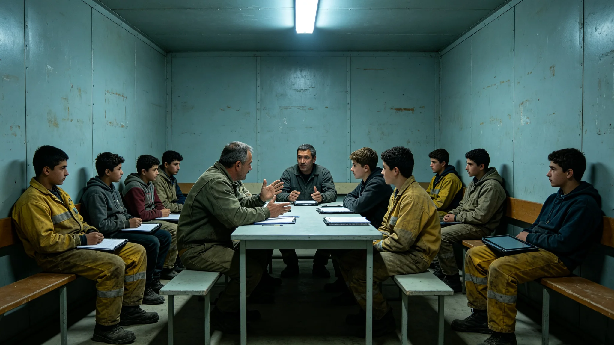

# 三恒星系"文明存续"通识课程第四代修订与深空生存伦理教材颁布公报

**发布机构**：三恒星系文明联合体教育委员会
**发布日期**：3373年4月18日
**文件等级**：跨星系公开

## 一、修订背景

联合体统一基础教育课程标准（见GS-3173-01）颁布已约两百年，文明史教材（见GS-3196-01）由钱念祖主编审定。随文明存续千年规划（见GS-3360-01）建立，教育委员会启动"文明存续"通识课程第四代修订，新增深空生存伦理模块。

## 二、前三代课程

| 代 | 重点 | 年代 |
|---|---|---|
| 第一代 | 基础读写与工业常识 | 约3173 |
| 第二代 | 跨星系地理与基础科学 | 约3230 |
| 第三代 | 文明史与跨星系统一价值观 | 约3290 |
| 第四代（本件） | 文明存续与深空生存伦理 | 3373 |

## 三、第四代新增模块

**（一）冗余与备份**

教学生理解：为什么基因库要三库异地（见GS-3362-01）、为什么通信要冷备（见GS-3354-01）、为什么档案不存一种介质（见GS-3368-01）。

**（二）签字与责任**

教学生理解：自动化系统不担责，签字人担责（见GS-3367-01）。系统可以给建议，人必须签字。

**（三）不干预**

教学生理解：野化区不干预（见GS-3352-01）、船骸不抢救（见GS-3351-01）、生态不人为造完美。"有时候什么都不做，是最难做的事。"

**（四）深时间**

教学生理解：我们这一代说的话，可能一千年后才有人读（见GS-3360-01）。我们写它，不是因为相信他们会读，是因为我们这一代该说的话不该跟着我们埋掉。

## 四、教材原则

- 不煽情、不英雄主义。教材不写"伟大祖先"，写"祖先做了哪些枯燥的备份"。
- 不预测未来。教材不写"未来一定更好"，写"未来可能更难，我们留了什么"。
- 不要求学生"爱文明"。教材只教学生：万一文明出问题，你知道冗余在哪、知道该找谁签字、知道什么时候该什么都不做。

## 五、与既有课程关系

- 文明史教材（见GS-3196-01）不变，仍讲过去。
- 本课程新增"存续"模块，讲如果出问题怎么办。
- 课程不考试、不打分、不升学挂钩——它是每个公民的常识，不是竞争科目。

## 六、实施

- 3373年秋季起，三恒星系各定居点公共教室开设。
- 师资由退休工程师、退休预警员、退休修复师志愿担任，不设专职教师。
- 课程时长固定20学时，不增不减。

## 七、附则

教育委员会在公报末写："我们不指望每个学生都成为英雄。我们只希望，万一哪天灯灭了，有个人记得：备份在哪、该找谁、什么时候别动。"

## 八、课程不考试

存续课程不考试、不打分、不升学挂钩。教育委员会说明："这门课不是竞争科目，是每个公民的常识。考它，等于把常识变成分数；变成分数，就有人只学考试的部分，不学不该忘的部分。"

## 九、师资不专职

存续课程师资由退休工程师、退休预警员、退休修复师志愿担任，不设专职教师。教育委员会说明："这门课不该由教书的人教，该由做过的人教。"

## 十、20学时分配

| 模块 | 学时 |
|---|---|
| 冗余与备份 | 4 |
| 签字与责任 | 4 |
| 不干预 | 4 |
| 深时间 | 4 |
| 讨论 | 4 |

不考试，不打分。

### 附：## 十一、不考试

存续课程不考试、不打分、不升学挂钩。它是每个公民的常识，不是竞争科目。

## 十二、教材编写过程

第四代教材由教育委员会组织12人编写组编写，成员含退休工程师4人、退休预警员2人、退休修复师2人、代际正义学派代表1人、学生代表3人（来自各定居点公共教室）。编写周期24个月，其中前6个月为案例收集，中间12个月为初稿，后6个月为各星区试讲。

试讲在三个定居点各选一个公共教室进行，学生年龄16—18岁，合计87人。试讲后问卷显示，学生最常问的问题不是"考试考什么"，而是"万一真出问题，我该找谁"。编写组据此在教材末附一页"紧急联系名册"，列明各星区备份点、签字岗位、不干预原则。

## 十三、课程在各定居点的开设

| 星区 | 开设教室数 | 志愿师资数 | 预计3373秋首批学员 |
|---|---|---|---|
| 比邻星b方向 | 24 | 31 | 约420人 |
| 太阳系方向 | 18 | 22 | 约310人 |
| 鲸鱼座τ方向 | 12 | 14 | 约210人 |
| 第四恒星系方向 | 6 | 7 | 约90人 |
| 合计 | 60 | 74 | 约1,030人 |

第五恒星系方向不设课程（四级隔离）。老地球野化区不设（无人常住）。

## 十四、教材内容节选原则

教材不设章节编号，以案例为单元，每个案例固定四段：

1. 发生了什么（只记事实，不评价）；
2. 当时谁签的字（记人名与职务）；
3. 后来出了什么问题（只记后果，不道德审判）；
4. 今天的人如果再遇到，该记住哪一句。

教材不设"正确答案"。讨论课上，学生可对同一案例给出不同判断，教师不评判对错，只追问"你这么判断，签字的人会是谁"。

## 十五、与既有课程的衔接

第四代存续课程不替代既有课程：文明史教材（见GS-3196-01）仍讲过去，工业基础课仍讲技能，本课程只在"万一出问题"这一格上补位。学生16—18岁修完20学时后，不发证书、不记学分。教育委员会说明："这门课不该被记住为'我修过的一门课'，该被记住为'我知道备份在哪'。"

---

**发布**：三恒星系文明联合体教育委员会
**日期**：3373年4月18日