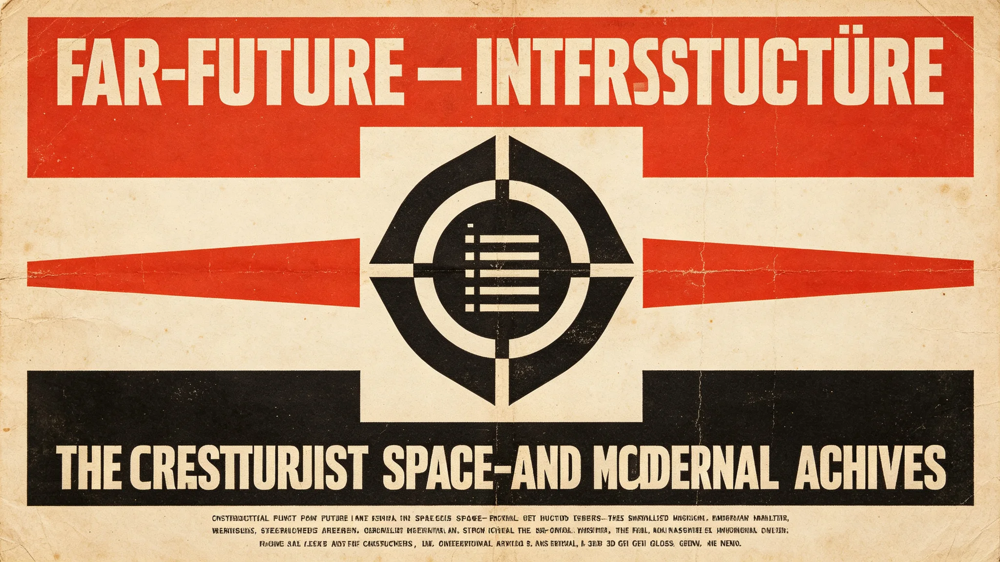

# 千年文明遗产"不可交易名录"与文明遗物强制登记制度修订公报

**发布机构**：联合体文化遗产保护局
**发布日期**：3374年7月7日
**文件等级**：跨星系公开

## 一、修订背景

跨星系文化遗产保护公约（见GS-3159-01）已建立名录制度。随文物修复产业（见GS-3162-01）与交换贸易（见GS-3307-01）扩大，部分文明遗物在跨星市场上流转，其中含本不应交易的原舱遗物与初代文书。保护局修订制度，确立"不可交易名录"。

## 二、名录原则

**（一）不可交易**

凡入名录的文明遗物，所有权归联合体，不可买卖、不可抵押、不可赠予、不可继承。

**（二）强制登记**

凡私人或机构持有疑似入名录遗物，须强制登记。登记不没收，只登记。持有人可继续持有，但不可交易。

**（三）不追溯**

制度不追溯历史交易。已在私人手中的，登记后继续持有；新发现的，按名录处理。

## 三、入名录标准

| 类别 | 示例 |
|---|---|
| ARK-01原舱遗物 | 见GS-3158-01、GS-3351-01 |
| 初代文书 | 见GS-3356-01污损事件 |
| 第一代拓荒者私人物品 | 见GS-3121授名、GS-3148功勋墙 |
| 第五恒星系方向交换原生艺术品 | 见GS-3394-01检疫争议 |
| 深时间遗嘱正本 | 见GS-3360-01 |

## 四、登记流程

- 持有人向当地保护站登记，提交照片与来源。
- 保护站30日内答复是否入名录。
- 入名录者，保护站发登记牌，不没收。
- 争议由文化遗产仲裁庭裁决。

## 五、与贸易关系

- 入名录遗物不得跨星交易。
- 未入名录的普通文物可交易，但交易须登记来源。
- 第五恒星系方向原生艺术品另按接触期生物安全（见GS-3302-01）与贸易（见GS-3307-01）规定处理。

## 六、问题

1. **私人持有抵触**：部分持有人担心登记即没收。保护局强调：登记不没收，只是不可交易。
2. **鉴定困难**：部分遗物来源不明，难以判断是否入名录。保护局接受"存疑先登记"，不急于定性。

## 七、附则

保护局在公报末写："有些东西不该用钱衡量，不是因为它贵，是因为它属于所有还没出生的人。我们不让它买卖，是不让它在我们这代人手里被买走。"

## 五、登记不没收的执行

保护局强调：登记入名录≠没收。持有人继续持有，只不可交易。为消除"登记即没收"误解，保护局在登记牌上印一行字："此物属你，只属你，也属所有还没出生的人。你可保管，不可转让。"

## 六、争议裁决

名录争议由文化遗产仲裁庭裁决，不由持有人与保护局自行谈判。仲裁庭只问一件事：此物是否该入名录。不问价格、不问感情。

## 七、持有人权利

登记入名录者，持有人仍享有：保管权、展览权（经保护局审批）、修缮权（按最小干预）。丧失的只有：买卖、抵押、赠予、继承。保护局说明："你还能用它，只是不能把它变成钱。"

## 八、首批名录

首批入名录文明遗物约340件，含ARK-01原舱遗物、初代文书、第一代拓荒者私人物品。持有人继续持有，只不可交易。

### 附：## 九、登记不没收

登记入名录不没收，持有人继续持有。登记牌印：此物属你，只属你，也属所有还没出生的人。你可保管，不可转让。

## 十、首批名录分类明细

首批入名录340件，分类如下：

| 类别 | 件数 | 持有人分布 |
|---|---|---|
| ARK-01原舱遗物 | 87 | 船骸保护站公藏62，私人持25 |
| 初代文书 | 114 | 联合档案馆公藏98，私人持16 |
| 第一代拓荒者私人物品 | 96 | 家族私持71，纪念馆公藏25 |
| 第五恒星系方向原生艺术品 | 23 | 公藏19，贸易托管4 |
| 深时间遗嘱正本 | 20 | 遗嘱库封存20 |
| 合计 | 340 | |

私人持有的112件，登记后继续由原持有人保管，保护站每五年巡检一次状态，不收取保管费。

## 十一、登记流程时间节点

- 3374年第三季度：各星区保护站开设登记窗口。
- 3375年：私人持有人登记截止。逾期未登记者，经两次催告仍不登记，由保护站代为登记并登记持有人姓名，不处罚。
- 3376年：首次名录年度复核，新增发现的遗物随时入名录。
- 每十年由文化遗产保护局发布一次名录总数变化，不公布单件文物市场估值。

## 十二、与跨星贸易的衔接

入名录遗物不得跨星交易，违者按遗产公约处理，没收遗物入公藏，不处罚款——保护局说明："不罚钱，因为罚钱等于承认它能卖。没收就是。"

未入名录的普通文物可跨星交易，但交易双方须在贸易报关时登记来源链，来源链中断者不得交易。3374年下半年，保护局与跨星系贸易委员会联合发布《普通文物来源链登记指引》，与本制度并行。

## 十三、争议裁决案例（脱敏）

制度实施半年内，文化遗产仲裁庭受理争议11起，其中8起持有人接受名录，2起经仲裁维持名录，1起经仲裁移出名录（该物经鉴定为复制品，非原舱遗物）。仲裁庭不公布当事人姓名，只公布裁决理由。

保护局注明：11起争议中没有一起是"保护局强行没收"，全部是"这件东西到底算不算入名录"的技术争议。制度的难点不在没收，在鉴定。

---

**发布**：联合体文化遗产保护局
**日期**：3374年7月7日