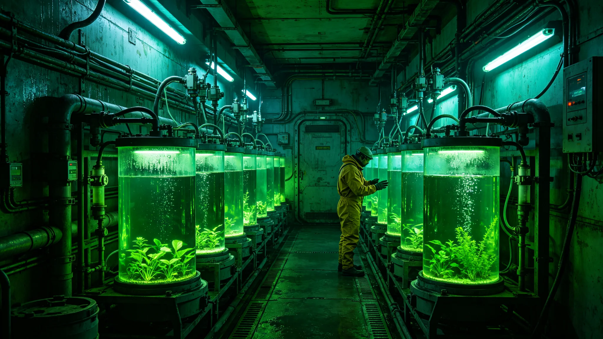

# 跨星系长航程生命保障第七代闭环系统整舱测试报告

**编制单位**：联合体生保工程学派 · 生保系统组
**报告编号**：LSS-3375-031
**日期**：3375年5月26日
**密级**：跨星系公开技术版

## 一、测试背景

长航程生命保障系统自3167年换型（见GS-3167-01）以来，已运行约两百年。随第七代聚变推进（见GS-3361-01）将无加注航程提至0.5光时，旧生保在长航程下消耗品补给压力大。生保系统组承担第七代闭环整舱测试，目标：在0.5光时长航程下，消耗品补给降至旧代的一半。

## 二、测试平台

| 项目 | 配置 |
|---|---|
| 整舱 | 1:1复现跨星线主力船生保舱 |
| 模拟乘员 | 8人，连续模拟30天长航程 |
| 闭环率目标 | ≥95%（旧代85%） |
| 废热回收 | 与第七代推进废热接口匹配 |
| 消耗品补给 | 旧代50% |

## 三、测试方法

1. **30天长航程模拟**：8人连续驻舱，模拟0.5光时单程。
2. **闭环测试**：测量水、氧、食物、废物闭环率。
3. **失效测试**：切断一个闭环环节，验证系统降级不停车。
4. **微生物稳定**：监测舱内微生物群落稳定性。
5. **废热回收**：验证推进废热被生保利用。

## 四、测试数据

| 指标 | 目标 | 实测 |
|---|---|---|
| 闭环率 | ≥95% | 96.2% |
| 消耗品补给 | ≤旧代50% | 47% |
| 30天连续 | 无中断 | 无中断 |
| 单环节切断 | 降级不停车 | 实测降级 |
| 微生物群落 | 稳定 | 稳定 |
| 废热回收 | 匹配 | 匹配 |

## 五、问题与整改

1. **藻类培养在长航程下衰减**：第20天起藻液密度下降。整改：增加光照周期自适应，复测稳定。
2. **废物处理模块异味**：闭环率高但有微量异味。整改：增加活性炭段，异味消除。
3. **与第七代推进接口**：首测废热接口公差，整改后匹配。

## 六、与旧代关系

- 第七代生保不强制换装，按船龄自然淘汰。
- 新船同时装第七代推进与生保，接口匹配。
- 旧船暂不换推进，生保也不换，避免接口错配。

## 七、与生态互锁

生保工程学派说明：第七代闭环不是把人封闭在机器里，而是把一小片生态系带上船。藻类、微生物、水、氧在舱内循环，与比邻星b全球生物圈（见GS-3389-01）是同一套逻辑，只是缩小到一舱。

## 八、后续

- 3376年：首条装第七代生保的跨星线试运行。
- 3390年：第八代预研，方向为更高闭环率与更长自持。

## 九、舱内生态与地面生态

生保工程学派强调：第七代闭环舱内生态与比邻星b全球生物圈（见GS-3389-01）是同一逻辑，只是尺度不同。舱内藻液、微生物、水循环，是把一整片生物圈缩小到一舱。技术组说明："我们不是把人封在机器里，是把一小片自然带上船。"

## 十、旧生保不换

旧生保不强制换装，按船龄自然淘汰。新船同时装第七代推进与生保，避免接口错配。生保组说明："旧船能跑就跑，不折腾。"

## 十一、藻液衰减整改

第20天起藻液密度下降，整改为光照周期自适应。复测30天连续藻液密度波动<5%。生保组说明：藻类也是活的，得让它适应长航程。

## 十二、闭环率

第七代生保闭环率96.2%，消耗品补给降至旧代47%。与第七代推进废热接口匹配。

### 附：## 十三、与第七代推进

第七代生保废热谱与第七代推进（见GS-3361-01）匹配，废热可被生保回收。新船同时换装，接口不另改。

## 十四、技术原理概述

第七代闭环率由旧代85%提至96.2%，关键改进在三处：

1. **水循环**：旧代尿液与冷凝水部分闭环，第七代将全部废水经膜蒸馏与活性炭段后回用水培，水循环率由70%提至92%。
2. **氧气闭环**：旧代藻产氧补足部分呼吸消耗，第七代将藻液培养面积扩大40%，并与乘员呼吸CO₂直连，氧闭环率由80%提至94%。
3. **食物闭环**：旧代部分食物由舱外补给，第七代在藻液外增加小型水培菜圃，补足约15%新鲜蔬菜需求，其余仍需补给。

生保工程学派在报告中注明：96.2%不是100%。剩下3.8%的水、氧、食物仍需补给——长航程不是完全自给，是把补给压力减半。

## 十五、测试样本与乘员跟踪

- 8名模拟乘员均为志愿者，年龄28—45岁，其中男性5人、女性3人，均经体检合格驻舱。
- 驻舱30天，每日记录饮水量、呼吸频率、睡眠质量、心理状态。
- 第20天藻液衰减期间，3名乘员报告轻微睡眠中断，整改光照周期后恢复。
- 驻舱前后骨密度、血常规、心理量表均在正常范围，无异常。

联合体医学组随测试跟踪，结论：第七代闭环舱内环境较旧代对照舱，乘员主观舒适度评分提升约12%，主要来自异味消除与噪音降低。

## 十六、第三方验证与成本

第三方验证由联合体航天医学与生命保障实验室独立复测，闭环率96.0%、消耗品补给47.3%、30天连续无中断，与生保组自测偏差在1%以内。验证报告编号LSS-VRF-3375-07，随报告归档。

第七代生保整舱单舱成本约0.6亿星汇，较旧代高约20%，因藻液培养面积扩大与膜蒸馏段增加。新船同时换装第七代推进与生保，打包成本较旧代单换一项高约15%，但长航程补给节省在三年内可收回差价。

---

**编制**：联合体生保工程学派 · 生保系统组
**审核**：生保工程学派评审委员会
**日期**：3375年5月26日