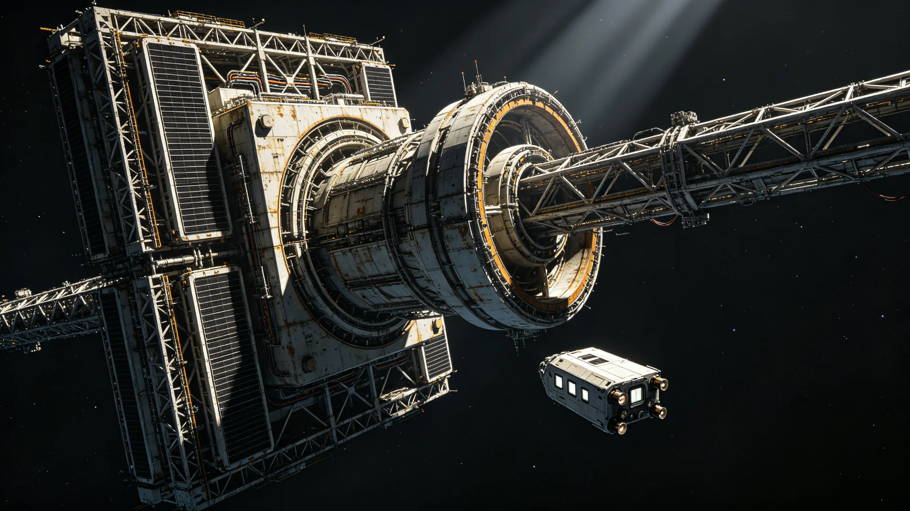

# 下一代轨道聚变电站并网与跨星线电价指数年度报告

**编制单位**：联合体经济委员会 · 能源组
**报告编号**：ECON-ENERGY-3377
**日期**：3377年6月30日
**密级**：跨星系公开

## 一、并网背景

跨星系基础设施能耗随第九代通信中继（见GS-3354-01）、第七代生保（见GS-3375-01）、第五代电梯（见GS-3365-01）上升。下一代轨道聚变电站在深空总装船坞（见GS-3366-01）建成，3376年底并网。本报告为3376年度电价指数。

## 二、聚变电站

| 项目 | 旧能源站 | 新轨道聚变电站 |
|---|---|---|
| 位置 | 各定居点本地 | 轨道，集中供电 |
| 功率 | 分散 | 集中，向三恒星线供电 |
| 寿命设计 | 百年 | 千年（千年规划） |
| 故障冗余 | 单站 | 三站异地互备 |

## 三、电价指数

| 项目 | 3375年 | 3376年 | 同比 |
|---|---|---|---|
| 跨星线基础电价指数 | 100 | 94 | -6% |
| 生保能耗 | 100 | 91 | -9% |
| 通信中继能耗 | 100 | 88 | -12% |
| 电梯能耗 | 100 | 93 | -7% |

并网后电价下降约6%。能源组说明：不是因为便宜了，是因为集中供电比分散效率高。

## 四、问题

1. **集中供电风险**：三站互备，但集中供电意味着单点故障影响面大。能源组坚持三站异地，任一站故障不致全线停电。
2. **长距离输电损耗**：轨道站向比邻星b、鲸鱼座τ方向供电仍有损耗，部分定居点保留本地备用电源。
3. **千年寿命与维护**：聚变电站千年寿命设计要求材料千年耐久（见GS-3391-01主缆疲劳评估同类逻辑）。

## 五、与千年规划

能源组在报告中说明：轨道聚变电站是文明存续千年规划（见GS-3360-01）"能源冗余"的落地。我们不指望某一站用一千年，我们指望三站在一千年里总能有一站在跑。

## 六、下一年度

- 3377年：三站全部运行。
- 3380年：随第七代推进换装，评估能耗结构变化。

## 六、三站布局

| 电站 | 位置 | 与主星区光时 | 状态 |
|---|---|---|---|
| 电站甲 | 比邻星b轨道 | 0.1 | 运行 |
| 电站乙 | 鲸鱼座τ方向轨道 | 0.1 | 运行 |
| 电站丙 | 太阳系外缘 | 4.2 | 运行 |

三站中任一站故障，另两站可维持基本供电，不致全星区停电。电站丙因距离远，主要作为冷备，平时低功耗运行。

## 七、供电边界

聚变电站不向任何单一用户专属供电，只入公共电网。工业大户（如电梯、通信中继）按公共电网电价付费用，不"自办电站"。能源组说明："电进了一张网，就是所有人的。谁钱多谁多用电，不靠谁建电站。"

## 八、电价不补贴居民

居民基础用电不补贴，工业用电按公共电网价。能源组说明："电是公共的，不是福利。用多少付多少，但价格所有人一样。"

## 九、三站光时

电站甲、乙距主星区光时0.1，可实时互备。电站丙距主星区4.2光时，仅作冷备，不参与实时互备。能源组说明："远的那个救不了急，但能救命。"

## 十、电价下降

3377年并网后跨星线基础电价指数由100降至94，生保能耗降9%，通信中继能耗降12%。集中供电效率提升为主要原因。

### 附：## 十一、三站不专属

聚变电站不向任何用户专属供电，只入公共电网。工业大户按公共电价付费，不自办电站。

## 十二、并网前后能耗结构

| 用能方 | 3375年占比 | 3376年占比 | 变化 |
|---|---|---|---|
| 生保闭环（见GS-3375-01） | 28% | 26% | -2% |
| 通信中继（见GS-3354-01） | 22% | 19% | -3% |
| 电梯运行（见GS-3365-01） | 18% | 17% | -1% |
| 居民生活 | 20% | 22% | +2% |
| 工业生产 | 12% | 16% | +4% |
| 合计 | 100% | 100% | |

能源组注明：工业生产占比上升，因集中供电后工业大户不再自建本地电源，转入公共电网结算。居民生活占比微升，非因用电增加，因集中供电后居民电价透明化。

## 十三、三站技术参数

| 项目 | 电站甲 | 电站乙 | 电站丙 |
|---|---|---|---|
| 设计功率 | 基准 | 基准 | 基准 |
| 寿命设计 | 1000年 | 1000年 | 1000年 |
| 常态运行 | 满功率 | 满功率 | 低功耗冷备 |
| 距主星区光时 | 0.1 | 0.1 | 4.2 |
| 人员值守 | 季度巡检 | 季度巡检 | 年度巡检 |

电站丙距主星区4.2光时，不参与实时互备，仅作千年冷备。能源组说明：丙站平时几乎不发电，它在那儿冻着，就是为了甲、乙都坏了的时候，还有一盏灯亮着。

## 十四、年度审计

本报告电价指数经联合体计量与能源审计组独立核验，抽样覆盖三站月度运行记录12份中的6份、公共电网结算凭证47份中的14份。审计结论：电价指数下降6%可由集中供电效率提升解释，无隐匿补贴。审计报告编号AUD-3377-11，随报告归档。

## 十五、对居民电价的影响

跨星线基础电价指数下降6%，反映在居民月均电费上约为年降3%—4%。能源组注明：这不是政府降价，是集中供电效率提升后自然下降。不搞补贴，不搞行政降价——该降的让它自己降下来。

## 十七、3378年展望

3378年三站全部运行后，电价指数预计再降约2%。能源组不设降价指标，只监测成本。若成本不降，电价不降。能源组说明："电价跟着成本走，不跟着政策走。"

能源组另注：三站并网后，跨星线工业大户不再自建本地电源，工业用电成本下降约一成。居民用电成本下降较慢，因居民用电占比小、分散。能源组不追居民电价下降，只追整体成本下降。

---

**编制**：联合体经济委员会 · 能源组
**审核**：经济委员会
**日期**：3377年6月30日